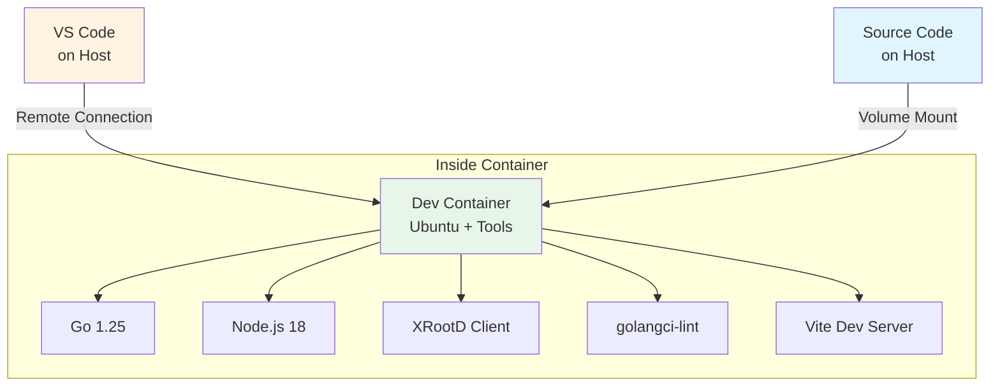

# Dev Container - DataHarbor

Zero-configuration development environment for DataHarbor full-stack application.

## Overview

The Dev Container provides a fully configured development environment with all tools pre-installed, ensuring consistency across all developers and platforms (Windows, macOS, Linux).

### ✅ What's Included

**Languages & Runtimes**:
- Go 1.25+ (backend - from official Microsoft devcontainer image)
- Node.js 18+ & npm (frontend - via devcontainer features)
- XRootD client libraries (for data access integration)

**Development Tools**:
- golangci-lint 1.55.2+ (Go code linting)
- gopls, delve, staticcheck (Go development tools)
- Vite (frontend dev server with hot reload)
- ESLint, Prettier (frontend code quality)
- make, git, bash, zsh

**VS Code Extensions** (auto-installed):
- Go extension with full IntelliSense
- Vue.js (Volar) with TypeScript support
- ESLint, Prettier for code formatting
- Docker and Docker Compose
- GitHub Copilot
- YAML, Makefile, Markdown support

---

## Quick Start

### Prerequisites

1. **Docker Desktop** - [Install Docker](https://www.docker.com/products/docker-desktop)
2. **VS Code** or **Cursor IDE** - [Download VS Code](https://code.visualstudio.com/)
3. **Dev Containers Extension** - [Install Extension](https://marketplace.visualstudio.com/items?itemName=ms-vscode-remote.remote-containers)

### Windows + WSL2 Users

> ⚠️ **Important**: Using Dev Containers with WSL2 requires special setup

**Recommended: Use Docker Desktop** (Easiest)

1. Install Docker Desktop for Windows
2. Enable WSL2 backend (Settings → General → Use WSL 2 based engine)
3. Enable WSL Integration (Settings → Resources → WSL Integration → Enable for your distro)
4. Install Dev Containers extension in VS Code
5. Your code can be anywhere (`D:\workspace\` works fine)

**Alternative: Docker in WSL without Docker Desktop**

If you're running Docker directly in WSL (not Docker Desktop):

```bash
# Install Dev Containers extension IN WSL
wsl code --install-extension ms-vscode-remote.remote-containers

# Verify installation
wsl code --list-extensions | grep ms-vscode-remote.remote-containers
```

**Critical**: Your code MUST be in the WSL filesystem (`/home/user/projects/`), not Windows filesystem (`/mnt/d/`).

**Opening Project**:
```bash
# From WSL terminal (CORRECT)
cd ~/workspace/dataharbor
code .

# From Windows terminal (also works)
wsl code ~/workspace/dataharbor
```

Then in VS Code:
1. Verify bottom-left shows `WSL: Ubuntu-24.04`
2. Run: `Dev Containers: Reopen in Container`

### macOS/Linux Users

Standard setup:
1. Install Docker Desktop
2. Install Dev Containers extension
3. Open project → Reopen in Container

### First Run (3-7 minutes)

```bash
# 1. Clone repository (if not already cloned)
git clone https://github.com/AnarManafov/dataharbor.git
cd dataharbor

# 2. Open in VS Code or Cursor
code .

# 3. When prompted: Click "Reopen in Container"
#    (Or: Press F1 → "Dev Containers: Reopen in Container")

# 4. Wait for container to build (first time only)
#    - Downloads Go 1.25 image
#    - Installs Node.js 18+
#    - Installs XRootD client libraries
#    - Installs npm and Go dependencies

# 5. You're ready! Verify setup:
go version          # Should show Go 1.25+
node --version      # Should show Node 18+
npm --version       # Should show npm 9+
xrdfs --version     # Should show XRootD client version
```

---

## How It Works



**Key Features**:
- Code lives on your host machine (full Git integration)
- VS Code runs on host, connected to container
- All compilation and execution happens in container
- Extensions installed automatically in container
- Hot reload for both frontend and backend

## Features

### Auto-Installed Extensions

The following VS Code extensions are automatically installed:

**Go Development**:

- `golang.go` - Go language support with IntelliSense

**Vue.js/Frontend Development**:

- `vue.volar` - Vue.js language support
- `vue.vscode-typescript-vue-plugin` - TypeScript integration for Vue
- `dbaeumer.vscode-eslint` - ESLint integration
- `esbenp.prettier-vscode` - Code formatting

**Docker**:

- `ms-azuretools.vscode-docker` - Docker support

**Git & Productivity**:

- `github.copilot` - AI pair programming
- `github.copilot-chat` - AI chat assistant

**Language Support**:

- `redhat.vscode-yaml` - YAML support
- `ms-vscode.makefile-tools` - Makefile support
- `yzhang.markdown-all-in-one` - Markdown support

### Pre-Configured Settings

- Format on save (Go, Vue.js, JavaScript, JSON, YAML)
- Auto-organize imports (Go)
- Auto-fix ESLint issues (Vue.js, JavaScript)
- golangci-lint integration for Go
- Prettier for frontend code formatting
- Line rulers at 100/120 characters
- Tab size: 2 spaces (configurable per language)

### Port Forwarding

Ports are automatically forwarded to your host:

- **Frontend (Vite)**: `https://localhost:5173`
- **Backend API**: `http://localhost:8081`
- No manual configuration needed

---

## Customization

### Add Personal Settings

Create `.vscode/settings.json` (ignored by Git):

```json
{
  "editor.fontSize": 14,
  "terminal.integrated.fontSize": 13,
  "workbench.colorTheme": "your-favorite-theme"
}
```

### Add More Extensions

Edit `.devcontainer/devcontainer.json`:

```json
{
  "customizations": {
    "vscode": {
      "extensions": [
        "existing-extensions...",
        "your.new-extension"
      ]
    }
  }
}
```

Then rebuild container: `F1` → `Dev Containers: Rebuild Container`

### Modify Container Image

Edit `.devcontainer/Dockerfile`:

```dockerfile
# Add your custom tools
RUN apt-get update && apt-get install -y \
    your-favorite-tool \
    && rm -rf /var/lib/apt/lists/*
```

Rebuild: `F1` → `Dev Containers: Rebuild Container`

---

## Troubleshooting

### Cursor IDE Users: Git Editor Issues

If you're using **Cursor IDE** instead of VS Code, you may encounter this error during interactive Git operations (like `git rebase -i`, `git commit` without `-m`):

```bash
hint: Waiting for your editor to close the file... code or code-insiders is not installed
error: there was a problem with the editor 'code --wait'
```

**Why this happens**: Dev containers are designed for VS Code and use the `code` CLI to communicate with the host editor. Cursor, being a VS Code fork, doesn't have the same CLI bridge installed in containers by default.

**Solution 1: Use VS Code for Dev Container Work** (Recommended)

For the best dev container experience with interactive Git operations, use VS Code:
- Download: https://code.visualstudio.com/
- Both editors can coexist on your system

**Solution 2: Set Git Editor to a Terminal-Based Editor**

Use a terminal editor that works natively in the container:

```bash
# Option A: nano (easiest for beginners)
git config --global core.editor "nano"

# Option B: vim (if you prefer vim)
git config --global core.editor "vim"

# Verify it worked
git config --global core.editor
```

### Container won't start

```bash
# Check Docker is running
docker ps

# View container logs
docker logs <container-id>

# Rebuild container
F1 → "Dev Containers: Rebuild Container"

# Reset completely
F1 → "Dev Containers: Rebuild Container Without Cache"
```

### Extensions not installing

```bash
# Manually install extensions
# Open Extensions view (Ctrl+Shift+X)
# Search and install: golang.go, vue.volar, etc.

# Or rebuild container
F1 → "Dev Containers: Rebuild Container"
```

### npm install fails

```bash
# Clear npm cache
npm cache clean --force

# Remove node_modules and reinstall
rm -rf node_modules web/node_modules
npm install

# If still failing, rebuild container
F1 → "Dev Containers: Rebuild Container"
```

### Go tools not working

```bash
# Reinstall Go tools
go install golang.org/x/tools/gopls@latest
go install github.com/go-delve/delve/cmd/dlv@latest
go install github.com/golangci/golangci-lint/cmd/golangci-lint@latest

# Check Go environment
go env

# Restart Go language server
F1 → "Go: Restart Language Server"
```

### Port conflicts

```bash
# Check if ports are in use
lsof -i :5173
lsof -i :8081

# Change port in config
# Frontend: Edit web/vite.config.js
# Backend: Edit app/config/application.yaml or use env var
DATAHARBOR_SERVER_PORT=8082 npm run dev:backend
```

### XRootD client not found

```bash
# Check XRootD installation
which xrdfs
xrdfs --version

# If missing, rebuild container
F1 → "Dev Containers: Rebuild Container"
```

### Windows WSL Issues

**Problem: "docker not found" error**

This happens when Dev Containers extension is installed on Windows but not in WSL:

```bash
# Solution: Install extension in WSL
wsl code --install-extension ms-vscode-remote.remote-containers
```

**Problem: Extension works but container won't start**

Your code might be on Windows filesystem (`/mnt/d/` or `D:\`), which doesn't work well with Dev Containers when using Docker in WSL.

Solution: Move code to WSL filesystem:
```bash
# Copy from Windows to WSL
wsl
mkdir -p ~/workspace
cp -r /mnt/d/workspace/dataharbor ~/workspace/
cd ~/workspace/dataharbor
code .
```

**Problem: VS Code shows "WSL: Ubuntu" but container fails**

Make sure you opened the project FROM WSL, not by doing "Reopen in WSL" from Windows:

```bash
# Correct way:
wsl
cd ~/workspace/dataharbor
code .  # Opens VS Code connected to WSL

# Then: Reopen in Container
```

---

## Advanced Usage

### Use Different Node.js Version

Edit `.devcontainer/devcontainer.json`:

```json
{
  "features": {
    "ghcr.io/devcontainers/features/node:1": {
      "version": "20"  // Change to desired version
    }
  }
}
```

### Use Different Go Version

Edit `.devcontainer/Dockerfile`:

```dockerfile
FROM mcr.microsoft.com/devcontainers/go:1-1.26-bookworm
# Change version number ^^^
```

### Share Dev Container Config

Commit `.devcontainer/` to Git - entire team gets same setup!

### Connect to XRootD Server

The container includes XRootD client libraries. Configure connection in `app/config/application.yaml`:

```yaml
xrootd:
  servers:
    - "root://your-xrootd-server.example.com:1094"
  timeout: "30s"
```

### SSH into Container

```bash
# Get container ID
docker ps

# SSH into container
docker exec -it <container-id> bash
```

---

## Resources

- [Dev Containers Documentation](https://code.visualstudio.com/docs/devcontainers/containers)
- [VS Code Remote Development](https://code.visualstudio.com/docs/remote/remote-overview)
- [DevContainer Specification](https://containers.dev/)
- [DataHarbor Documentation](../docs/README.md)

---

**Related Documentation**:
- [Development Guide](../docs/DEVELOPMENT.md) - Development workflow and contribution guidelines
- [Setup Guide](../docs/SETUP.md) - Manual environment setup
- [Architecture Guide](../docs/ARCHITECTURE.md) - System architecture overview
