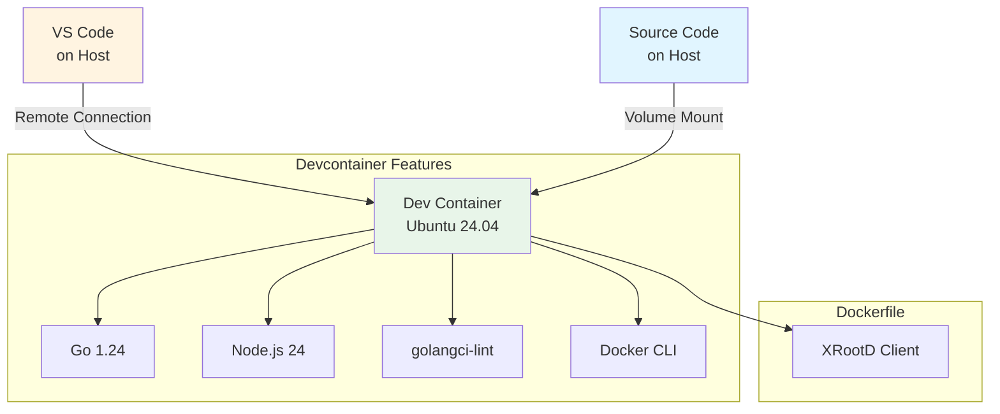

# Dev Container - DataHarbor

[← Back to Main README](../README.md) | [Documentation](../docs/README.md)

Zero-configuration development environment for DataHarbor full-stack application.

## Overview

The Dev Container provides a fully configured development environment with all tools pre-installed, ensuring consistency across all developers and platforms.

### ✅ What's Included

| Category             | Tools                                        |
| -------------------- | -------------------------------------------- |
| **Base Image**       | Ubuntu 24.04 LTS (via devcontainer features) |
| **Languages**        | Go 1.25+, Node.js 24+                        |
| **Go Tools**         | golangci-lint, gopls, delve, staticcheck     |
| **Frontend**         | Vite, ESLint, Prettier                       |
| **Utilities**        | Git, GitHub CLI, Docker, Zsh, Oh My Zsh      |
| **Project-specific** | XRootD client libraries                      |

**VS Code Extensions** (auto-installed):
- Go, Vue.js (Volar), ESLint, Prettier
- Docker, GitHub Copilot
- YAML, Makefile, Markdown support

---

## Quick Start

### Prerequisites

1. **Docker Desktop** - [Install Docker](https://www.docker.com/products/docker-desktop)
2. **VS Code** or **Cursor IDE** - [Download VS Code](https://code.visualstudio.com/)
3. **Dev Containers Extension** - [Install Extension](https://marketplace.visualstudio.com/items?itemName=ms-vscode-remote.remote-containers)

### Windows + WSL2 Users

> ⚠️ **Important**: Using Dev Containers with WSL2 requires special setup

**Recommended: Use Docker Desktop** (Easiest)

1. Install Docker Desktop for Windows
2. Enable WSL2 backend (Settings → General → Use WSL 2 based engine)
3. Enable WSL Integration (Settings → Resources → WSL Integration → Enable for your distro)
4. Install Dev Containers extension in VS Code
5. Your code can be anywhere (`D:\workspace\` works fine)

**Alternative: Docker in WSL without Docker Desktop**

If you're running Docker directly in WSL (not Docker Desktop):

```bash
# Install Dev Containers extension IN WSL
wsl code --install-extension ms-vscode-remote.remote-containers

# Verify installation
wsl code --list-extensions | grep ms-vscode-remote.remote-containers
```

**Critical**: Your code MUST be in the WSL filesystem (`/home/user/projects/`), not Windows filesystem (`/mnt/d/`).

**Opening Project**:
```bash
# From WSL terminal (CORRECT)
cd ~/workspace/dataharbor
code .

# From Windows terminal (also works)
wsl code ~/workspace/dataharbor
```

Then in VS Code:
1. Verify bottom-left shows `WSL: Ubuntu-24.04`
2. Run: `Dev Containers: Reopen in Container`

### macOS/Linux Users

Standard setup:
1. Install Docker Desktop
2. Install Dev Containers extension
3. Open project → Reopen in Container

### First Run (3-7 minutes)

```bash
# 1. Clone repository (if not already cloned)
git clone https://github.com/AnarManafov/dataharbor.git
cd dataharbor

# 2. Open in VS Code or Cursor
code .

# 3. When prompted: Click "Reopen in Container"
#    (Or: Press F1 → "Dev Containers: Reopen in Container")

# 4. Wait for container to build (first time only)

# 5. Verify setup:
go version          # Go 1.24+
node --version      # Node 24+
xrdfs --version     # XRootD client
```

---

## Architecture



### Port Forwarding

| Port | Service          |
| ---- | ---------------- |
| 5173 | Frontend (Vite)  |
| 8081 | Backend API (Go) |

---

## Customization

### Change Tool Versions

Edit `.devcontainer/devcontainer.json`:

```json
{
  "features": {
    "ghcr.io/devcontainers/features/go:1": {
      "version": "1.24"
    },
    "ghcr.io/devcontainers/features/node:1": {
      "version": "24"
    }
  }
}
```

### Add Extensions

Edit `.devcontainer/devcontainer.json` → `customizations.vscode.extensions`

### Add System Packages

Edit `.devcontainer/Dockerfile`:

```dockerfile
RUN apt-get update && apt-get install -y your-package
```

Then rebuild: `F1` → `Dev Containers: Rebuild Container`

---

## Troubleshooting

### Cursor IDE: Git Editor Issues

Cursor doesn't have VS Code's CLI bridge. Use a terminal editor:

```bash
git config --global core.editor "nano"  # or "vim"
```

### Container won't start

```bash
docker ps                    # Check Docker is running
docker logs <container-id>   # View logs
# F1 → "Dev Containers: Rebuild Container Without Cache"
```

### Go tools not working

```bash
# F1 → "Go: Restart Language Server"
# Or reinstall:
go install golang.org/x/tools/gopls@latest
```

### Windows WSL Issues

**"docker not found"**: Install extension in WSL:
```bash
wsl code --install-extension ms-vscode-remote.remote-containers
```

**Container fails**: Move code to WSL filesystem (`~/workspace/`), not `/mnt/d/`.

---

## Resources

- [Dev Containers Documentation](https://code.visualstudio.com/docs/devcontainers/containers)
- [DevContainer Features](https://containers.dev/features)
- [DataHarbor Documentation](../docs/README.md)

---

[← Back to Main README](../README.md) | [Documentation](../docs/README.md)
