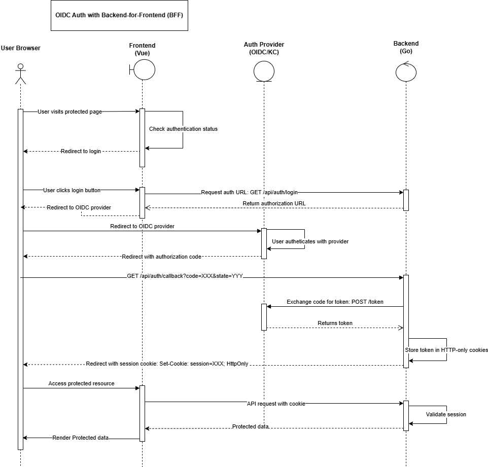

# Data Lake UI


The Data Lake UI provides a user interface to access GSI Lustre cluster data.  
It consists of the following main parts:

* [Frontend](./web/README.md)
* [Backend](./app/README.md)

## Features

* Users can remotely browse directories and files.
* Directories and files are listed with their properties (size, modification date).
* Users can select and download individual files.

## Architecture

### Authentication

The application uses OpenID Connect (OIDC) for authentication, implemented with a Backend-For-Frontend (BFF) pattern for enhanced security. This approach keeps authentication tokens secure on the server side, never exposing them to the browser.

#### BFF Authentication Flow

The diagram below illustrates the authentication flow in our application:

[](./docs/architecture/auth/bff_auth_flow_sequence.png)

[Original draw.io source file](./docs/architecture/auth/bff_auth_flow_sequence.drawio) (for editing and reference)

#### Authentication Algorithm

The authentication flow works as follows:

1. **Initial Authentication Request**:
   * User attempts to access a protected resource in the frontend
   * Frontend detects user is not authenticated
   * Frontend redirects to the login page

1. **Login Initiation**:
   * User clicks the login button
   * Frontend calls the backend endpoint (`GET /api/auth/login`)
   * Backend generates a random state parameter to prevent CSRF attacks
   * Backend creates the OIDC authorization URL and returns it to the frontend
   * Frontend redirects the user's browser to the OIDC provider's authorization URL

1. **OIDC Authentication**:
   * User authenticates with the OIDC provider (e.g., Keycloak)
   * OIDC provider validates credentials and permissions
   * OIDC provider redirects back to our backend callback URL with an authorization code and state parameter

1. **Token Exchange**:
   * Backend verifies the state parameter to prevent CSRF attacks
   * Backend exchanges the authorization code for tokens with the OIDC provider
   * This exchange occurs server-to-server and includes the client secret
   * Backend receives access token, ID token, and refresh token

1. **Secure Session Creation**:
   * Backend stores tokens in HTTP-only cookies that JavaScript cannot access
   * Backend sets appropriate cookie security flags (HttpOnly, SameSite, etc.)
   * Backend redirects the user to the originally requested page

1. **Authenticated API Requests**:
   * Frontend makes API requests to backend with cookies automatically attached
   * Backend middleware validates the session cookies
   * Backend extracts the access token and uses it for backend operations
   * Protected resources are returned to the frontend

1. **Token Refresh**:
   * When the access token expires, backend detects this during an API request
   * Backend uses the stored refresh token to obtain a new access token
   * Backend updates the session cookies with the new tokens
   * The original API request is completed without user interruption

1. **Logout**:
   * User initiates logout in the frontend
   * Frontend calls the backend logout endpoint (`POST /api/auth/logout`)
   * Backend invalidates the session and clears the secure cookies
   * User is redirected to the login page or home page

Key security benefits of this approach:

* Authentication tokens are stored securely in HTTP-only cookies
* Tokens are never accessible to JavaScript, mitigating XSS attacks
* Token refresh happens server-side, improving security
* Server-side session management with stronger protection

## Versioning

The project follows Semantic Versioning for versioning.  
Each release is tagged according to the following rules:

* **Global Versions**: Use a prefix `vX.Y.Z` (e.g., `v1.0.0`) to create global versions.
* **Backend Versions**: Generated automatically as `app/vX.Y.Z` (e.g., `app/v1.0.0`) from global versions.
* **Frontend Versions**: Generated automatically as `web/vX.Y.Z` (e.g., `web/v1.0.0`) from global versions.

### Release Process

The release process is initiated by manually applying an annotated global version tag (`vX.Y.Z`) and pushing it to GitHub:

```shell
# Create a new annotated version tag (recommended)
git tag -a v1.2.3 -m "Release v1.2.3"

# Push the tag to trigger the automated release process
git push origin v1.2.3
```

When a global version tag is pushed to the master branch, the following automated workflow is triggered:

1. **Version Tag Processing**: The system processes the tag and extracts version information
2. **Component Tag Generation**: The system creates corresponding frontend (`web/vX.Y.Z`) and backend (`app/vX.Y.Z`) version tags
3. **Package.json Updates**: Updates version information in package.json files
4. **Changelog Generation**: Automatically generates a changelog from commit messages since the last release
5. **Release Notes**: Updates the central RELEASE_NOTES.md file with the new version information
6. **Build & Package**: Creates builds for both frontend and backend components
7. **RPM Creation**: Generates RPM packages for deployment
8. **GitHub Release**: Publishes a new GitHub release with all artifacts and notes

### Dynamic Versioning (Development)

```shell
# During development, use Git tags for displaying versions in your app
npm run dev

# When preparing a release (after tagging)
npm run prepare-release

# Just to check or update package.json versions 
npm run sync-versions
```

### Release Process

The release process is fully automated via GitHub Actions and triggers on pushes to the `master` branch.

The automation workflow performs the following tasks:

1. **Version Determination** - Automatically calculates the next version numbers based on existing tags
2. **Tag Creation** - Creates and pushes new version tags for global, frontend, and backend components 
3. **Package.json Updates** - Updates version information in package.json files
4. **Changelog Generation** - Automatically generates a changelog from commit messages
5. **Release Notes** - Updates the central RELEASE_NOTES.md file with the new version information

There is no need for manual version management or release note updates - everything is handled by the CI/CD pipeline.

## CI/CD Workflows

The project uses GitHub Actions for continuous integration and delivery, with several workflows that handle different aspects of the development and release process.

### CI/CD Workflow Diagrams

#### 1. Version Tag Push Workflow (Release Process)

When a version tag like "v0.13.9" is pushed, it triggers the following sequence:

```
Tag Push (v0.13.9)
  ↓
  ↓ [Triggers]
  ↓
┌─────────────────────────────┐
│ version-tag-processor.yml   │
├─────────────────────────────┤
│ 1. determine-versions       │
│ 2. update-package-versions  │
│ 3. update-changelog         │ 
│ 4. generate-changelog       │
│ 5. update-release-notes     │
└──────────────┬──────────────┘
               │
               │ [On workflow_run completion]
               ▼
┌─────────────────────────────┐
│ publish-release.yml         │
├─────────────────────────────┤
│ 1. prepare-release          │
│ 2. create-component-tags    │ ← Creates web/v0.13.9 and app/v0.13.9
│ 3. build-frontend           │
│ 4. build-backend            │
│ 5. build-rpms               │ ← Uses build-rpm.yml reusable workflow
│ 6. publish-release          │ ← Creates GitHub Release
└─────────────────────────────┘
```

#### 2. Pull Requests and Pushes to Master

```
┌───────────────────────────────────────────────────────────┐
│                  Push to master OR PR                     │
└───────────┬─────────────────────────────┬─────────────────┘
            │                             │
            ▼                             ▼
┌───────────────────────┐     ┌───────────────────────┐
│ Backend Changes       │     │ Frontend Changes      │
│ (app/** files)        │     │ (web/** files)        │
└──────────┬────────────┘     └─────────┬─────────────┘
           │                            │
           ▼                            ▼
┌──────────────────────┐    ┌───────────────────────┐
│ backend.yml          │    │ frontend.yml          │
├──────────────────────┤    ├───────────────────────┤
│ 1. build             │    │ 1. build              │
│ 2. test-and-coverage │    │ 2. security-scan      │
│ 3. lint              │    │ 3. build-rpm          │
│ 4. build-rpm         │    └───────────────────────┘
└──────────────────────┘
```

#### 3. Reusable Workflow (build-rpm.yml)

This workflow is used by multiple other workflows for building RPM packages:

```
┌─────────────────────────────┐
│ build-rpm.yml               │
├─────────────────────────────┤
│ [Input parameters]          │
│ - component                 │ ← "frontend", "backend", or "both"
│ - version                   │ ← Optional, uses package.json if not provided
│ - is_pr_build               │ ← Adds PR-specific version suffix if true
│                             │
│ [Jobs]                      │
│ 1. build                    │ ← Builds RPM packages and uploads as artifacts
└─────────────────────────────┘
```

These workflows ensure that:
- Code is properly built, tested and linted
- RPM packages are created for both frontend and backend components
- Releases are automatically published with proper changelogs
- Version management is handled consistently across components

## How to run locally

This setup ensures that both the Vue 3 Frontend and Go Backend are running simultaneously in development mode, making development more efficient.

### Install dependencies

```shell
npm install
```

Since the project defines npm workspaces, this command can be run from the root folder of the project or from the Frontend subdirectory `./web`.

### Start Development Servers

To start both the Frontend and Backend servers in development mode (with a hot-reload support), run:

```shell
npm run dev
```

This will start the Vue Frontend server and the Go Backend server concurrently.  
The Frontend will be running on [localhost:5173](http://localhost:5173/) (or on the port specified by Vite).

### Configuration

#### Provide Configuration File

If you need to provide an optional configuration file path to the Go Backend, set the `CONFIG_FILE_PATH` environment variable before running the npm run dev command:

```shell
CONFIG_FILE_PATH=/path/to/config.yaml npm run dev
```

### Build the Project

To build both the Frontend and Backend, run:

```shell
npm run build
```

This will build the Vue Frontend using Vite and compile the Go Backend.

## RPM Packaging

The project provides RPM packages for both parts, [the frontend](./web/README.md#rpm) and [the backend](./app/README.md#rpm).

## Containerization

The project can provide Two Containers ([One for Frontend](./web/README.md#containerization), [One for Backend](./app/README.md#containerization)). The Backend can be treated as a microservice.  The Backend is relatively compact, therefore container is not really needed, as it can be deployed as an app. But splitting Frontend and Backend deployment is still advisable, see below.

* **Isolation**:
Each service runs in its own container, which means they are isolated from each other. This can make debugging easier and improve security.
* **Scalability**:  
You can scale the Frontend and Backend independently based on their respective loads. For example, if your Backend needs more resources, you can scale it up without affecting the Frontend.
* **Flexibility**:  
You can update or redeploy one service without affecting the other. This is particularly useful for continuous deployment and integration.
* **Best Practices**:  
This approach aligns with the microservices architecture, which is a widely adopted best practice in modern application development.
