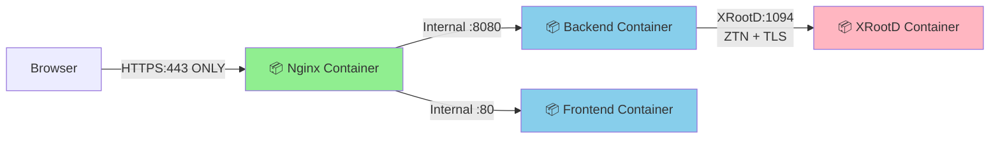
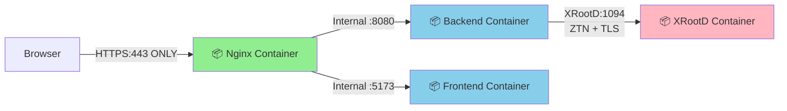

# DataHarbor - Docker Deployment Guide

Complete guide for deploying DataHarbor using Docker Compose in both development and production environments.

## Architecture

### Production Deployment



**Containers:** Nginx Gateway • Backend (Go) • Frontend (Nginx) • XRootD Server  
**Security:** ZTN (Zero Trust Networking) + TLS encryption for XRootD communication

### Development Deployment



**Containers:** Nginx Gateway • Backend (Go dev server) • Frontend (Vite dev server) • XRootD Server  
**Security:** ZTN (Zero Trust Networking) + TLS encryption with self-signed certificates

## Table of Contents

- [Overview](#overview)
- [Prerequisites](#prerequisites)
- [Quick Start](#quick-start)
- [Directory Structure](#directory-structure)
- [Configuration](#configuration)
- [Development Deployment](#development-deployment)
- [Production Deployment](#production-deployment)
- [Certificate Management](#certificate-management)
- [Troubleshooting](#troubleshooting)
- [Maintenance](#maintenance)

## Overview

DataHarbor provides two Docker Compose configurations:

- **`docker-compose.yml`** - Development deployment (includes XRootD server, source mounting, hot reload)
- **`docker-compose.prod.yml`** - Production deployment (Backend + Frontend + Nginx Gateway + XRootD - production ready)

### Container Services

Both deployments run the following containers:

| Service      | Development                   | Production              | Purpose                        |
| ------------ | ----------------------------- | ----------------------- | ------------------------------ |
| **nginx**    | Gateway with HTTPS            | Gateway with HTTPS      | Reverse proxy, SSL termination |
| **backend**  | Go dev server (hot reload)    | Compiled Go binary      | REST API, XRootD client        |
| **frontend** | Vite dev server (HMR)         | Nginx static server     | Vue.js web interface           |
| **xrootd**   | Dev config, self-signed certs | Prod config, real certs | Storage server                 |

**Key Differences:**
- **Dev:** Source code mounted, auto-reload, self-signed certificates, debug logging
- **Prod:** Pre-built images, optimized binaries, production certificates, structured logging

## Quick Start

### Development (with local XRootD)

```bash
cd docker
docker compose up -d

# Access application
open https://localhost
```

### Production (external XRootD)

```bash
cd docker
cp .env.example .env
# Edit .env with your configuration
docker compose -f docker-compose.prod.yml up -d
```

## Prerequisites

### Required Software

- **Docker** 24.0+ with Compose V2
- **Docker Compose** 2.20+
- **Docker Buildx** (for development deployment only - optimized multi-stage builds)
- **Git** (for version info in builds)

### System Requirements

- **CPU:** 2+ cores
- **RAM:** 4GB minimum, 8GB recommended
- **Disk:** 10GB free space

### For Development

- **WSL2** (Windows) or native Linux/macOS
- **Go** 1.25+ (optional, for local development)
- **Node.js** 22+ (optional, for local development)

### Installing Docker Buildx

Docker Buildx should come bundled with Docker Desktop. If you're using Docker separately or encounter issues:

**macOS (Homebrew):**
```bash
# Install buildx
brew install docker-buildx

# Create Docker CLI plugins directory
mkdir -p ~/.docker/cli-plugins

# Link buildx as a Docker plugin
ln -sf /opt/homebrew/bin/docker-buildx ~/.docker/cli-plugins/docker-buildx

# Verify installation
docker buildx version
```

**Linux:**
```bash
# Download latest buildx
mkdir -p ~/.docker/cli-plugins
curl -Lo ~/.docker/cli-plugins/docker-buildx \
    https://github.com/docker/buildx/releases/latest/download/buildx-linux-amd64

# Make it executable
chmod +x ~/.docker/cli-plugins/docker-buildx

# Verify installation
docker buildx version
```

**Why Buildx is needed:**
- **Development only:** Required for `docker-compose.yml` which uses `target: builder` for hot reload
- Production deployment (`docker-compose.prod.yml`) does not require Buildx
- Buildx provides optimized caching and faster builds for multi-stage Dockerfiles
- Without it, you'll see warnings but builds will still work using legacy builder

## Directory Structure

```
docker/
├── docker-compose.yml          # Development deployment
├── docker-compose.prod.yml     # Production deployment
├── .env.example                # Environment template
├── README.md                   # This file
├── backend/                    # Backend Dockerfile
├── frontend/                   # Frontend Dockerfile
├── nginx/                      # Nginx configuration
│   ├── Dockerfile
│   ├── nginx.conf              # Main configuration
│   ├── nginx.dev.conf          # Development sites
│   └── nginx.prod.conf         # Production sites
├── xrootd/                     # XRootD server configuration
│   ├── Dockerfile.dev          # Development Dockerfile
│   ├── Dockerfile.prod         # Production Dockerfile
│   ├── configs/                # XRootD configuration files
│   │   ├── xrootd-dev.cfg      # Development config
│   │   └── xrootd-prod.cfg     # Production config
│   └── scripts/                # Setup scripts
├── certs/                      # SSL certificates (generated)
└── config/                     # Application configuration
```

## Container Documentation

See component-specific documentation:

- [Backend Documentation](backend/README.md) - Go service details
- [Frontend Documentation](frontend/README.md) - Vue.js web interface
- [Nginx Documentation](nginx/README.md) - Gateway configuration
- [XRootD Documentation](xrootd/README.md) - Storage server setup

## Configuration

### Environment Variables

Create `.env` from template:

```bash
cd docker
cp .env.example .env
nano .env
```

#### Required Variables

```bash
# Application environment
DATAHARBOR_ENV=development          # or production

# Backend configuration
DATAHARBOR_SERVER_ADDRESS=:8080
DATAHARBOR_SERVER_DEBUG=true        # Verbose logging

# XRootD connection
DATAHARBOR_XRD_HOST=xrootd          # For dev: 'xrootd', for prod: external server
DATAHARBOR_XRD_PORT=1094
DATAHARBOR_XRD_ENABLE_ZTN=true

# Authentication (OIDC)
DATAHARBOR_AUTH_ENABLED=true
DATAHARBOR_AUTH_OIDC_ISSUER=https://id.gsi.de/realms/wl
DATAHARBOR_AUTH_OIDC_CLIENT_ID=your-client-id-here
DATAHARBOR_AUTH_OIDC_REDIRECT_URL=https://localhost/auth/callback
DATAHARBOR_AUTH_OIDC_ALLOWED_ORIGINS=https://localhost

# SSL Certificates
SSL_CERT_PATH=/etc/nginx/certs/server.crt
SSL_KEY_PATH=/etc/nginx/certs/server.key
```

#### Optional Variables (with defaults)

```bash
# Logging
LOG_LEVEL=info                      # debug, info, warn, error

# CORS
ALLOWED_ORIGINS=https://localhost   # Comma-separated list

# Nginx
NGINX_WORKER_PROCESSES=auto
NGINX_WORKER_CONNECTIONS=1024

# XRootD (development only)
XRD_HOME_DIR=${HOME}               # User's home directory for XRootD
```

### XRootD Configuration

In development, XRootD runs as a local container and mounts the user's home directory:

```bash
# XRootD settings
DATAHARBOR_XRD_HOST=xrootd          # Container name
XRD_HOME_DIR=${HOME}                # Mounts your home directory as /data in container
```

**Development Notes:**
- XRootD runs locally with **self-signed certificates**
- **`XRD_HOME_DIR`** mounts your home directory into XRootD at `/data`
- ZTN (Zero Trust Networking) is enabled by default
- Files in `$HOME` can be accessed via `xroot://localhost:1094/data/`

In production, configure these settings based on your external XRootD deployment:

```bash
DATAHARBOR_XRD_HOST=punch2.gsi.de
DATAHARBOR_XRD_PORT=1094
DATAHARBOR_XRD_ENABLE_ZTN=true    # Must match server's ZTN configuration
```

**Production Notes:**
- XRootD runs as a container with **production certificates**
- Configure **`DATAHARBOR_XRD_HOST`** to point to your XRootD server
- Ensure **`DATAHARBOR_XRD_ENABLE_ZTN`** matches the server configuration

### Application Configuration Files

Backend uses `config/application.yaml`:

```yaml
env: production
server:
  address: ":8080"
  debug: false
xrd:
  host: "punch2.gsi.de"
  port: 1094
  enable_ztn: true
auth:
  enabled: true
  oidc:
    issuer: "${DATAHARBOR_AUTH_OIDC_ISSUER}"
    client_id: "${DATAHARBOR_AUTH_OIDC_CLIENT_ID}"
    redirect_url: "${DATAHARBOR_AUTH_OIDC_REDIRECT_URL}"
    allowed_origins: ["${DATAHARBOR_AUTH_OIDC_ALLOWED_ORIGINS}"]
```

### Certificate Management

- **`SSL_CERT_PATH`** and **`SSL_KEY_PATH`** - Paths to your SSL certificates
- **Development:** Self-signed certificates are auto-generated by Nginx container
- **Production:** Copy your production certificates to `certs/` directory

#### Auto-Generated Development Certificates

The development Nginx container automatically generates self-signed certificates on first startup if they don't exist. Browser will show security warning - this is expected for development.

#### Production Certificates

```bash
# Create certificates directory
mkdir -p certs

# Copy your SSL certificates
cp /path/to/your/server.crt certs/
cp /path/to/your/server.key certs/

# Set proper permissions
chmod 644 certs/server.crt
chmod 600 certs/server.key
```

## Development Deployment

Development setup includes XRootD server, source code mounting, and hot reload.

### Start Development Environment

```bash
cd docker

# Start all services including XRootD
docker compose up -d

# View logs
docker compose logs -f

# Stop services
docker compose down
```

### Development Features

- **Hot Reload:** Source code changes are reflected immediately
- **XRootD Server:** Runs locally with ZTN/TLS enabled
- **Self-Signed Certs:** Automatically generated for development
- **Home Directory:** Mounted into XRootD (`$HOME` → `/data`)
- **Access:**
  - Gateway (HTTPS only): <https://localhost>
  - XRootD: xroot://localhost:1094
  - **Note:** Backend (8080) and Frontend (5173) ports are NOT exposed externally

### Modifying Source Code

#### Backend Changes

```bash
# Backend runs with 'go run' for automatic recompilation
# Edit files in app/ directory
nano ../app/controller/file_controller.go

# Changes will be picked up automatically
# Check logs: docker compose logs -f backend
```

#### Frontend Changes

```bash
# Frontend uses Vite dev server with HMR
# Edit files in web/src/ directory
nano ../web/src/views/FileExplorer.vue

# Browser will hot-reload automatically
```

#### XRootD Configuration

```bash
# Edit XRootD configs (requires rebuild since configs are built into container)
nano xrootd/configs/xrootd-dev.cfg      # For development
nano xrootd/configs/xrootd-prod.cfg     # For production

# Rebuild and restart XRootD container
docker compose build xrootd
docker compose up -d xrootd
```

### Debugging

```bash
# Check container status
docker compose ps

# View logs for specific service
docker compose logs -f backend
docker compose logs -f xrootd

# Execute commands in containers
docker compose exec backend sh
docker compose exec xrootd bash

# Test XRootD connection
docker compose exec xrootd xrdfs localhost:1094 ls /data
```

## Production Deployment

Production deployment uses pre-built images and external XRootD server.

### Prerequisites

1. **External XRootD Server** configured with ZTN/TLS
2. **SSL Certificates** (real certificates, not self-signed)
3. **OIDC Configuration** from Keycloak admin
4. **Domain Name** pointing to your server

### Deployment Steps

#### 1. Prepare Configuration

```bash
cd docker

# Copy environment template
cp .env.example .env

# Edit with production values
nano .env
```

#### 2. Prepare Certificates

```bash
# Create certificates directory
mkdir -p certs

# Copy your SSL certificates
cp /path/to/your/server.crt certs/
cp /path/to/your/server.key certs/

# Set proper permissions
chmod 644 certs/server.crt
chmod 600 certs/server.key
```

#### 3. Create Backend Configuration

```bash
# Create config directory
mkdir -p ../config

# Create application.yaml
cat > ../config/application.yaml << EOF
env: production
server:
  address: ":8080"
  debug: false
xrd:
  host: "punch2.gsi.de"
  port: 1094
  enable_ztn: true
auth:
  enabled: true
EOF
```

#### 4. Build and Start Services

```bash
# Build images
docker compose -f docker-compose.prod.yml build

# Start services
docker compose -f docker-compose.prod.yml up -d

# Check status
docker compose -f docker-compose.prod.yml ps

# View logs
docker compose -f docker-compose.prod.yml logs -f
```

#### 5. Verify Deployment

```bash
# Check health endpoints
curl -k https://localhost/health

# Check backend API
curl -k https://localhost/api/health

# Check all services are running
docker compose ps
```

### Production Monitoring

```bash
# View real-time logs
docker compose logs -f

# Check resource usage
docker stats

# View nginx access logs
docker compose exec nginx tail -f /var/log/nginx/dataharbor-access.log

# View backend logs
docker compose exec backend tail -f /app/log/dataharbor.log
```

## Certificate Management

### Development (Self-Signed Certificates)

Development uses self-signed certificates generated automatically:

```bash
# Certificates are generated in XRootD container startup
# Located at: /etc/xrootd/hostcert.pem and /etc/xrootd/hostkey.pem

# View certificate details
docker compose exec xrootd openssl x509 -in /etc/xrootd/hostcert.pem -text -noout

# Regenerate certificates
docker compose exec xrootd /usr/local/bin/generate-certs.sh
docker compose restart xrootd nginx
```

### Production (Real Certificates)

#### Option 1: Let's Encrypt

```bash
# Install certbot
sudo apt-get install certbot

# Generate certificate
sudo certbot certonly --standalone -d yourdomain.com

# Copy to docker directory
cp /etc/letsencrypt/live/yourdomain.com/fullchain.pem docker/certs/server.crt
cp /etc/letsencrypt/live/yourdomain.com/privkey.pem docker/certs/server.key
```

#### Option 2: Organizational CA

```bash
# Request certificate from your organization's CA
# Copy provided certificates to docker/certs/

# Update .env file
SSL_CERT_PATH=./certs/server.crt
SSL_KEY_PATH=./certs/server.key
```

#### Certificate Renewal

```bash
# Update certificates
cp /path/to/new/cert.crt docker/certs/server.crt
cp /path/to/new/key.key docker/certs/server.key

# Reload nginx
docker compose exec nginx nginx -s reload
```

## Troubleshooting

### Container Won't Start

```bash
# Check logs
docker compose logs [service-name]

# Check container status
docker compose ps

# Remove and recreate
docker compose down
docker compose up -d
```

### Backend Cannot Connect to XRootD

```bash
# Check XRootD is accessible
docker compose exec backend ping xrootd

# Test XRootD connection
docker compose exec backend wget -O- http://xrootd:1094

# Check backend logs
docker compose logs backend | grep -i xrootd
```

### Authentication Issues

```bash
# Verify OIDC configuration
docker compose exec backend env | grep OIDC

# Test OIDC discovery endpoint
curl https://id.gsi.de/realms/wl/.well-known/openid-configuration

# Check backend logs for auth errors
docker compose logs backend | grep -i auth
```

### SSL/TLS Issues

```bash
# Verify certificate files exist
ls -la certs/

# Check certificate validity
openssl x509 -in certs/server.crt -text -noout

# Test HTTPS connection
curl -v -k https://localhost:443/health
```

### Permission Issues (XRootD)

```bash
# Check XRootD user mapping
docker compose exec xrootd cat /etc/xrootd/mapfile

# Check file permissions in mounted directory
docker compose exec xrootd ls -la /data

# Check XRootD logs
docker compose exec xrootd tail -f /var/log/xrootd/xrootd.log
```

## Maintenance

### Updating Images

```bash
# Pull latest code
git pull

# Rebuild images
docker compose build --no-cache

# Restart services
docker compose down
docker compose up -d
```

### Backup and Restore

```bash
# Backup configuration
tar -czf dataharbor-config-$(date +%Y%m%d).tar.gz \
  docker/.env \
  config/ \
  certs/

# Backup logs
docker compose cp backend:/app/log ./backup/backend-logs
docker compose cp nginx:/var/log/nginx ./backup/nginx-logs

# Restore
tar -xzf dataharbor-config-YYYYMMDD.tar.gz
docker compose up -d
```

### Log Rotation

```bash
# Configure Docker log rotation in /etc/docker/daemon.json
{
  "log-driver": "json-file",
  "log-opts": {
    "max-size": "10m",
    "max-file": "3"
  }
}

# Restart Docker daemon
sudo systemctl restart docker
```

### Cleanup

```bash
# Remove stopped containers
docker compose down

# Remove images
docker compose down --rmi all

# Remove volumes (WARNING: deletes data!)
docker compose down -v

# Clean unused Docker resources
docker system prune -a
```

## Advanced Configuration

### Custom Network

```yaml
# In docker-compose.prod.yml
networks:
  dataharbor-network:
    driver: bridge
    ipam:
      config:
        - subnet: 172.20.0.0/16
          gateway: 172.20.0.1
```

### Resource Limits

```yaml
# Add to services in docker-compose.prod.yml
deploy:
  resources:
    limits:
      cpus: '2'
      memory: 2G
    reservations:
      cpus: '1'
      memory: 1G
```

### Health Check Customization

```yaml
# Modify health check intervals
healthcheck:
  test: ["CMD", "wget", "--spider", "http://localhost:8080/health"]
  interval: 60s
  timeout: 5s
  start_period: 30s
  retries: 5
```

## Security Best Practices

1. **Never commit `.env` file** - Contains sensitive secrets
2. **Use strong passwords** - Generate with `openssl rand -hex 32`
3. **Keep certificates secure** - Restrict file permissions (600 for keys)
4. **Update regularly** - Pull latest images and rebuild
5. **Monitor logs** - Check for suspicious activity
6. **Use network isolation** - Keep database/backend on internal network
7. **Enable firewall** - Only expose port 443 (HTTPS)
8. **Use HTTPS only** - Port 80 is NOT exposed externally

## Port Exposure

### External Ports (exposed to host)

- **443** - HTTPS (Nginx gateway) - **ONLY port exposed externally**

### Internal Ports (container-to-container only)

- **80** - Frontend static files / Nginx health checks (NOT exposed externally)
- **8080** - Backend API (NOT exposed externally)
- **5173** - Frontend dev server (NOT exposed externally, dev only)
- **1094** - XRootD server (NOT exposed externally)

**Security Note:** Only HTTPS (port 443) is accessible from outside. All other ports are internal to the Docker network and cannot be accessed from the host or external networks.

## Support

- **Main Documentation**: [docs/](../docs/)
- **Issues**: https://github.com/AnarManafov/dataharbor/issues
- **Version**: 0.14.6

---

**Last Updated**: October 2025
