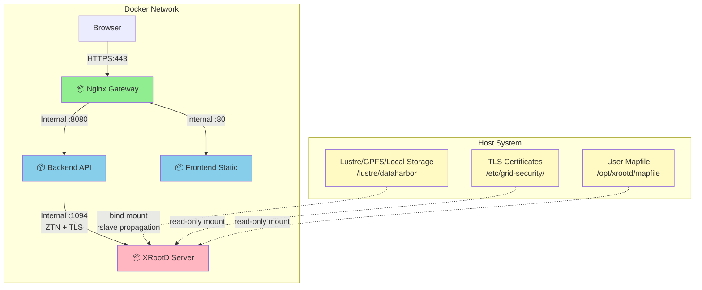
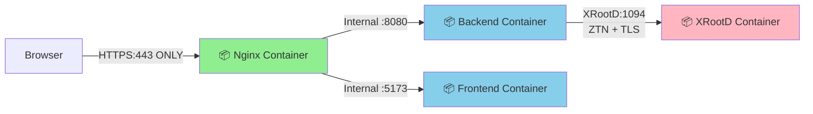

# DataHarbor - Docker Deployment Guide

[← Back to Main README](../README.md) | [Documentation](../docs/README.md)

Complete guide for deploying DataHarbor using Docker Compose in both development and production environments.

## Architecture

### Production Deployment



**Containers:** Nginx Gateway • Backend (Go) • Frontend (Nginx) • XRootD Server
**Host Mounts:** Data directory (Lustre/GPFS/local) • TLS certificates • User mapfile
**Configuration:** All config files baked into images; deployment settings via `.env` file
**Security:** ZTN (Zero Trust Networking) + TLS encryption • User mapping • Resource limits

### Development Deployment



**Containers:** Nginx Gateway • Backend (Go dev server) • Frontend (Vite dev server) • XRootD Server
**Security:** ZTN (Zero Trust Networking) + TLS encryption with self-signed certificates

## Table of Contents

- [Overview](#overview)
- [Prerequisites](#prerequisites)
- [Quick Start](#quick-start)
- [Directory Structure](#directory-structure)
- [Configuration](#configuration)
- [Development Deployment](#development-deployment)
- [Production Deployment](#production-deployment)
- [Certificate Management](#certificate-management)
- [Troubleshooting](#troubleshooting)
- [Maintenance](#maintenance)

## Overview

DataHarbor provides three Docker Compose configurations:

| File                            | Purpose                  | Use Case                                               |
| ------------------------------- | ------------------------ | ------------------------------------------------------ |
| **`docker-compose.yml`**        | Development              | Local dev with hot reload, Vite HMR, self-signed certs |
| **`docker-compose.deploy.yml`** | Production (recommended) | Deploy pre-built images from GHCR                      |
| **`docker-compose.prod.yml`**   | Production (alternative) | Build images locally from source                       |

**For production deployment, use `docker-compose.deploy.yml`** (pulls pre-built images from GitHub Container Registry). Use `docker-compose.prod.yml` only if you need to build images locally.

**CI/CD:** Docker images are automatically built and pushed to GHCR only on releases (not on PRs to save CI minutes). For development builds, use the manual build script: `./scripts/build-docker.sh`

### Container Services

Both deployments run the following containers:

| Service      | Development                   | Production              | Purpose                        |
| ------------ | ----------------------------- | ----------------------- | ------------------------------ |
| **nginx**    | Gateway with HTTPS            | Gateway with HTTPS      | Reverse proxy, SSL termination |
| **backend**  | Go dev server (hot reload)    | Compiled Go binary      | REST API, XRootD client        |
| **frontend** | Vite dev server (HMR)         | Nginx static server     | Vue.js web interface           |
| **xrootd**   | Dev config, self-signed certs | Prod config, host certs | Storage server                 |

### Container Architecture (CPU Platform)

| Image        | CI/Release Builds         | Local Dev Builds          | Reason                                           |
| ------------ | ------------------------- | ------------------------- | ------------------------------------------------ |
| **backend**  | linux/amd64 + linux/arm64 | linux/amd64 + linux/arm64 | Go cross-compiles natively (no emulation needed) |
| **frontend** | linux/amd64 + linux/arm64 | linux/amd64 + linux/arm64 | Node.js + nginx have native ARM64 support        |
| **nginx**    | linux/amd64 + linux/arm64 | linux/amd64 + linux/arm64 | nginx has native ARM64 images                    |
| **xrootd**   | linux/amd64 only          | linux/amd64 only          | CERN/OSG XRootD packages are x86_64 only         |

**Notes:**

- **ARM64 Mac users**: backend, frontend, and nginx run natively; xrootd uses QEMU emulation
- **AMD64 Linux**: All containers run natively
- **Multi-arch images**: Docker automatically pulls the correct architecture for your platform

### Production XRootD Setup

Production deployment includes a **containerized XRootD server** that serves data from the host filesystem:

- **Lustre/GPFS Support**: Bind mount with proper propagation (`rslave`)
- **Host Certificates**: TLS certificates mounted from host system
- **User Mapping**: External mapfile for token-to-Unix-user mapping
- **Performance**: Near-zero overhead (~1% CPU), respects Lustre striping
- **Security**: SELinux/AppArmor aware, resource limits, TLS verification

**Key Architecture Points:**
- XRootD runs in container but serves host filesystem (Lustre/GPFS/local storage)
- Bind mount with `rslave` propagation ensures Lustre mount changes propagate to container
- No data copying - direct I/O path: XRootD → Lustre client → Network → Lustre servers
- Extended attributes enabled for Lustre striping information
- User mapping via external mapfile (UIDs must match host filesystem UIDs)

**Path Mapping (Production):**
- Your `XROOTD_DATA_DIR` (e.g., `/lustre/dataharbor`) is mounted at `/data` inside the container
- XRootD uses `oss.localroot /data` to map client path `/` → container path `/data`
- Users see `/` as the root in the file browser, which maps to your `XROOTD_DATA_DIR`
- SciTokens `base_path = /` allows access to the entire exported path

## Quick Start

### Development (with local XRootD)

```bash
cd docker
docker compose up -d

# Access application
open https://localhost
```

### Production (with containerized XRootD serving host filesystem)

**Option A: Using the deploy bundle from a GitHub release (recommended)**

Each [GitHub release](https://github.com/AnarManafov/dataharbor/releases) includes a deployment bundle (`dataharbor-deploy-<version>.tar.gz`) containing the Compose file and an `.env` template. No need to clone the full repository.

```bash
# 1. Download and extract the deploy bundle from the release page
VERSION=0.15.0  # Replace with the desired release version
tar xzf dataharbor-deploy-${VERSION}.tar.gz
cd dataharbor-deploy-${VERSION}

# 2. Configure environment
cp .env.example .env
nano .env

# 3. Deploy (pulls images from GHCR)
VERSION=${VERSION} docker compose up -d

# 4. Verify
docker compose ps
```

**Option B: Using pre-built GHCR images with the full repository**

```bash
cd docker

# 1. Configure environment
cp .env.production.example .env
nano .env

# Required settings - see "Required Environment Variables" section below

# 2. Deploy (pulls images from GHCR)
docker compose -f docker-compose.deploy.yml up -d

# 3. Verify
docker compose -f docker-compose.deploy.yml ps

# Deploy specific version
VERSION=0.14.6 docker compose -f docker-compose.deploy.yml up -d

# Deploy dev build (built with scripts/build-docker.sh)
VERSION=dev docker compose -f docker-compose.deploy.yml up -d
```

**Option C: Build images locally**

```bash
cd docker

# 1. Configure environment
cp .env.production.example .env
nano .env

# 2. Build and deploy
docker compose -f docker-compose.prod.yml build
docker compose -f docker-compose.prod.yml up -d

# 3. Verify
docker compose -f docker-compose.prod.yml ps
docker logs dataharbor-xrootd-prod
```

## Prerequisites

### Required Software

- **Docker** 24.0+ with Compose V2
- **Docker Compose** 2.20+
- **Docker Buildx** (for development deployment only - optimized multi-stage builds)
- **Git** (for version info in builds)

### System Requirements

- **CPU:** 2+ cores
- **RAM:** 4GB minimum, 8GB recommended
- **Disk:** 10GB free space

### For Development

- **WSL2** (Windows), colima (macOS) or native Linux/macOS
- **Go** 1.25+ (optional, for local development without devcontainers)
- **Node.js** 22+ (optional, for local development without devcontainers)

### Apple Silicon (ARM64) Users - QEMU Setup

The XRootD container requires `linux/amd64` (x86_64) architecture. On Apple Silicon Macs, you need **QEMU emulation** to run x86_64 containers.

#### Checking QEMU Support

Docker supports QEMU natively via the `tonistiigi/binfmt` image. First, check if QEMU is already configured:

```bash
# Check current emulation support
docker run --privileged --rm tonistiigi/binfmt

# Expected output shows supported platforms and emulators:
# {
#   "supported": ["linux/arm64", "linux/amd64", ...],
#   "emulators": ["qemu-x86_64", ...]
# }
```

#### Installing QEMU Support

If QEMU is not configured or you need to reinstall it:

```bash
# Install QEMU emulators for all architectures
docker run --privileged --rm tonistiigi/binfmt --install all

# Or install only x86_64 support (sufficient for XRootD)
docker run --privileged --rm tonistiigi/binfmt --install amd64
```

This registers QEMU handlers in the Linux kernel's `binfmt_misc` system, enabling automatic emulation of foreign binaries.

#### Verifying QEMU Setup

After installation, verify x86_64 emulation works:

```bash
# Test running an x86_64 container on ARM64 host
docker run --rm --platform linux/amd64 alpine uname -m
# Should output: x86_64

# Check buildx supported platforms
docker buildx ls
# Should show: linux/amd64, linux/arm64, etc.
```

### Installing Docker Buildx

Docker Buildx should come bundled with Docker Desktop. If you're using Docker separately or encounter issues:

**macOS (Homebrew):**
```bash
# Install buildx
brew install docker-buildx

# Create Docker CLI plugins directory
mkdir -p ~/.docker/cli-plugins

# Link buildx as a Docker plugin
ln -sf /opt/homebrew/bin/docker-buildx ~/.docker/cli-plugins/docker-buildx

# Verify installation
docker buildx version
```

**Linux:**
```bash
# Download latest buildx
mkdir -p ~/.docker/cli-plugins
curl -Lo ~/.docker/cli-plugins/docker-buildx \
    https://github.com/docker/buildx/releases/latest/download/buildx-linux-amd64

# Make it executable
chmod +x ~/.docker/cli-plugins/docker-buildx

# Verify installation
docker buildx version
```

**Why Buildx is needed:**
- **Development only:** Required for `docker-compose.yml` which uses `target: builder` for hot reload
- Production deployment (`docker-compose.prod.yml`) does not require Buildx
- Buildx provides optimized caching and faster builds for multi-stage Dockerfiles
- Without it, you'll see warnings but builds will still work using legacy builder

## Directory Structure

```text
docker/
├── docker-compose.yml          # Development deployment
├── docker-compose.prod.yml     # Production build (builds images locally)
├── docker-compose.deploy.yml   # Production deployment (pulls from GHCR)
├── .env.example                # Development environment template
├── .env.production.example     # Production environment template
├── .dockerignore               # Docker ignore patterns
├── README.md                   # This file
├── backend/                    # Backend container
│   ├── Dockerfile
│   ├── .dockerignore
│   └── README.md
├── frontend/                   # Frontend container
│   ├── Dockerfile              # Production build
│   ├── Dockerfile.dev          # Development build
│   ├── nginx.conf              # Static file server config
│   ├── .dockerignore
│   └── README.md
├── nginx/                      # Nginx gateway
│   ├── Dockerfile
│   ├── docker-entrypoint.sh    # Entrypoint with config templating
│   ├── nginx.conf              # Main configuration
│   └── README.md
├── xrootd/                     # XRootD server
│   ├── Dockerfile              # Development multi-stage Dockerfile
│   ├── Dockerfile.prod         # Production Dockerfile (SciTokens, multiuser)
│   ├── README.md
│   ├── configs/                # XRootD configuration files (baked into images)
│   │   ├── xrootd-dev.cfg      # Development config
│   │   ├── xrootd-prod.cfg     # Production config (envsubst template)
│   │   ├── scitokens.cfg       # SciTokens base config
│   │   ├── scitokens_dev.cfg   # SciTokens dev config
│   │   ├── scitokens_prod.cfg  # SciTokens prod config (envsubst template)
│   │   └── mapfile             # Default empty user mapping file
│   └── scripts/                # Setup scripts
│       ├── docker-entrypoint.sh      # Development entrypoint
│       ├── docker-entrypoint-prod.sh # Production entrypoint (envsubst rendering)
│       └── setup-test-data.sh        # Test data generator
├── cert-init/                  # Certificate initialization
│   ├── Dockerfile
│   ├── generate-dev-certs.sh   # Self-signed cert generator
│   └── README.md
└── config/                     # Application configuration
    └── application.yaml        # Backend config (baked into image)
```

## Container Documentation

See component-specific documentation:

- [Backend Documentation](backend/README.md) - Go service details
- [Frontend Documentation](frontend/README.md) - Vue.js web interface
- [Nginx Documentation](nginx/README.md) - Gateway configuration
- [XRootD Documentation](xrootd/README.md) - Storage server setup

## Configuration

### Environment Variables

Create `.env` from template:

```bash
cd docker
# For development:
cp .env.example .env
# For production:
cp .env.production.example .env

nano .env
```

#### Development Variables

```bash
# Host project path (REQUIRED for development)
# Path to project root as seen by Docker daemon
HOST_PROJECT_ROOT=/path/to/dataharbor

# Authentication (OIDC)
AUTH_ENABLED=true
OIDC_ISSUER=https://id.gsi.de/realms/wl
OIDC_CLIENT_ID=your-client-id
OIDC_CLIENT_SECRET=your-client-secret
OIDC_DISCOVERY_URL=https://id.gsi.de/realms/wl/.well-known/openid-configuration
OIDC_SESSION_SECRET=$(openssl rand -hex 32)

# SSL Certificates (for nginx gateway)
SSL_CERT_PATH=/path/to/server.crt
SSL_KEY_PATH=/path/to/server.key

# XRootD data directory (optional - defaults to named volume)
# This directory will be mounted as /data in the XRootD container
XROOTD_DATA_DIR=./xrootd-data

# Logging
LOG_LEVEL=info                      # debug, info, warn, error
```

#### Production Variables

```bash
# XRootD Server Connection
XRD_HOST=xrootd                     # Service name for container, or external hostname
XRD_PORT=1094
XRD_INITIAL_DIR=/
XRD_ENABLE_ZTN=true

# XRootD Data Directory (REQUIRED)
XROOTD_DATA_DIR=/lustre/dataharbor  # or /data/xrootd

# XRootD TLS Certificates (REQUIRED)
XRD_CERT_PATH=/etc/grid-security/hostcert.pem
XRD_KEY_PATH=/etc/grid-security/hostkey.pem

# XRootD User Mapfile (REQUIRED)
XRD_MAPFILE_PATH=/opt/xrootd/mapfile

# XRootD TLS CA Verification
# Set to false for self-signed certs in staging/testing
XROOTD_TLS_CA_VERIFY=true

# XRootD CA Certificates (optional - for TLS verification)
CA_CERTS_PATH=/etc/grid-security/certificates

# SciTokens audience (defaults to OIDC_ISSUER if not set)
# Only set if your token audience differs from the issuer URL
# SCITOKENS_AUDIENCE=https://id.gsi.de/realms/wl

# XRootD Client Certificates (optional - for backend ZTN auth)
XRD_CLIENT_CERT_PATH=./certs/client

# XRootD Logging
XROOTD_LOG_DIR=./logs/xrootd

# Nginx SSL Certificates (REQUIRED)
SSL_CERT_PATH=/etc/letsencrypt/live/yourdomain.com/fullchain.pem
SSL_KEY_PATH=/etc/letsencrypt/live/yourdomain.com/privkey.pem

# Authentication (OIDC)
AUTH_ENABLED=true
OIDC_ISSUER=https://id.gsi.de/realms/wl
OIDC_CLIENT_ID=your-client-id
OIDC_CLIENT_SECRET=your-client-secret
OIDC_DISCOVERY_URL=https://id.gsi.de/realms/wl/.well-known/openid-configuration
OIDC_SESSION_SECRET=$(openssl rand -hex 32)

# Frontend / CORS
# Public URL of the deployment (used for CORS and frontend URL)
# CORS_ALLOW_ORIGINS=https://yourdomain.com
# FRONTEND_URL=https://yourdomain.com

# Logging and Timezone
LOG_LEVEL=info                      # debug, info, warn, error
TZ=UTC                              # or Europe/Berlin, America/New_York
```

### XRootD Configuration

In development, XRootD runs as a local container:

```bash
# XRootD settings (hardcoded in docker-compose.yml)
# Backend connects to: xrootd:1094
# Optional: Mount local directory for testing
XROOTD_DATA_DIR=./xrootd-data        # Mounted as /data in container
```

**Development Notes:**

- XRootD runs locally with **self-signed certificates**
- **`XROOTD_DATA_DIR`** mounts a directory into XRootD at `/data`
- ZTN (Zero Trust Networking) is enabled by default
- Files in the data directory can be accessed via `xroot://localhost:1094/data/`

In production, configure these settings based on your XRootD deployment:

```bash
XRD_HOST=xrootd                      # Container service name (default)
XRD_PORT=1094
XRD_ENABLE_ZTN=true                  # Must match server's ZTN configuration
XRD_INITIAL_DIR=/                    # Initial directory path
```

**Production Notes:**

- XRootD runs as a container with **production certificates** mounted from the host
- XRootD configuration (`xrootd-prod.cfg`, `scitokens_prod.cfg`) is **baked into the Docker image**
- Environment-specific values (SciTokens issuer/audience, TLS CA settings) are rendered at container startup via `envsubst`
- Configure **`XRD_HOST`** to point to your XRootD service
- Ensure **`XRD_ENABLE_ZTN`** matches the server configuration

### Application Configuration

Backend uses `config/application.yaml` which is **baked into the Docker image** at build time. All values are overridable at runtime via `DATAHARBOR_*` environment variables (Viper's `AutomaticEnv`), which are set from the `.env` file through the Compose environment section.

The XRootD configuration (`xrootd-prod.cfg`, `scitokens_prod.cfg`) is also baked into the image. The production entrypoint uses `envsubst` to render environment-specific values (like `SCITOKENS_ISSUER`, `SCITOKENS_AUDIENCE`) and generates the TLS CA config based on the `XROOTD_TLS_CA_VERIFY` setting.

**You do not need to mount or manage configuration files.** All deployment-specific settings are controlled via the `.env` file.

### Certificate Management

- **`SSL_CERT_PATH`** and **`SSL_KEY_PATH`** - Paths to your SSL certificates
- **Development:** Self-signed certificates are auto-generated by Nginx container
- **Production:** Copy your production certificates to `certs/` directory

#### Auto-Generated Development Certificates

The development Nginx container automatically generates self-signed certificates on first startup if they don't exist. Browser will show security warning - this is expected for development.

#### Production Certificates

```bash
# Create certificates directory
mkdir -p certs

# Copy your SSL certificates
cp /path/to/your/server.crt certs/
cp /path/to/your/server.key certs/

# Set proper permissions
chmod 644 certs/server.crt
chmod 600 certs/server.key
```

## Development Deployment

Development setup includes XRootD server, source code mounting, and hot reload.

### Environment Setup

Before starting, create a `.env` file from the template:

```bash
cd docker
cp .env.example .env
```

Edit `.env` and set the **required** `HOST_PROJECT_ROOT` variable:

```bash
# HOST_PROJECT_ROOT - Path to the project root as seen by Docker daemon
#
# macOS/Linux (native Docker):
HOST_PROJECT_ROOT=/Users/yourname/projects/dataharbor

# WSL2 with Docker (running inside WSL):
HOST_PROJECT_ROOT=/home/yourname/workspace/dataharbor

# VS Code devcontainer (Docker-from-Docker):
# Use the HOST path, not /workspaces/... path inside the container
HOST_PROJECT_ROOT=/home/yourname/workspace/dataharbor
```

**Why is this needed?** Volume mounts for hot reload require the path as seen by the Docker daemon, which may differ from your working directory (especially in devcontainers).

### Start Development Environment

```bash
cd docker

# Start all services including XRootD
docker compose up -d

# View logs
docker compose logs -f

# Stop services
docker compose down
```

### Development Features

- **Hot Reload:** Source code changes are reflected immediately
- **XRootD Server:** Runs locally with ZTN/TLS enabled
- **Self-Signed Certs:** Automatically generated by `cert-init` service
- **Data Directory:** Optional `XROOTD_DATA_DIR` mounts a host directory as `/data` in XRootD (defaults to named volume)
- **Access:**
  - Gateway (HTTPS only): <https://localhost>
  - XRootD: xroot://localhost:1094
  - **Note:** Backend (8080) and Frontend (5173) ports are NOT exposed externally

### Modifying Source Code

#### Backend Changes

```bash
# Backend uses 'go run' which compiles on startup
# Edit files in app/ directory
nano ../app/controller/file_controller.go

# Restart the backend container to pick up changes
docker compose restart backend

# Or rebuild and restart for a clean state
docker compose up -d --build backend

# Check logs: docker compose logs -f backend
```

#### Frontend Changes

```bash
# Frontend uses Vite dev server with HMR
# Edit files in web/src/ directory
nano ../web/src/views/FileExplorer.vue

# Browser will hot-reload automatically
```

#### XRootD Configuration

```bash
# Edit XRootD configs (requires rebuild since configs are built into container)
nano xrootd/configs/xrootd-dev.cfg      # For development
nano xrootd/configs/xrootd-prod.cfg     # For production

# Rebuild and restart XRootD container
docker compose build xrootd
docker compose up -d xrootd
```

### Debugging

```bash
# Check container status
docker compose ps

# View logs for specific service
docker compose logs -f backend
docker compose logs -f xrootd

# Execute commands in containers
docker compose exec backend sh
docker compose exec xrootd bash

# Test XRootD connection
docker compose exec xrootd xrdfs localhost:1094 ls /data
```

## Production Deployment

Production deployment uses pre-built images and containerized XRootD server serving host filesystem.

### Prerequisites

1. **Host System Requirements**:
   - Linux host with Lustre/GPFS mount or local storage directory
   - Docker 24.0+ with Compose V2
   - Port 443 (HTTPS) available

2. **Required Files on Host**:
   - **Data directory**: Lustre/GPFS mount or local filesystem (e.g., `/lustre/dataharbor`)
   - **XRootD TLS certificates**: Host certificate and private key
   - **Nginx SSL certificates**: For HTTPS gateway (can be same as XRootD certs)
   - **User mapfile**: JSON file mapping token usernames to Unix users
   - **CA certificates**: For TLS verification (optional for testing)

   > **Note:** Application configuration files (backend `application.yaml`, XRootD `xrootd-prod.cfg`, SciTokens `scitokens_prod.cfg`) are baked into the Docker images. You do not need to create or manage them on the host.

3. **User Mapping Requirements**:
   - Unix users in mapfile **must exist on host system**
   - UIDs must match between host and filesystem (critical for Lustre/NFS)
   - Users must have proper permissions on data directory

### Required Environment Variables

Create `.env.production.example` → `.env` and configure:

```bash
# === XROOTD DATA DIRECTORY (REQUIRED) ===
# Path on HOST to serve via XRootD
XROOTD_DATA_DIR=/lustre/dataharbor    # Lustre mount
# XROOTD_DATA_DIR=/data/xrootd        # or local storage

# === XROOTD TLS CERTIFICATES (REQUIRED) ===
# Paths on HOST to TLS certificate files
XRD_CERT_PATH=/etc/grid-security/hostcert.pem
XRD_KEY_PATH=/etc/grid-security/hostkey.pem

# === USER MAPFILE (REQUIRED) ===
# Path on HOST to user mapping file
XRD_MAPFILE_PATH=/opt/xrootd/mapfile

# === NGINX SSL CERTIFICATES (REQUIRED) ===
# Paths on HOST to SSL certificate for HTTPS gateway
SSL_CERT_PATH=/etc/letsencrypt/live/yourdomain.com/fullchain.pem
SSL_KEY_PATH=/etc/letsencrypt/live/yourdomain.com/privkey.pem

# === CA CERTIFICATES (OPTIONAL) ===
# For TLS verification - comment out for self-signed certs
CA_CERTS_PATH=/etc/grid-security/certificates

# === AUTHENTICATION (REQUIRED) ===
OIDC_ISSUER=https://id.gsi.de/realms/wl
OIDC_CLIENT_ID=your-client-id
OIDC_CLIENT_SECRET=your-client-secret
OIDC_DISCOVERY_URL=https://id.gsi.de/realms/wl/.well-known/openid-configuration
OIDC_SESSION_SECRET=$(openssl rand -hex 32)

# === XROOTD CONFIGURATION (OPTIONAL) ===
XRD_HOST=xrootd                        # Service name (default)
XRD_PORT=1094                          # XRootD port (default)
XROOTD_LOG_DIR=./logs/xrootd          # Host directory for logs

# === TLS CA VERIFICATION (OPTIONAL) ===
# Set to false for self-signed certs (staging/testing)
XROOTD_TLS_CA_VERIFY=true

# === SCITOKENS (OPTIONAL) ===
# Audience claim — defaults to OIDC_ISSUER if not set
# SCITOKENS_AUDIENCE=https://id.gsi.de/realms/wl

# === FRONTEND / CORS (OPTIONAL) ===
# Public URL of the deployment (used for CORS and redirects)
# Defaults to https://localhost if not set
# CORS_ALLOW_ORIGINS=https://yourdomain.com
# FRONTEND_URL=https://yourdomain.com
```

### User Mapfile Setup

Create mapfile at `/opt/xrootd/mapfile` on host:

```bash
sudo mkdir -p /opt/xrootd
sudo nano /opt/xrootd/mapfile
```

**Format** (JSON):
```json
[
  {
    "sub": "alice",
    "result": "alice"
  },
  {
    "sub": "bob.smith",
    "result": "bobsmith"
  }
]
```

**Critical Requirements**:
1. `"result"` users **must exist on host**: `id alice` should work
2. UIDs must match filesystem (especially for Lustre/NFS)
3. Users must have permissions on `XROOTD_DATA_DIR`

**Example for Lustre**:
```bash
# On host where Lustre is mounted
sudo useradd -u 1001 alice
sudo chown alice:alice /lustre/dataharbor/alice-data
ls -ln /lustre/dataharbor/alice-data  # Should show UID 1001
```

### Lustre-Specific Configuration

#### Bind Mount Propagation

The `docker-compose.prod.yml` automatically uses `rslave` propagation:

```yaml
volumes:
  - type: bind
    source: ${XROOTD_DATA_DIR}
    target: /data
    bind:
      propagation: rslave  # Critical for Lustre!
```

**Why `rslave`?**
- Ensures Lustre mount changes on host propagate to container
- Required for dynamic mount updates
- Prevents stale mount references

#### SELinux/AppArmor Issues

If SELinux or AppArmor blocks container access to Lustre:

**Option 1: Set SELinux context** (recommended)
```bash
sudo chcon -Rt svirt_sandbox_file_t /lustre/dataharbor
```

**Option 2: Disable confinement** (less secure)

Uncomment in `docker-compose.prod.yml`:
```yaml
xrootd:
  security_opt:
    - label:disable
    - apparmor:unconfined
```

#### Performance Optimizations

The production config includes Lustre optimizations:

```properties
# xrootd-prod.cfg (already configured)
ofs.xattr * on                         # Required for Lustre striping
```

**Performance Characteristics**:
- **Bind mount overhead**: <1% CPU, negligible memory
- **I/O path**: XRootD → Lustre client → Network → Lustre servers (no buffering)
- **Lustre striping**: Automatically respected
- **TLS overhead**: ~5-10% (acceptable for security)

### Deployment Steps

#### 1. Prepare Host System

```bash
# Create data directory (or use existing Lustre mount)
# For Lustre: Use existing mount point
# For local: Create directory
sudo mkdir -p /data/xrootd
sudo chown -R $(id -u):$(id -g) /data/xrootd

# Prepare certificates directory
sudo mkdir -p /etc/xrootd-prod
sudo cp /path/to/hostcert.pem /etc/xrootd-prod/
sudo cp /path/to/hostkey.pem /etc/xrootd-prod/
sudo chmod 644 /etc/xrootd-prod/hostcert.pem
sudo chmod 600 /etc/xrootd-prod/hostkey.pem

# Create user mapfile
sudo nano /opt/xrootd/mapfile
# (Add JSON user mappings as shown above)

# Create users on host
sudo useradd -u 1001 alice
sudo useradd -u 1002 bob
```

#### 2. Configure Environment

```bash
# Option A: From deploy bundle (downloaded from GitHub release)
cd dataharbor-deploy-<version>
cp .env.example .env
nano .env

# Option B: From repository source
cd docker
cp .env.production.example .env
nano .env
```

Set these required variables:
- `XROOTD_DATA_DIR`
- `XRD_CERT_PATH`, `XRD_KEY_PATH`
- `XRD_MAPFILE_PATH`
- `SSL_CERT_PATH`, `SSL_KEY_PATH`
- `OIDC_*` variables
- `CORS_ALLOW_ORIGINS`, `FRONTEND_URL` (if not using localhost)

#### 3. Deploy Services

```bash
# Using deploy bundle (pulls pre-built images from GHCR)
VERSION=<version> docker compose up -d

# OR using repository with pre-built images
docker compose -f docker-compose.deploy.yml up -d

# OR build images locally from source
docker compose -f docker-compose.prod.yml build
docker compose -f docker-compose.prod.yml up -d

# Check status
docker compose ps
```

#### 4. Verify Deployment

```bash
# Check XRootD startup logs
docker logs dataharbor-xrootd-prod

# Look for these confirmations:
# [+] TLS Certificates verified
# [+] User mapfile verified
# [+] Data directory verified
# [+] Filesystem type: lustre (if using Lustre)

# Test XRootD connection
docker exec dataharbor-xrootd-prod xrdfs localhost:1094 query config version

# Check mounted filesystem
docker exec dataharbor-xrootd-prod df -h /data

# Test HTTPS gateway
curl -k https://localhost/health
```

### Production Monitoring

```bash
# View real-time logs
docker compose logs -f

# Check resource usage
docker stats

# View nginx access logs
docker compose exec nginx tail -f /var/log/nginx/dataharbor-access.log

# View backend logs
docker compose exec backend tail -f /app/log/dataharbor.log
```

### Staging with Self-Signed Certificates

For staging/testing environments where you don't have CA-signed certificates, you can use self-signed certificates:

#### 1. Generate Self-Signed Certificates

```bash
# Create certificates directory
mkdir -p certs

# Generate self-signed certificate (valid for 365 days)
openssl req -x509 -nodes -days 365 -newkey rsa:2048 \
  -keyout certs/server.key \
  -out certs/server.crt \
  -subj "/C=US/ST=State/L=City/O=Organization/CN=localhost"

# Set proper permissions
chmod 644 certs/server.crt
chmod 600 certs/server.key
```

#### 2. Configure Environment for Self-Signed Certs

In your `.env` file, point to the self-signed certificates:

```bash
# Use self-signed certs for both nginx and XRootD
SSL_CERT_PATH=./certs/server.crt
SSL_KEY_PATH=./certs/server.key
XRD_CERT_PATH=./certs/server.crt
XRD_KEY_PATH=./certs/server.key
```

#### 3. Disable TLS CA Verification in XRootD

For self-signed certificates, set the following in your `.env` file:

```bash
# For self-signed certificates - disable CA verification
XROOTD_TLS_CA_VERIFY=false
```

The production entrypoint will generate the appropriate XRootD TLS configuration at startup based on this setting.

**⚠️ Security Warning:** Only set `XROOTD_TLS_CA_VERIFY=false` for staging/testing. For production with real CA certificates, keep the default (`true`) and set `CA_CERTS_PATH` to your CA certificate directory.

#### 4. Deploy and Test

```bash
# Deploy
docker compose -f docker-compose.deploy.yml up -d

# Test (use -k to skip certificate verification in curl)
curl -k https://localhost/health
```

## Certificate Management

### Development (Self-Signed Certificates)

Development uses self-signed certificates generated automatically:

```bash
# Certificates are generated in XRootD container startup
# Located at: /etc/xrootd/hostcert.pem and /etc/xrootd/hostkey.pem

# View certificate details
docker compose exec xrootd openssl x509 -in /etc/xrootd/hostcert.pem -text -noout

# Regenerate certificates
docker compose exec xrootd /usr/local/bin/generate-certs.sh
docker compose restart xrootd nginx
```

### Production (Real Certificates)

#### Option 1: Let's Encrypt

```bash
# Install certbot
sudo apt-get install certbot

# Generate certificate
sudo certbot certonly --standalone -d yourdomain.com

# Copy to docker directory
cp /etc/letsencrypt/live/yourdomain.com/fullchain.pem docker/certs/server.crt
cp /etc/letsencrypt/live/yourdomain.com/privkey.pem docker/certs/server.key
```

#### Option 2: Organizational CA

```bash
# Request certificate from your organization's CA
# Copy provided certificates to docker/certs/

# Update .env file
SSL_CERT_PATH=./certs/server.crt
SSL_KEY_PATH=./certs/server.key
```

#### Certificate Renewal

```bash
# Update certificates
cp /path/to/new/cert.crt docker/certs/server.crt
cp /path/to/new/key.key docker/certs/server.key

# Reload nginx
docker compose exec nginx nginx -s reload
```

## Troubleshooting

### Container Won't Start

```bash
# Check logs
docker compose logs [service-name]

# Check container status
docker compose ps

# Remove and recreate
docker compose down
docker compose up -d
```

### Backend Cannot Connect to XRootD

```bash
# Check XRootD is accessible
docker compose exec backend ping xrootd

# Test XRootD connection
docker compose exec backend wget -O- http://xrootd:1094

# Check backend logs
docker compose logs backend | grep -i xrootd
```

### Authentication Issues

```bash
# Verify OIDC configuration
docker compose exec backend env | grep OIDC

# Test OIDC discovery endpoint
curl https://id.gsi.de/realms/wl/.well-known/openid-configuration

# Check backend logs for auth errors
docker compose logs backend | grep -i auth
```

### SSL/TLS Issues

```bash
# Verify certificate files exist
ls -la certs/

# Check certificate validity
openssl x509 -in certs/server.crt -text -noout

# Test HTTPS connection
curl -v -k https://localhost:443/health
```

### Permission Issues (XRootD)

```bash
# Check XRootD user mapping
docker compose exec xrootd cat /etc/xrootd/mapfile

# Check file permissions in mounted directory
docker compose exec xrootd ls -la /data

# Check XRootD logs
docker compose exec xrootd tail -f /var/log/xrootd/xrootd.log

# Verify user exists in container
docker exec dataharbor-xrootd-prod id alice
```

### Lustre-Specific Issues

#### Filesystem Not Accessible

```bash
# Check if Lustre is mounted on host
df -h | grep lustre
mount | grep lustre

# Check SELinux is not blocking
sudo ausearch -m avc -ts recent | grep xrootd

# Fix SELinux context
sudo chcon -Rt svirt_sandbox_file_t /lustre/dataharbor

# Verify bind mount in container
docker exec dataharbor-xrootd-prod df -h /data
docker exec dataharbor-xrootd-prod df -T /data  # Show filesystem type
```

#### User Mapping Fails

```bash
# Verify user exists on host
id alice

# Verify UID matches in container and on Lustre
ls -ln /lustre/dataharbor/alice-data        # On host
docker exec dataharbor-xrootd-prod ls -ln /data/alice-data  # In container

# Check mapfile syntax
cat /opt/xrootd/mapfile | python3 -m json.tool
```

#### Lustre Mount Changes Not Reflected

```bash
# Check bind mount propagation
docker inspect dataharbor-xrootd-prod | grep -A5 "Propagation"

# Should show: "Propagation": "rslave"

# If not, update docker-compose.prod.yml and recreate container
docker compose -f docker-compose.prod.yml up -d --force-recreate xrootd
```

#### XRootD Performance Issues on Lustre

```bash
# Check Lustre striping
lfs getstripe /lustre/dataharbor

# View XRootD trace logs
docker exec dataharbor-xrootd-prod tail -f /var/log/xrootd/xrootd.log

# Check for Lustre errors on host
dmesg | grep -i lustre

# Verify extended attributes are accessible
docker exec dataharbor-xrootd-prod getfattr -d /data
```

## Maintenance

### Updating Images

**Using pre-built images (deploy bundle or GHCR):**
```bash
# Update to a new version
VERSION=0.16.0 docker compose pull
VERSION=0.16.0 docker compose up -d

# Or pull latest
docker compose pull
docker compose up -d
```

**Building locally from source:**
```bash
git pull
docker compose -f docker-compose.prod.yml build --no-cache
docker compose -f docker-compose.prod.yml up -d
```

### Backup and Restore

```bash
# Backup configuration (only .env and certificates needed — configs are baked into images)
tar -czf dataharbor-config-$(date +%Y%m%d).tar.gz \
  .env \
  certs/

# Backup logs
docker compose cp backend:/app/log ./backup/backend-logs
docker compose cp nginx:/var/log/nginx ./backup/nginx-logs

# Restore
tar -xzf dataharbor-config-YYYYMMDD.tar.gz
docker compose up -d
```

### Log Rotation

```bash
# Configure Docker log rotation in /etc/docker/daemon.json
{
  "log-driver": "json-file",
  "log-opts": {
    "max-size": "10m",
    "max-file": "3"
  }
}

# Restart Docker daemon
sudo systemctl restart docker
```

### Cleanup

```bash
# Remove stopped containers
docker compose down

# Remove images
docker compose down --rmi all

# Remove volumes (WARNING: deletes data!)
docker compose down -v

# Clean unused Docker resources
docker system prune -a
```

## Advanced Configuration

### Custom Network

```yaml
# In docker-compose.prod.yml
networks:
  dataharbor-network:
    driver: bridge
    ipam:
      config:
        - subnet: 172.20.0.0/16
          gateway: 172.20.0.1
```

### Resource Limits

```yaml
# Add to services in docker-compose.prod.yml
deploy:
  resources:
    limits:
      cpus: '2'
      memory: 2G
    reservations:
      cpus: '1'
      memory: 1G
```

### Health Check Customization

```yaml
# Modify health check intervals
healthcheck:
  test: ["CMD", "wget", "--spider", "http://localhost:8080/health"]
  interval: 60s
  timeout: 5s
  start_period: 30s
  retries: 5
```

## Security Best Practices

1. **Never commit `.env` file** - Contains sensitive secrets
2. **Use strong passwords** - Generate with `openssl rand -hex 32`
3. **Keep certificates secure** - Restrict file permissions (600 for keys)
4. **Update regularly** - Pull latest images and rebuild
5. **Monitor logs** - Check for suspicious activity
6. **Use network isolation** - Keep services on internal Docker network
7. **Enable firewall** - Only expose port 443 (HTTPS)
8. **Use HTTPS only** - Port 80 is NOT exposed externally
9. **TLS verification** - Always use CA verification in production (`XROOTD_TLS_CA_VERIFY=true`)
10. **User mapping audit** - Only authorized users in mapfile
11. **Resource limits** - Enable CPU/memory limits to prevent DoS
12. **Lustre quotas** - User quotas on Lustre are enforced by XRootD
13. **SELinux/AppArmor** - Use confinement when possible, only disable if necessary
14. **Certificate rotation** - Rotate certificates before expiration
15. **UID consistency** - Use LDAP/NIS for consistent UID mapping across cluster

### Production-Specific Security

**For Lustre/GPFS deployments**:

- **User synchronization**: Ensure UIDs match between host, container, and filesystem
- **Mapfile protection**: Restrict access to mapfile on host (`chmod 600 /opt/xrootd/mapfile`)
- **Data directory permissions**: Use Lustre ACLs for fine-grained access control
- **Network security**: XRootD port (1094) is internal to Docker network, not exposed externally
- **Audit logging**: Enable XRootD audit plugin for compliance requirements

## Port Exposure

### External Ports (exposed to host)

- **443** - HTTPS (Nginx gateway) - **ONLY port exposed externally**

### Internal Ports (container-to-container only)

- **80** - Frontend static files / Nginx health checks (NOT exposed externally)
- **8080** - Backend API (NOT exposed externally)
- **5173** - Frontend dev server (NOT exposed externally, dev only)
- **1094** - XRootD server (NOT exposed externally, backend access only)

**Security Note:** Only HTTPS (port 443) is accessible from outside. All other ports, including XRootD (1094), are internal to the Docker network and cannot be accessed from the host or external networks. The backend communicates with XRootD via the internal Docker network.

## Support

- **Main Documentation**: [docs/](../docs/)
- **GitHub Issues**: [github.com/AnarManafov/dataharbor/issues](https://github.com/AnarManafov/dataharbor/issues)

---

[← Back to Main README](../README.md) | [Documentation](../docs/README.md) | [↑ Top](#dataharbor---docker-deployment-guide)
