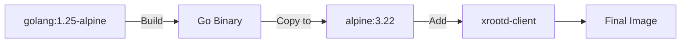

# Backend Container

Go-based backend service for DataHarbor.

## Overview

The backend handles:
- XRootD protocol communication
- OIDC authentication
- REST API endpoints
- File operations

## Build Stages



Multi-stage build keeps image size minimal (~50MB).

## Configuration

### Environment Variables

**Server**:
- `DATAHARBOR_SERVER_ADDRESS` - Listen address (default: `:8080`)
- `DATAHARBOR_SERVER_DEBUG` - Debug mode (default: `false`)
- `DATAHARBOR_ENV` - Environment (`development`/`production`)

**XRootD**:
- `DATAHARBOR_XRD_HOST` - XRootD server hostname
- `DATAHARBOR_XRD_PORT` - XRootD port (default: `1094`)
- `DATAHARBOR_XRD_INITIAL_DIR` - Root directory
- `DATAHARBOR_XRD_ENABLE_ZTN` - Enable ZTN protocol

**Authentication**:
- `DATAHARBOR_AUTH_ENABLED` - Enable OIDC auth
- `DATAHARBOR_AUTH_OIDC_ISSUER` - OIDC issuer URL
- `DATAHARBOR_AUTH_OIDC_CLIENT_ID` - Client ID
- `DATAHARBOR_AUTH_OIDC_CLIENT_SECRET` - Client secret
- `DATAHARBOR_AUTH_OIDC_SESSION_SECRET` - Session encryption key

**Logging**:
- `DATAHARBOR_LOGGING_LEVEL` - Log level (`debug`/`info`/`warn`/`error`)
- `DATAHARBOR_LOGGING_FORMAT` - Format (`text`/`json`)

### Configuration File

Optional YAML config at `/app/config/application.yaml`:

```yaml
env: production
server:
  address: ":8080"
  debug: false
xrd:
  host: "xrootd-server.com"
  port: 1094
  enable_ztn: true
auth:
  enabled: true
```

## Development

### Hot Reload

Development mode uses `go run` for automatic recompilation:

```bash
# Edit source code
nano ../../app/controller/file_controller.go

# Changes picked up automatically
docker compose logs -f backend
```

### Local Testing

```bash
# Access directly
curl http://localhost:8080/health

# View logs
docker compose logs -f backend

# Shell access
docker compose exec backend sh
```

## Production

### Build

```bash
# Build image
docker compose -f docker-compose.prod.yml build backend

# Verify
docker images dataharbor-backend:latest
```

### Health Check

Endpoint: `GET /health`

Returns HTTP 200 if service is healthy.

## Troubleshooting

### Can't connect to XRootD

```bash
# Check hostname resolution
docker compose exec backend ping xrootd

# Check environment
docker compose exec backend env | grep XRD

# Check logs
docker compose logs backend | grep -i xrootd
```

### Authentication errors

```bash
# Verify OIDC config
docker compose exec backend env | grep OIDC

# Test discovery endpoint
curl https://id.gsi.de/realms/wl/.well-known/openid-configuration

# Check logs
docker compose logs backend | grep -i auth
```

### Build failures

```bash
# Clean build cache
docker compose build --no-cache backend

# Check Go modules
cd ../../app && go mod tidy
```

## Ports

- `8080` - HTTP API (internal)
- Exposed via Nginx gateway on port 443

## Dependencies

- `xrootd-client` - XRootD protocol library
- Go 1.25+
- Alpine Linux 3.22

## Security

- Runs as non-root user (`dataharbor:1000`)
- No privileged capabilities required
- Environment-based secrets (no hardcoded credentials)

---

[← Back to Docker README](../README.md)
