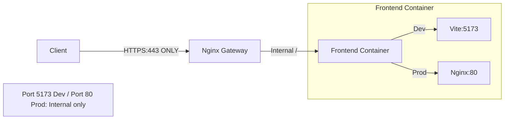

# Frontend Container

Vue.js web interface for DataHarbor.

## Overview

Modern web UI with:

- File browser interface
- OIDC authentication flow
- Real-time file operations
- Responsive design

## Architecture



**Note:** Clients access the frontend through the nginx gateway on port 443 (HTTPS only). Frontend ports (5173 for dev, 80 for prod) are NOT exposed externally - they're internal to the Docker network.

## Build Modes

The frontend operates differently in development vs production:

- **Development**: Vite dev server on port 5173 with Hot Module Reload (HMR)
- **Production**: Pre-built static files served by Nginx on port 80

## Development Mode

**Dockerfile**: `Dockerfile.dev`

Features:

- Vite dev server with HMR (Hot Module Reload)
- Source code mounting
- HTTPS with self-signed certs (from XRootD volume)
- Direct access on port 5173

### Configuration

Environment variables:

- `NODE_ENV=development`
- `VITE_SSL_CERT=/app/certs/server.crt`
- `VITE_SSL_KEY=/app/certs/server.key`

Certificates mounted from `xrootd-certs` volume (auto-generated).

### Development Workflow

```bash
# Edit source files
nano ../../web/src/views/FileExplorer.vue

# Changes auto-reload in browser
# No rebuild needed

# View logs
docker compose logs -f frontend
```

### Direct Access

- **Dev Server:** <https://localhost:5173> (NOT exposed externally - internal only)
- **Via Gateway:** <https://localhost> (recommended - HTTPS only public access)

**Important:** The frontend dev server port 5173 is NOT exposed outside the Docker network. Clients must access the application through the nginx gateway at <https://localhost>.

## Production Mode

**Dockerfile**: `Dockerfile`

Two-stage build:

1. **Build stage**: Compiles Vue app to static files
2. **Runtime stage**: Serves files with Nginx

### Build Process

```bash
# Build production image
docker compose -f docker-compose.prod.yml build frontend

# Verify
docker images dataharbor-frontend:latest
```

### Nginx Configuration

Custom config at `nginx.conf`:

- Serves static files from `/usr/share/nginx/html`
- Runs on port 80 (internal)
- No SSL (handled by gateway)

## Certificate Handling

**Development**: The frontend Vite dev server uses HTTPS with certificates shared from the XRootD container via a Docker volume (`xrootd-certs`). These self-signed certificates are auto-generated and mounted at `/app/certs/` in the frontend container.

**Production**: The frontend runs as a plain HTTP server on port 80 (internal only). All SSL/TLS is handled by the nginx gateway, which terminates HTTPS and forwards plain HTTP requests to the frontend container.

## Configuration Files

### Vite Config

Located in `../../web/vite.config.ts`:

- HTTPS configuration for dev server
- Proxy settings for API calls
- Build optimization

### Environment Variables

Vite uses `.env` files in `../../web/`:

- `.env.development` - Development settings
- `.env.production` - Production settings

## Common Tasks

### Install Dependencies

```bash
# Inside container
docker compose exec frontend npm install

# Or rebuild
docker compose up -d --build frontend
```

### Build for Production

```bash
# Inside container
docker compose exec frontend npm run build

# Output in /app/dist
```

### Linting

```bash
docker compose exec frontend npm run lint
```

## Troubleshooting

### Frontend not loading

```bash
# Check logs
docker compose logs frontend

# Verify health
curl -k https://localhost:5173/

# Check nginx gateway
docker compose logs nginx
```

### Certificate errors in dev

```bash
# Verify cert volume exists
docker volume ls | grep xrootd-certs

# Check cert files
docker compose exec frontend ls -la /app/certs/

# Regenerate certs
docker compose restart xrootd
docker compose restart frontend
```

### Build failures

```bash
# Clear node_modules
docker compose exec frontend rm -rf node_modules
docker compose exec frontend npm install

# Or rebuild image
docker compose build --no-cache frontend
```

### HMR not working

```bash
# Check Vite config
docker compose exec frontend cat vite.config.ts

# Restart dev server
docker compose restart frontend
```

## Ports

- **Dev:** 5173 (HTTPS Vite server - NOT exposed externally, internal only)
- **Prod:** 80 (HTTP, internal only - nginx gateway handles external HTTPS)

## Dependencies

- Node.js 24
- Vue 3
- Vite
- Nginx (production only)

## Performance

**Development**:

- HMR for instant updates
- Source maps enabled
- Debug mode active

**Production**:

- Minified bundles
- Tree-shaking
- Gzip compression (via nginx)
- Static file caching

---

[← Back to Docker README](../README.md)
