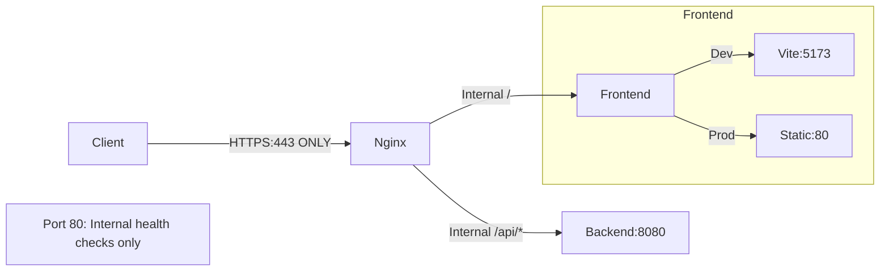
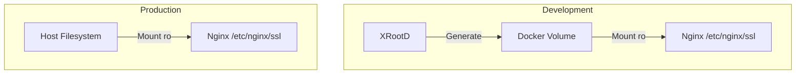

# Nginx Gateway

Reverse proxy and SSL termination for DataHarbor.

## Overview

Nginx acts as the entry point, providing:

- SSL/TLS termination
- Reverse proxy to backend and frontend
- Static file serving
- Health check endpoint

## Architecture



**Note:** Client can only access port 443 (HTTPS). Port 80 is used internally for container health checks.

## Configuration Files

The nginx Dockerfile uses **multi-stage builds** with separate targets for dev and prod:

| Target | Config Baked In        | Frontend Target         | Use Case                        |
| ------ | ---------------------- | ----------------------- | ------------------------------- |
| `dev`  | `dataharbor-dev.conf`  | `https://frontend:5173` | Local development with Vite HMR |
| `prod` | `dataharbor-prod.conf` | `http://frontend:80`    | Production - self-contained     |

### Key Differences

| Feature           | Development            | Production            |
| ----------------- | ---------------------- | --------------------- |
| Frontend protocol | `https://` (Vite TLS)  | `http://` (plain)     |
| Frontend port     | 5173 (Vite dev server) | 80 (nginx static)     |
| WebSocket         | Enabled (HMR)          | Not needed            |
| SSL verification  | Disabled (self-signed) | N/A (no upstream TLS) |

### Building

```bash
# Development image (Vite dev server with HMR)
docker build --target dev -t dataharbor-nginx:dev -f docker/nginx/Dockerfile .

# Production image (static files - self-contained)
docker build --target prod -t dataharbor-nginx:latest -f docker/nginx/Dockerfile .
```

### In Docker Compose

```yaml
# Development (docker-compose.yml)
nginx:
  build:
    dockerfile: docker/nginx/Dockerfile
    target: dev  # Vite dev server on port 5173

# Production (docker-compose.prod.yml / deploy.yml)
nginx:
  build:
    dockerfile: docker/nginx/Dockerfile
    target: prod  # Static files on port 80 - self-contained
```

**Production images from GHCR are built with `target: prod`** - no external config files needed!

### Routes

- `/api/*` → Backend service
- `/health` → Backend health check
- `/*` → Frontend application

### SSL Configuration

**Development**:

```nginx
ssl_certificate /etc/nginx/ssl/server.crt;
ssl_certificate_key /etc/nginx/ssl/server.key;
```

Certificates from `xrootd-certs` volume (auto-generated).

**Production**:

Mount from host filesystem via environment variables:

```bash
SSL_CERT_PATH=./certs/server.crt
SSL_KEY_PATH=./certs/server.key
```

## Certificate Management



### Development Certificates

Auto-generated by XRootD container:

- Subject: `/C=DE/ST=Development/L=Docker/O=DataHarbor/CN=xrootd`
- Valid: 365 days
- Self-signed (browser warnings expected)

### Production Certificates

Provide your own certificates:

```bash
# Place certificates
mkdir -p certs/
cp your-cert.crt certs/server.crt
cp your-key.key certs/server.key

# Set permissions
chmod 644 certs/server.crt
chmod 600 certs/server.key

# Update .env
SSL_CERT_PATH=./certs/server.crt
SSL_KEY_PATH=./certs/server.key
```

### Renewal

```bash
# Update certificate files
cp new-cert.crt certs/server.crt
cp new-key.key certs/server.key

# Reload nginx
docker compose exec nginx nginx -s reload
```

## Health Checks

Built-in health check:

```bash
# HTTP health check (port 80)
curl http://localhost/health

# HTTPS health check
curl -k https://localhost/health
```

Health check proxies to backend `/health` endpoint.

## Configuration Updates

### Modify nginx config

```bash
# Edit configuration (choose dev or prod)
nano docker/nginx/conf.d/dataharbor-dev.conf   # Development
nano docker/nginx/conf.d/dataharbor-prod.conf  # Production

# Test configuration
docker compose exec nginx nginx -t

# Reload
docker compose exec nginx nginx -s reload

# Or restart
docker compose restart nginx
```

### Common Modifications

**Add custom headers**:

```nginx
location / {
    add_header X-Custom-Header "value";
    proxy_pass https://frontend;
}
```

**Increase timeouts**:

```nginx
proxy_connect_timeout 60s;
proxy_send_timeout 60s;
proxy_read_timeout 60s;
```

**Enable gzip**:

```nginx
gzip on;
gzip_types text/plain text/css application/json application/javascript;
```

## Ports

- `443` - HTTPS (exposed externally - public access)
- `80` - HTTP (NOT exposed externally - internal health checks only)

**Important:** Only port 443 is accessible from outside the Docker network. Port 80 is used internally for container health checks and redirects to HTTPS when accessed within the container network.

## Logs

### Access Logs

```bash
# View access log
docker compose exec nginx tail -f /var/log/nginx/dataharbor-access.log

# View error log
docker compose exec nginx tail -f /var/log/nginx/dataharbor-error.log
```

### Log Format

Standard combined format with timing:

```
$remote_addr - $remote_user [$time_local] "$request" 
$status $body_bytes_sent "$http_referer" 
"$http_user_agent" $request_time
```

## Troubleshooting

### 502 Bad Gateway

Backend or frontend not responding:

```bash
# Check upstream services
docker compose ps backend frontend

# Check backend health
docker compose exec nginx wget -O- http://backend:8080/health

# Check frontend
docker compose exec nginx wget -O- http://frontend:80/
```

### SSL Certificate Errors

```bash
# Verify certificate files
docker compose exec nginx ls -la /etc/nginx/ssl/

# Check certificate validity
docker compose exec nginx openssl x509 -in /etc/nginx/ssl/server.crt -text -noout

# Test certificate
openssl s_client -connect localhost:443 -servername localhost
```

### Configuration Errors

```bash
# Test configuration
docker compose exec nginx nginx -t

# Check nginx logs
docker compose logs nginx
```

### Connection Timeouts

```bash
# Check proxy settings in nginx.conf
docker compose exec nginx grep -i timeout /etc/nginx/conf.d/dataharbor.conf

# Increase timeouts if needed
nano docker/nginx/nginx.conf
docker compose restart nginx
```

## Security

### SSL Configuration

- TLS 1.2 and 1.3 only
- Strong cipher suites
- HSTS header (production)

### Headers

Security headers included:

```nginx
add_header X-Frame-Options "SAMEORIGIN";
add_header X-Content-Type-Options "nosniff";
add_header X-XSS-Protection "1; mode=block";
```

### Best Practices

- Keep certificates updated
- Use strong SSL ciphers
- Enable OCSP stapling (production)
- Implement rate limiting if needed
- Monitor access logs for anomalies

## Performance

### Optimizations

- Gzip compression enabled
- Static file caching
- Proxy buffering
- Keep-alive connections

### Monitoring

```bash
# Active connections
docker compose exec nginx nginx -T | grep worker_connections

# Request statistics
docker compose exec nginx cat /var/log/nginx/dataharbor-access.log | \
  awk '{print $9}' | sort | uniq -c | sort -rn
```

---

[← Back to Docker README](../README.md)
