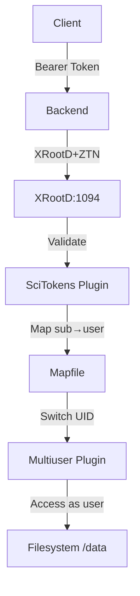
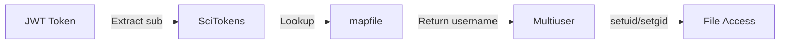

# XRootD Container

Storage server with ZTN protocol and user mapping (development only).

## Overview

Development XRootD server with:

- ZTN (Zero Trust Network) protocol
- SciTokens authentication
- Multiuser plugin for UID mapping
- Auto-generated SSL certificates
- Test users and data

## Architecture



## User Mapping

### How It Works



1. User authenticates via OIDC (Keycloak)
2. Backend passes JWT token to XRootD
3. SciTokens plugin validates token
4. Mapfile maps token `sub` to Unix username
5. Multiuser plugin switches to that user's UID
6. Files accessed with proper permissions

### Test Users

| Token Subject | Unix User   | UID  | Home Directory    |
| ------------- | ----------- | ---- | ----------------- |
| `a.manafov`   | `amanafov`  | 1003 | `/data/amanafov`  |
| `testuser1`   | `testuser1` | 1001 | `/data/testuser1` |
| `testuser2`   | `testuser2` | 1002 | `/data/testuser2` |
| (unmapped)    | denied      | -    | -                 |

### Mapfile Configuration

Located at `/etc/xrootd/mapfile`:

```json
[
  {
    "sub": "a.manafov",
    "result": "amanafov"
  },
  {
    "sub": "testuser1",
    "result": "testuser1"
  }
]
```

**Fields**:

- `sub` - JWT token subject claim
- `result` - Unix username to map to
- Empty `result` - Deny access

### Adding Users

Edit `Dockerfile`:

```dockerfile
RUN useradd -m -s /bin/bash -u 1004 newuser && \
    mkdir -p /data/newuser && \
    chown newuser:newuser /data/newuser
```

Update `configs/mapfile`:

```json
{
  "sub": "new.user.subject",
  "result": "newuser"
}
```

Rebuild:

```bash
docker compose build xrootd
docker compose up -d xrootd
```

## Certificate Management

### Auto-Generation

On first startup, `generate-certs.sh` creates:

- `/etc/xrootd/hostcert.pem` - Certificate
- `/etc/xrootd/hostkey.pem` - Private key
- Valid for 365 days
- Self-signed for development

### Sharing with Other Containers

Certificates copied to `xrootd-certs` volume:

```bash
/etc/xrootd-shared/
├── server.crt  # Certificate
└── server.key  # Private key
```

Shared with:

- **Nginx** - Mounted at `/etc/nginx/ssl/`
- **Frontend** - Mounted at `/app/certs/`

### Manual Regeneration

```bash
# Regenerate certificates
docker compose exec xrootd /usr/local/bin/generate-certs.sh

# Restart services using certs
docker compose restart xrootd nginx frontend
```

## Configuration Files

### XRootD Config

`configs/xrootd-dev.cfg`:

```ini
# ZTN protocol
xrd.protocol XrdHttp:1094 libXrdHttp.so
xrd.tls /var/run/xrootd/certs/hostcert.pem /var/run/xrootd/certs/hostkey.pem

# SciTokens authentication
http.exthandler xrdtpc libXrdHttpTPC.so
acc.authdb /etc/xrootd/scitokens_dev.cfg

# Export data directory
all.export /data
```

### SciTokens Config

`configs/scitokens_dev.cfg`:

```ini
[Global]
audience = https://id.gsi.de/realms/wl

[Issuer GSI]
issuer = https://id.gsi.de/realms/wl
base_path = /data
name_mapfile = /etc/xrootd/mapfile
default_user =
```

**Parameters**:

- `audience` - Expected JWT `aud` claim
- `issuer` - Expected JWT `iss` claim
- `name_mapfile` - Path to user mapping file
- `default_user` - Empty = deny unmapped users

## Test Data

### Setup Script

`scripts/setup-test-data.sh` creates test files:

```bash
/data/
├── amanafov/
│   └── welcome.txt
├── testuser1/
│   └── sample.dat
├── testuser2/
│   └── test.txt
└── public/
    └── shared.txt
```

### Manual Data

Add files from host (development):

```bash
# Copy to Docker volume
docker cp myfile.txt dataharbor-xrootd-dev:/data/amanafov/

# Or use xrdcp
xrdcp myfile.txt xroot://localhost:1094//data/amanafov/
```

## Common Tasks

### Check User Mapping

```bash
# Verify users exist
docker compose exec xrootd id amanafov

# List data directories
docker compose exec xrootd ls -la /data

# Check file ownership
docker compose exec xrootd ls -la /data/amanafov
```

### Test Connection

```bash
# Test from backend container
docker compose exec backend wget -O- http://xrootd:1094

# Test with xrdfs
docker compose exec xrootd xrdfs localhost:1094 ls /data
```

### View Logs

```bash
# Container logs
docker compose logs -f xrootd

# XRootD service logs
docker compose exec xrootd tail -f /var/log/xrootd/xrootd.log

# Look for mapping activity
docker compose logs xrootd | grep -i "map\|scitoken"
```

## Troubleshooting

### Permission Denied

**Cause**: Token mapping failed or user not in mapfile

```bash
# Check mapfile syntax
docker compose exec xrootd cat /etc/xrootd/mapfile

# Verify SciTokens config
docker compose exec xrootd cat /etc/xrootd/scitokens_dev.cfg

# Check logs for errors
docker compose logs xrootd | grep -i error
```

### Files Created as Wrong User

**Cause**: Default user being used instead of mapped user

```bash
# Verify multiuser plugin loaded
docker compose logs xrootd | grep -i multiuser

# Check capabilities
docker compose exec xrootd getcap /usr/bin/xrootd

# Should show: cap_setuid,cap_setgid=ep
```

### Certificate Issues

```bash
# Check certificate files
docker compose exec xrootd ls -la /var/run/xrootd/certs/

# Verify certificate
docker compose exec xrootd openssl x509 -in /var/run/xrootd/certs/hostcert.pem -text

# Regenerate
docker compose exec xrootd /usr/local/bin/generate-certs.sh
```

### Connection Refused

```bash
# Check XRootD is running
docker compose ps xrootd

# Check port binding
docker compose exec xrootd netstat -tuln | grep 1094

# Test TCP connection
docker compose exec backend nc -zv xrootd 1094
```

## Security Notes

### Development vs Production

**Development (current)**:

- Self-signed certificates
- Permissive for testing
- All token subjects must be in mapfile
- Unmapped users denied access

**Production recommendations**:

- Use real certificates from CA
- Strict token validation
- Remove test users
- Implement proper ACLs
- Set `onmissing = deny` in scitokens config

### Best Practices

- Unique UID for each user
- Directory isolation (`/data/{username}`)
- Empty `default_user` to deny unmapped tokens
- Regular mapfile audits
- Monitor access logs

## Directory Structure

```text
xrootd/
├── README.md           # This file
├── Dockerfile          # Multi-stage build
├── configs/
│   ├── xrootd-dev.cfg  # XRootD server config
│   ├── scitokens_dev.cfg # SciTokens plugin config
│   └── mapfile         # User mapping (JSON)
└── scripts/
    ├── docker-entrypoint.sh  # Startup script
    ├── generate-certs.sh     # Certificate generator
    └── setup-test-data.sh    # Test data creator
```

## Ports

- `1094` - XRootD protocol (ZTN/TLS)

## Volumes

- `xrootd-data` - File storage (`/data`)
- `xrootd-certs` - Certificates (shared with nginx/frontend)
- `xrootd-logs` - XRootD logs

## Dependencies

- AlmaLinux 9
- XRootD 5.9.0
- xrootd-scitokens plugin
- xrootd-multiuser plugin
- OpenSSL

## Performance

- Optimized for development/testing
- Not suitable for production without hardening
- Consider external XRootD server for production

---

[← Back to Docker README](../README.md)
