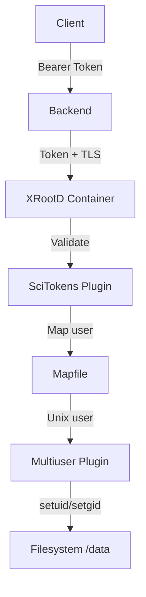
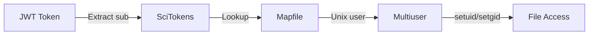

# XRootD Container

Storage server with ZTN protocol, SciTokens authentication, and user mapping.

## Overview

DataHarbor provides two XRootD container configurations:

| Configuration | Dockerfile | Purpose |
|---------------|------------|---------|
| **Development** | `Dockerfile` | Self-signed certs, test users, test data |
| **Production** | `Dockerfile.prod` | External mounts, minimal image, security-hardened |

### Features

- **ZTN (Zero Trust Network) Protocol** - Token-based authentication over TLS
- **SciTokens Authentication** - JWT token validation and claim extraction
- **Multiuser Plugin** - UID/GID switching based on authenticated user
- **Lustre/GPFS Support** - Bind mounts with proper propagation for parallel filesystems

## Architecture



## Quick Start

### Development

```bash
cd docker
docker compose up -d

# Check XRootD status
docker compose logs xrootd
```

Development mode automatically:
- Generates self-signed TLS certificates
- Creates test users (testuser1, testuser2, amanafov)
- Sets up test data in `/data`

### Production

```bash
cd docker

# Configure environment
cp .env.example .env
# Edit .env with your settings

# Start with production config
docker compose -f docker-compose.prod.yml up -d

# Or deploy pre-built images
docker compose -f docker-compose.deploy.yml up -d
```

## Configuration

### Development vs Production

| Aspect | Development | Production |
|--------|-------------|------------|
| **TLS Certificates** | Auto-generated self-signed | Host-mounted real certs |
| **Data Directory** | Named volume with test data | Bind mount from host (Lustre/GPFS) |
| **User Mapfile** | Baked into image | Mounted from host |
| **Test Users** | Created in container | Map to host filesystem UIDs |
| **Logging** | Verbose (debug) | Minimal (error only) |
| **Token Validation** | Passthrough on missing | Deny on missing |

### Required Environment Variables (Production)

| Variable | Description | Example |
|----------|-------------|---------|
| `XROOTD_DATA_DIR` | Host directory to serve | `/lustre/dataharbor` |
| `XRD_CERT_PATH` | Host path to TLS certificate | `/etc/ssl/certs/server.crt` |
| `XRD_KEY_PATH` | Host path to TLS private key | `/etc/ssl/private/server.key` |
| `XRD_MAPFILE_PATH` | Host path to user mapfile | `/opt/xrootd/mapfile` |
| `CA_CERTS_PATH` | Host path to CA certificates | `/etc/grid-security/certificates` |

## User Mapping

### How It Works



1. User authenticates via OIDC (e.g., Keycloak)
2. Backend passes JWT token to XRootD
3. SciTokens plugin validates token
4. Mapfile maps token `sub` claim to Unix username
5. Multiuser plugin switches to that user's UID/GID
6. Files accessed with proper permissions

### Mapfile Format

The mapfile is a JSON array of mappings:

```json
[
  {"sub": "alice@example.com", "result": "alice"},
  {"sub": "bob@example.com", "result": "bob"},
  {"sub": "*", "result": ""}
]
```

| Field | Description |
|-------|-------------|
| `sub` | JWT token subject claim (exact match or `*` for wildcard) |
| `result` | Unix username to map to (empty string = deny access) |

### Test Users (Development Only)

| Token Subject | Unix User | UID | Home Directory |
|---------------|-----------|-----|----------------|
| `a.manafov` | `amanafov` | 1003 | `/data/amanafov` |
| `testuser1` | `testuser1` | 1001 | `/data/testuser1` |
| `testuser2` | `testuser2` | 1002 | `/data/testuser2` |
| (unmapped) | denied | - | - |

### Production User Setup

**CRITICAL**: For production with Lustre/NFS:
- UIDs in the mapfile must match filesystem UIDs
- Users must exist on the host system
- Users must have proper permissions on `XROOTD_DATA_DIR`

```bash
# On host system
useradd -u 1001 alice
mkdir -p /lustre/dataharbor/alice
chown alice:alice /lustre/dataharbor/alice

# In mapfile
[{"sub": "alice@keycloak.example.com", "result": "alice"}]
```

## Certificate Management

### Development (Auto-Generated)

The `cert-init` container generates self-signed certificates on first startup:
- Stored in `shared-certs` Docker volume
- Valid for 365 days
- Shared with nginx, frontend, and xrootd containers

### Production (Host-Mounted)

Mount production certificates from the host system:

```yaml
volumes:
  - ${XRD_CERT_PATH}:/var/run/xrootd/certs/hostcert.pem:ro
  - ${XRD_KEY_PATH}:/var/run/xrootd/certs/hostkey.pem:ro
```

**Certificate Requirements:**
- Certificate readable by container (chmod 644)
- Private key readable by container (chmod 600)
- Valid for your hostname
- For grid computing: Use host certificate from a trusted CA

### Certificate Validation

The production entrypoint validates certificates on startup:
- Checks file existence and readability
- Verifies certificate expiry (warns if < 30 days)
- Shows certificate subject for verification

## Configuration Files

### XRootD Configuration

| File | Purpose |
|------|---------|
| `xrootd-dev.cfg` | Development with verbose logging |
| `xrootd-prod.cfg` | Production with minimal logging |

### SciTokens Configuration

| File | Purpose |
|------|---------|
| `scitokens_dev.cfg` | Development (passthrough on missing token) |
| `scitokens_prod.cfg` | Production (deny on missing token) |

### Key Configuration Options

```ini
# TLS Configuration
xrd.tls /var/run/xrootd/certs/hostcert.pem /var/run/xrootd/certs/hostkey.pem
xrd.tlsca certdir:/etc/grid-security/certificates  # Production
xrd.tlsca noverify  # Development (self-signed)

# ZTN Protocol
sec.protocol ztn -tokenlib libXrdAccSciTokens.so
sec.protbind * only ztn

# Multiuser Plugin
ofs.osslib ++ libXrdMultiuser.so default
multiuser.umask 0022

# SciTokens Authorization
ofs.authorize
ofs.authlib libXrdAccSciTokens.so config=/etc/xrootd/scitokens_prod.cfg
```

## Lustre/GPFS Considerations

### Bind Mount Configuration

For parallel filesystems, use bind mount with `rslave` propagation:

```yaml
volumes:
  - type: bind
    source: ${XROOTD_DATA_DIR}
    target: /data
    bind:
      propagation: rslave  # Required for Lustre mount changes
```

### Extended Attributes

Enable in XRootD config for Lustre striping information:

```ini
ofs.xattr * on
```

### Performance Notes

- Container adds ~1% CPU overhead
- Direct I/O path: XRootD → Lustre client → Network → Lustre servers
- No data copying - respects Lustre striping
- Recommend setting resource limits to prevent resource exhaustion

## Troubleshooting

### View Logs

```bash
# Container logs
docker compose logs -f xrootd

# XRootD service logs (inside container)
docker compose exec xrootd tail -f /var/log/xrootd/xrootd.log
```

### Check User Mapping

```bash
# Verify users exist
docker compose exec xrootd id amanafov

# Check data directories
docker compose exec xrootd ls -la /data

# Verify mapfile
docker compose exec xrootd cat /etc/xrootd/mapfile
```

### Test Connection

```bash
# Test from backend container
docker compose exec backend wget -O- http://xrootd:1094

# Test with xrdfs
docker compose exec xrootd xrdfs localhost:1094 ls /data
```

### Common Issues

| Issue | Cause | Solution |
|-------|-------|----------|
| Permission Denied | Token mapping failed | Check mapfile and user exists |
| TLS Handshake Failed | Certificate mismatch | Verify cert hostname and CA |
| Data Directory Empty | Mount not propagated | Check `rslave` propagation |
| User Not Found | UID mismatch | Ensure UIDs match host filesystem |

### Debug Mode

Enable verbose logging in development:

```ini
# In xrootd-dev.cfg
xrd.trace all
scitokens.trace all
xrootd.trace auth login debug
```

## Building Images

### Development

```bash
cd docker
docker compose build xrootd
```

### Production

```bash
cd docker
docker build -f docker/xrootd/Dockerfile.prod -t dataharbor-xrootd:prod ..
```

### Multi-Architecture Note

XRootD images are **linux/amd64 only** because:
- CERN XRootD packages are x86_64 only
- OSG multiuser plugin is x86_64 only

On ARM64 Macs, the container runs via QEMU emulation.

## Security Considerations

### Production Hardening

1. **Never use passthrough** in production - set `onmissing = deny`
2. **Set empty default_user** - deny unmapped tokens
3. **Use real certificates** - not self-signed
4. **Mount read-only** where possible
5. **Set resource limits** - prevent DoS
6. **Use SELinux/AppArmor** - if compatible with your filesystem

### Capability Requirements

The container requires `CAP_SETUID` and `CAP_SETGID` capabilities for the multiuser plugin:

```bash
# Verify capabilities (inside container)
getcap /usr/bin/xrootd
# Expected: /usr/bin/xrootd = cap_setgid,cap_setuid+ep
```

## Directory Structure

```text
xrootd/
├── README.md              # This file
├── Dockerfile             # Development image
├── Dockerfile.prod        # Production image (minimal)
├── configs/
│   ├── xrootd-dev.cfg     # Dev XRootD config
│   ├── xrootd-prod.cfg    # Prod XRootD config
│   ├── scitokens_dev.cfg  # Dev SciTokens config
│   ├── scitokens_prod.cfg # Prod SciTokens config
│   └── mapfile            # User mapping (JSON)
└── scripts/
    ├── docker-entrypoint.sh      # Dev entrypoint
    ├── docker-entrypoint-prod.sh # Prod entrypoint
    └── setup-test-data.sh        # Test data creator
```

---

[← Back to Docker README](../README.md)
