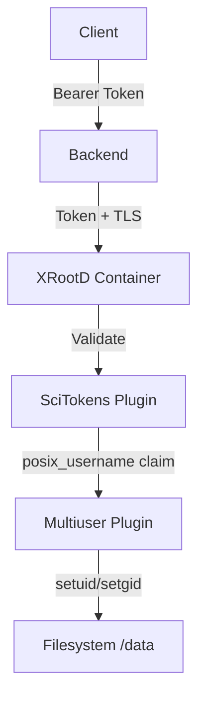
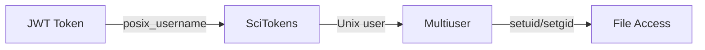

# XRootD Container

Storage server with ZTN protocol, SciTokens authentication, and user mapping.

## Overview

DataHarbor provides two XRootD container configurations:

| Configuration   | Dockerfile        | Purpose                                           |
| --------------- | ----------------- | ------------------------------------------------- |
| **Development** | `Dockerfile`      | Self-signed certs, test users, test data          |
| **Production**  | `Dockerfile.prod` | External mounts, minimal image, security-hardened |

### Features

- **ZTN (Zero Trust Network) Protocol** - Token-based authentication over TLS
- **SciTokens Authentication** - JWT token validation and claim extraction
- **Multiuser Plugin** - UID/GID switching based on authenticated user
- **Lustre/GPFS Support** - Bind mounts with proper propagation for parallel filesystems

## Architecture


```mermaid
graph TB
    CLIENT[Client] -->|Bearer Token| BE[Backend]
    BE -->|Token + TLS| XRD[XRootD Container]
    XRD -->|Validate| SCI[SciTokens Plugin]
    SCI -->|posix_username claim| MULTI[Multiuser Plugin]
    MULTI -->|setuid/setgid| FS[Filesystem /data]
```

## Quick Start

### Development

```bash
cd docker
docker compose up -d

# Check XRootD status
docker compose logs xrootd
```

Development mode automatically:
- Generates self-signed TLS certificates
- Creates test users (testuser1, testuser2, manafov)
- Sets up test data in `/data`
- Renders the SciTokens config with the same script production uses

### Production

```bash
cd docker

# Configure environment
cp .env.example .env
# Edit .env with your settings

# Start with production config
docker compose -f docker-compose.prod.yml up -d

# Or deploy pre-built images
docker compose -f docker-compose.deploy.yml up -d
```

## Configuration

### Development vs Production

| Aspect               | Development                 | Production                         |
| -------------------- | --------------------------- | ---------------------------------- |
| **TLS Certificates** | Auto-generated self-signed  | Host-mounted real certs            |
| **Data Directory**   | Named volume with test data | Bind mount from host (Lustre/GPFS) |
| **User Mapping**     | `posix_username` claim      | `posix_username` claim             |
| **Test Users**       | Created in container        | Resolved from host (LDAP/SSSD)     |
| **Logging**          | Verbose (debug)             | Minimal (error only)               |
| **Token Validation** | Deny on missing             | Deny on missing                    |

### Required Environment Variables (Production)

| Variable          | Description                  | Example                           |
| ----------------- | ---------------------------- | --------------------------------- |
| `XROOTD_DATA_DIR` | Host directory to serve      | `/lustre/dataharbor`              |
| `XRD_CERT_PATH`   | Host path to TLS certificate | `/etc/ssl/certs/server.crt`       |
| `XRD_KEY_PATH`    | Host path to TLS private key | `/etc/ssl/private/server.key`     |
| `CA_CERTS_PATH`   | Host path to CA certificates | `/etc/grid-security/certificates` |
| `OIDC_ISSUER`     | OIDC issuer URL              | `https://id.gsi.de/realms/wl`     |

The compose files wire `SCITOKENS_ISSUER: ${OIDC_ISSUER}` for the container, so set
`OIDC_ISSUER` in `.env` — setting `SCITOKENS_ISSUER` there has no effect.

Optional: `XRD_USER_MAPPING` (`claim`, the default, or `mapfile`) and, for mapfile
mode only, `XRD_MAPFILE_PATH`. See
[Alternative: static mapfile](#alternative-static-mapfile-xrd_user_mappingmapfile).

## User Mapping

XRootD runs every request as a real Unix user: the SciTokens plugin derives a
username from the access token, and the multiuser plugin `setuid()`s to it before
touching the filesystem. `XRD_USER_MAPPING` selects where that username comes from.

| `XRD_USER_MAPPING` | Default | Rendered `[Issuer OIDC]` block                                        |
| ------------------ | ------- | --------------------------------------------------------------------- |
| `claim`            | **yes** | `username_claim = posix_username`                                     |
| `mapfile`          | opt-in  | `map_subject = true`, `name_mapfile = ...`, `default_user = ""`        |

Any other value makes the entrypoint exit non-zero.

### How It Works (default: `posix_username` claim)


```mermaid
flowchart LR
    TOKEN[JWT Token] -->|posix_username| SCI[SciTokens]
    SCI -->|Unix user| MULTI[Multiuser]
    MULTI -->|setuid/setgid| FS[File Access]
```

1. User authenticates via OIDC (e.g. Keycloak)
2. Backend passes the access token to XRootD
3. SciTokens plugin validates the token and reads `posix_username` from it
4. Multiuser plugin switches to that user's UID/GID
5. Files are accessed with that user's permissions

Nothing to maintain per user: the IdP already knows the POSIX username.

**Host requirement:** every `posix_username` your IdP can issue must be resolvable
via `getent passwd <posix_username>` on the host, with the UID matching the data
filesystem (Lustre/GPFS/NFS). On HPC/enterprise hosts these users come from
LDAP/AD via SSSD; the container talks to the host's SSSD daemon through the
mounted socket.

**Fail-closed behaviour.** A token is rejected outright when the claim is

- missing — `scitokens.trace` logs `Failed to get token username`;
- empty or unsafe — `Token username claim contains unsafe characters`. Safe means
  `[A-Za-z0-9_.@-]+` and not starting with `-`.

This is the same guarantee the old `default_user = ""` gave: a user DataHarbor
cannot map is denied, never silently downgraded to a shared account. Users
without a POSIX account therefore cannot use claim mode.

### Required Token Contents

Access token (what XRootD validates):

| Claim            | Purpose                                                        |
| ---------------- | -------------------------------------------------------------- |
| `iss`            | Must equal `SCITOKENS_ISSUER`                                  |
| `aud`            | Must equal `SCITOKENS_AUDIENCE` (defaults to the issuer URL)    |
| `exp`, `iat`     | Validity window                                                 |
| `scope`          | `read:/` for browse/download, `write:/` for upload              |
| `sub`            | Stable user id — used by the backend for per-user rate limiting |
| `posix_username` | The Unix account XRootD switches to (claim mode)                |
| `ver`            | `scitoken:2.0`                                                  |

Userinfo endpoint (what the backend shows in the UI): `sub`,
`preferred_username`, `given_name`, `family_name`, `name`, and `posix_username`
when present. `email` is optional — the UI degrades gracefully without it, and
the requested scopes are configurable via `auth.oidc.scopes`.

Keep this list in mind before trimming claims or scopes on the IdP client: the
app breaks in ways that only show up at login or at first file access.

### Test Users (Development Only)

| `posix_username` | Unix User   | UID  | Home Directory    |
| ---------------- | ----------- | ---- | ----------------- |
| `manafov`        | `manafov`   | 1003 | `/data/manafov`   |
| `testuser1`      | `testuser1` | 1001 | `/data/testuser1` |
| `testuser2`      | `testuser2` | 1002 | `/data/testuser2` |
| (claim missing)  | denied      | -    | -                 |

### Production User Setup

**CRITICAL**: For production with Lustre/NFS:
- The Unix user must exist on the host (usually via LDAP/SSSD)
- Its UID must match the filesystem UID
- It must have permissions on `XROOTD_DATA_DIR`

```bash
# On the host, for each DataHarbor user
getent passwd alice          # must resolve, with the Lustre UID
mkdir -p /lustre/dataharbor/alice
chown alice:alice /lustre/dataharbor/alice
```

### Alternative: static mapfile (`XRD_USER_MAPPING=mapfile`)

The mapfile is the **escape hatch**, not the default. Use it when your IdP cannot
emit a POSIX-username claim, or as a rollback lever that needs no image change.

```bash
cd docker

# development (XRD_MAPFILE_PATH is required; the checked-in example works)
XRD_MAPFILE_PATH=./xrootd/configs/mapfile.example \
  docker compose -f docker-compose.yml -f docker-compose.mapfile.yml up -d

# production
XRD_MAPFILE_PATH=/opt/xrootd/mapfile \
  docker compose -f docker-compose.prod.yml -f docker-compose.mapfile.yml up -d
```

The override sets `XRD_USER_MAPPING=mapfile` and bind-mounts `XRD_MAPFILE_PATH`
read-only at `/etc/xrootd/mapfile`. `XRD_MAPFILE_PATH` is **required** — it has no
default, so `docker compose` refuses to start rather than mount the wrong file.

The entrypoint then exits non-zero rather than start with a broken mapping when
the mapfile is missing, unreadable, empty (`[]` or zero bytes — that would deny
every token), or not a JSON array. The structural checks are plain shell, so they
also run in the production image, which ships no `python3`; where `python3` does
exist it additionally parses the file as strict JSON.

**Format** — a JSON array of rules:

```json
[
  {"sub": "a.manafov", "result": "manafov"},
  {"sub": "alice@example.com", "result": "alice"},
  {"sub": "*", "result": ""}
]
```

| Field      | Description                                                        |
| ---------- | ------------------------------------------------------------------ |
| `sub`      | Token subject claim (exact match, or `*` for wildcard)              |
| `result`   | Unix username to map to (empty string = deny access)                |

The plugin also supports a `username` rule that matches the `username_claim`
value, but it is **inert here**: mapfile mode is exactly the mode in which
`username_claim` is not rendered, so such a rule can never match. Use `sub`.

Same host requirement as claim mode: every `result` user must resolve via
`getent passwd` on the host with the correct UID. The production entrypoint
spot-checks this at startup and warns about users it cannot resolve.
`default_user` stays hard-coded to `""`, so an unmapped `sub` is denied.

A mapfile left mounted while `XRD_USER_MAPPING=claim` is ignored; the entrypoint
logs a warning so it does not look effective.

#### Why a switch and not "claim first, mapfile as fallback"

From `XrdSciTokens/XrdSciTokensAccess.cc` at v6.1.1 (the version pinned in both
Dockerfiles):

- With `username_claim` set and the claim **missing**, `GenerateAcls()` logs
  `Failed to get token username` and returns `false`. The token is rejected
  *before* any mapfile rule is consulted — a mapfile can never rescue a token
  that lacks `posix_username`.
- `username_claim` implies `map_subject`
  (`m_map_subject = map_subject || !username_claim.empty()`) and makes
  `default_user` irrelevant.
- If a mapfile *is* configured alongside `username_claim`, its rules are still
  evaluated in `Access()` against `sub`, the claim value, path and groups; a
  match **overrides** the claim value and no match falls back to it. That is an
  override facility, not a fallback, and it is deliberately not exposed as a
  third mode.

So the two modes are exclusive by design. Do not try to combine them.

#### Keeping this path working

`scripts/test-render-scitokens.sh` renders the template in both modes and asserts
the resulting `[Issuer OIDC]` block plus the failure cases (unknown mode, missing
mapfile, invalid JSON). It runs in CI on every change under `docker/xrootd/`:

```bash
./docker/xrootd/scripts/test-render-scitokens.sh
```

## Certificate Management

### Development (Auto-Generated)

The `cert-init` container generates self-signed certificates on first startup:
- Stored in `shared-certs` Docker volume
- Valid for 365 days
- Shared with nginx, frontend, and xrootd containers

### Production (Host-Mounted)

Mount production certificates from the host system:

```yaml
volumes:
  - ${XRD_CERT_PATH}:/var/run/xrootd/certs/hostcert.pem:ro
  - ${XRD_KEY_PATH}:/var/run/xrootd/certs/hostkey.pem:ro
```

**Certificate Requirements:**
- Certificate readable by container (chmod 644)
- Private key readable by container (chmod 600)
- Valid for your hostname
- For grid computing: Use host certificate from a trusted CA

### Certificate Validation

The production entrypoint validates certificates on startup:
- Checks file existence and readability
- Verifies certificate expiry (warns if < 30 days)
- Shows certificate subject for verification

## Configuration Files

### XRootD Configuration

| File              | Purpose                          |
| ----------------- | -------------------------------- |
| `xrootd-dev.cfg`  | Development with verbose logging |
| `xrootd-prod.cfg` | Production with minimal logging  |

### SciTokens Configuration

One template serves both environments. The entrypoint renders it with `envsubst`
to `/etc/xrootd/scitokens_rendered.cfg`, which both `xrootd-dev.cfg` and
`xrootd-prod.cfg` point at.

| File                            | Purpose                                                |
| ------------------------------- | ------------------------------------------------------ |
| `configs/scitokens.cfg.tmpl`    | Shared template (dev and prod)                          |
| `scripts/render-scitokens-config.sh` | Renderer, sourced by both entrypoints              |
| `configs/mapfile.example`       | Sample mapfile for `XRD_USER_MAPPING=mapfile`           |

Values substituted at startup:

| Variable                       | Development             | Production                 |
| ------------------------------ | ----------------------- | -------------------------- |
| `SCITOKENS_ONMISSING`          | `deny`                  | `deny`                     |
| `SCITOKENS_BASE_PATH`          | `/data`                 | `/`                        |
| `SCITOKENS_ISSUER`             | `OIDC_ISSUER` from .env | `OIDC_ISSUER` from .env    |
| `SCITOKENS_AUDIENCE`           | issuer URL              | issuer URL                 |
| `SCITOKENS_USER_MAPPING_BLOCK` | from `XRD_USER_MAPPING` | from `XRD_USER_MAPPING`    |

`SCITOKENS_ONMISSING` is `deny` in **both** environments. `passthrough` only
delegates to a *chained* authorizer, and both `xrootd-dev.cfg` and
`xrootd-prod.cfg` load `ofs.authlib libXrdAccSciTokens.so` **without** `++` — so
SciTokens is the only authorizer, there is no chain, and `passthrough` denies
exactly like `deny`. Dev therefore runs production's value rather than
advertising a difference the configuration cannot produce. The renderer rejects
any value outside `deny` / `passthrough` / `allow_public` and warns loudly
whenever it is not `deny`.

Inspect what a running container actually uses:

```bash
docker compose exec xrootd cat /etc/xrootd/scitokens_rendered.cfg
```

### Key Configuration Options

```ini
# TLS Configuration
xrd.tls /var/run/xrootd/certs/hostcert.pem /var/run/xrootd/certs/hostkey.pem
xrd.tlsca certdir:/etc/grid-security/certificates  # Production
xrd.tlsca noverify  # Development (self-signed)

# ZTN Protocol
sec.protocol ztn -tokenlib libXrdAccSciTokens.so
sec.protbind * only ztn

# Multiuser Plugin
ofs.osslib ++ libXrdMultiuser.so default
multiuser.umask 0022

# SciTokens Authorization (config rendered from scitokens.cfg.tmpl at startup)
ofs.authorize
ofs.authlib libXrdAccSciTokens.so config=/etc/xrootd/scitokens_rendered.cfg
```

## Lustre/GPFS Considerations

### Bind Mount Configuration

For parallel filesystems, use bind mount with `rslave` propagation:

```yaml
volumes:
  - type: bind
    source: ${XROOTD_DATA_DIR}
    target: /data
    bind:
      propagation: rslave  # Required for Lustre mount changes
```

### Extended Attributes

Enable in XRootD config for Lustre striping information:

```ini
ofs.xattr * on
```

### Performance Notes

- Container adds ~1% CPU overhead
- Direct I/O path: XRootD → Lustre client → Network → Lustre servers
- No data copying - respects Lustre striping
- Recommend setting resource limits to prevent resource exhaustion

## Troubleshooting

### View Logs

```bash
# Container logs
docker compose logs -f xrootd

# XRootD service logs (inside container)
docker compose exec xrootd tail -f /var/log/xrootd/xrootd.log
```

### Check User Mapping

```bash
# Which mapping mode is in effect, and with what issuer/audience
docker compose logs xrootd | grep -E 'User mapping|SciTokens config'

# The configuration XRootD actually loaded
docker compose exec xrootd cat /etc/xrootd/scitokens_rendered.cfg

# Verify the Unix user the token maps to exists
docker compose exec xrootd getent passwd manafov

# Check data directories
docker compose exec xrootd ls -la /data
```

A denied user in claim mode shows up in the XRootD log as
`Failed to get token username` (claim absent) or
`Token username claim contains unsafe characters` (claim empty or malformed).
Decode the access token and check that `posix_username` is present.

### Test Connection

```bash
# Test from backend container
docker compose exec backend wget -O- http://xrootd:1094

# Test with xrdfs
docker compose exec xrootd xrdfs localhost:1094 ls /data
```

### Common Issues

| Issue                | Cause                | Solution                                        |
| -------------------- | -------------------- | ----------------------------------------------- |
| Permission Denied    | Token mapping failed | Check `posix_username` is in the token and the Unix user resolves |
| TLS Handshake Failed | Certificate mismatch | Verify cert hostname and CA       |
| Data Directory Empty | Mount not propagated | Check `rslave` propagation        |
| User Not Found       | UID mismatch         | Ensure UIDs match host filesystem |

### Debug Mode

Enable verbose logging in development:

```ini
# In xrootd-dev.cfg
xrd.trace all
scitokens.trace all
xrootd.trace auth login debug
```

## Versions & Package Sources

| Component        | Version / Source                                                   |
| ---------------- | ------------------------------------------------------------------ |
| Base image       | `rockylinux/rockylinux:10` (builder), `:10-minimal` (prod runtime) |
| XRootD           | `6.1.1` — CERN stable repo (`xrootd.web.cern.ch`, el10)            |
| xrootd-multiuser | `2.2.1` (osg25up) — OSG `osg-upcoming-development` channel, el10   |

Pin a different XRootD version with `--build-arg XROOTD_VERSION=<x.y.z>`.

> **Why the OSG `osg-upcoming-development` channel?** XRootD 6.0 bumped the
> plugin ABI suffix from `-5` to `-6` (`libXrd*.so.3` → `.so.6`). The
> `xrootd-multiuser` plugin is only distributed by OSG, and at the time of this
> upgrade the 6.x-ABI build (`libXrdMultiuser-6.so`) ships **only** in OSG's
> pre-release `osg-upcoming-development` channel — the stable `osg-*-main`
> channels still carry the 5.x-ABI build, which will not load under XRootD 6.x.
> Once OSG promotes the 6.x multiuser build to a `main`/`release` channel, drop
> the `--enablerepo=osg-upcoming-development` flag in the Dockerfiles.

> **Why still the `25-main` series?** An `osg/26-main` el10 series exists and its
> release RPM installs, but the repositories behind it are still an empty
> bootstrap skeleton (verified 2026-08-27): `osg`, `osg-development`,
> `osg-upcoming-development` and `osg-testing` together publish only
> `osg-release`, `buildsys-macros` and `osg-ca-certs` (2–5 packages each, versus
> 97–170 in `25-main`), and `osg-upcoming` / `osg-contrib` return HTTP 404. There
> is no `xrootd-multiuser` in any `26-main` channel yet. Re-check before bumping.

## Building Images

### Development

```bash
cd docker
docker compose build xrootd
```

### Production

```bash
cd docker
docker build -f docker/xrootd/Dockerfile.prod -t dataharbor-xrootd:prod ..
```

### Multi-Architecture Note

XRootD images are **linux/amd64 only** because:
- CERN XRootD packages are x86_64 only
- OSG multiuser plugin is x86_64 only

On ARM64 Macs, the container runs via QEMU emulation.

## Security Considerations

### Production Hardening

1. **Never use passthrough** in production - set `onmissing = deny`
2. **Keep mapping fail-closed** - claim mode rejects tokens without a usable
   `posix_username`; mapfile mode keeps `default_user = ""`. Neither is configurable
3. **Use real certificates** - not self-signed
4. **Mount read-only** where possible
5. **Set resource limits** - prevent DoS
6. **Use SELinux/AppArmor** - if compatible with your filesystem

### Capability Requirements

The container requires `CAP_SETUID` and `CAP_SETGID` capabilities for the multiuser plugin:

```bash
# Verify capabilities (inside container)
getcap /usr/bin/xrootd
# Expected: /usr/bin/xrootd = cap_setgid,cap_setuid+ep
```

## Directory Structure

```text
xrootd/
├── README.md              # This file
├── Dockerfile             # Development image
├── Dockerfile.prod        # Production image (minimal)
├── configs/
│   ├── xrootd-dev.cfg        # Dev XRootD config
│   ├── xrootd-prod.cfg       # Prod XRootD config
│   ├── scitokens.cfg.tmpl    # Shared SciTokens template (dev + prod)
│   └── mapfile.example       # Sample mapfile for XRD_USER_MAPPING=mapfile
└── scripts/
    ├── docker-entrypoint.sh          # Dev entrypoint
    ├── docker-entrypoint-prod.sh     # Prod entrypoint
    ├── render-scitokens-config.sh    # Renders scitokens.cfg.tmpl (both modes)
    ├── test-render-scitokens.sh      # Render test, runs in CI
    └── setup-test-data.sh            # Test data creator
```

---

[← Back to Docker README](../README.md)
