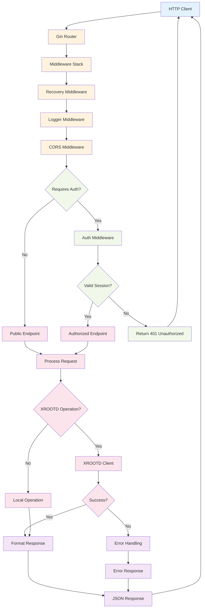
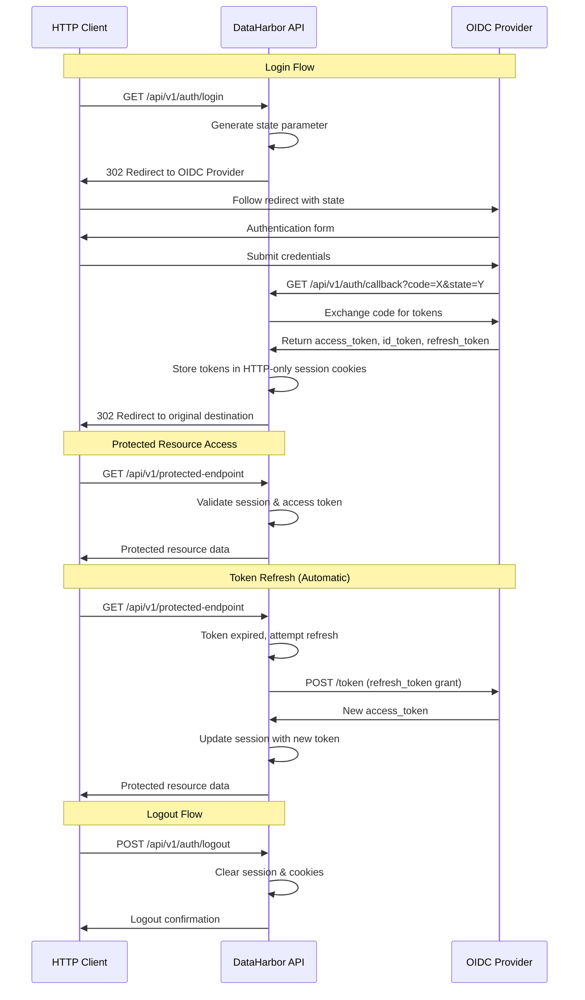
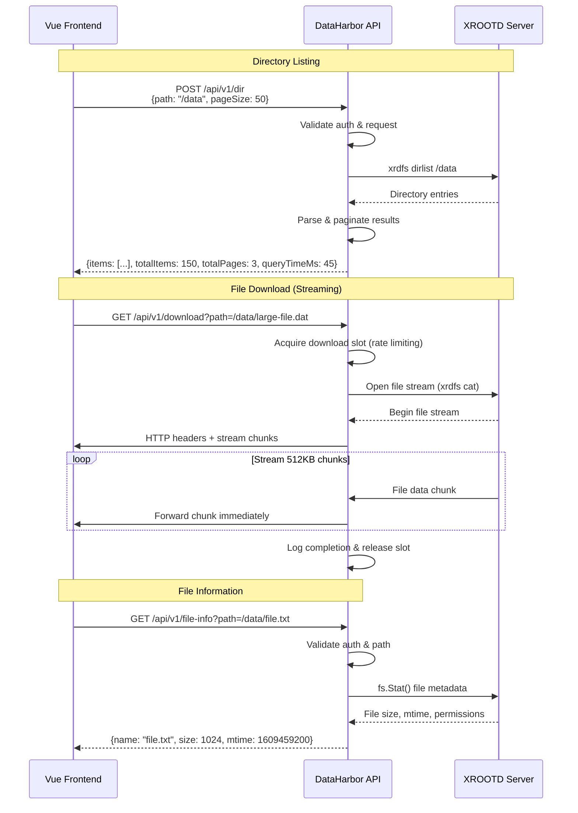
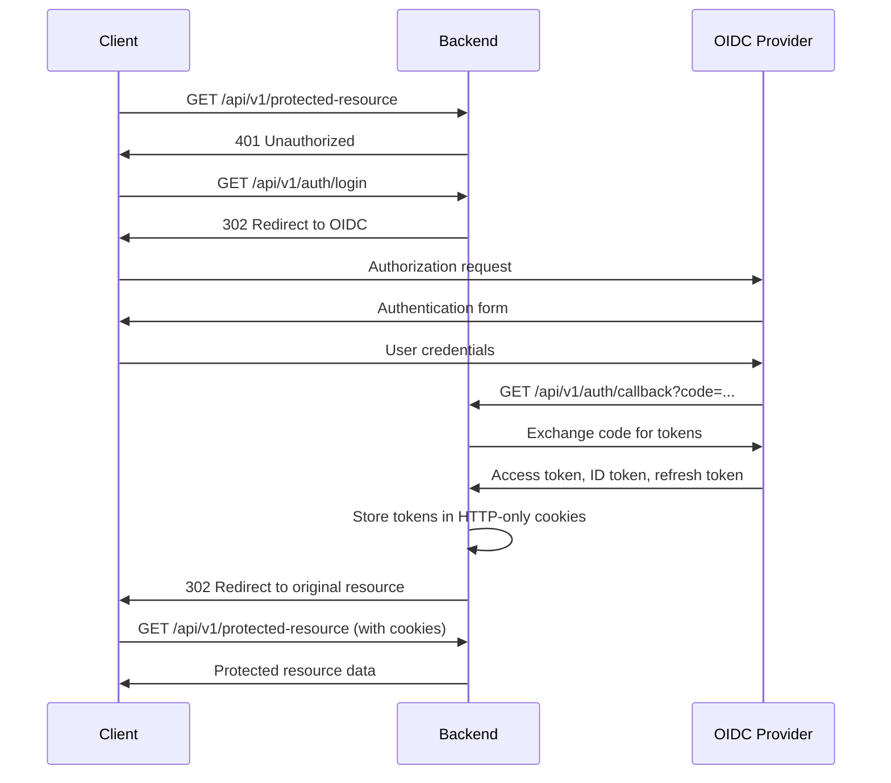

# REST API Documentation

[← Back to Documentation](./README.md)

This document provides comprehensive documentation for DataHarbor's REST API endpoints.

## API Architecture & Flow Diagrams

### API Request Processing Flow



### Authentication Flow (API Perspective)



### File Operations API Flow



## Base Information

- **Base URL**: `http://localhost:8081` (development) or your configured server URL
- **Content-Type**: `application/json`
- **Authentication**: Session-based with HTTP-only cookies (OIDC)

## Response Format

All API responses follow a consistent structure:

```json
{
  "code": 200,
  "message": "success",
  "data": { /* response data */ }
}
```

Error responses:

```json
{
  "code": 400,
  "message": "Error description"
}
```

## Authentication Endpoints

### Login Redirect

Initiates OIDC authentication flow.

**Endpoint**: `GET /api/v1/auth/login`

**Response**: HTTP redirect to OIDC provider

**Usage**:

```javascript
// Redirect user to login
window.location.href = '/api/v1/auth/login'
```

### OIDC Callback

Handles OIDC provider callback with authorization code.

**Endpoint**: `GET /api/v1/auth/callback`

**Parameters**:

- `code` (query): Authorization code from OIDC provider
- `state` (query): State parameter for CSRF protection

**Response**: HTTP redirect to original destination

### Get Current User

Retrieves information about the currently authenticated user.

**Endpoint**: `GET /api/v1/auth/user`

**Response**:

```json
{
  "code": 200,
  "message": "success",
  "data": {
    "id": "user123",
    "name": "John Doe",
    "email": "john.doe@example.com",
    "roles": ["user", "admin"]
  }
}
```

### Logout

Terminates user session and clears authentication cookies.

**Endpoint**: `POST /api/v1/auth/logout`

**Response**:

```json
{
  "code": 200,
  "message": "Successfully logged out"
}
```

## File System Endpoints

### Get Initial Directory

Retrieves the initial directory path configured for the XROOTD server.

**Endpoint**: `GET /api/v1/initial_dir`

**Response**:

```json
{
  "code": 200,
  "message": "success",
  "data": "/tmp/"
}
```

**Example**:

```shell
curl "http://localhost:8081/api/v1/initial_dir"
```

### List Directory (First Page)

Retrieves files and folders from a directory, returning the first page if pagination is needed.

**Endpoint**: `POST /api/v1/dir`

**Request Body**:

```json
{
  "path": "/path/to/directory",
  "pageSize": 50
}
```

**Parameters**:

| Field      | Type    | Required | Description                       |
| ---------- | ------- | -------- | --------------------------------- |
| `path`     | string  | Yes      | Full path to the directory        |
| `pageSize` | integer | Yes      | Number of items per page (1-1000) |

**Response**:

```json
{
  "code": 200,
  "message": "success",
  "data": {
    "items": [
      {
        "name": "example.txt",
        "type": "file",
        "size": 1024,
        "date_time": "2024-01-15 10:30:00"
      },
      {
        "name": "subdirectory",
        "type": "dir",
        "size": 0,
        "date_time": "2024-01-14 15:20:00"
      }
    ],
    "totalItems": 150,
    "pageSize": 50,
    "totalPages": 3,
    "totalFileCount": 120,
    "totalFolderCount": 30,
    "cumulativeFileSize": 1048576,
    "queryTimeMs": 45
  }
}
```

**Example**:

```shell
curl -X POST -H "Content-Type: application/json" -d '{"path":"/tmp/", "pageSize": 10}' http://localhost:8081/api/v1/dir
```

### List Directory (Paginated)

Retrieves a specific page of files and folders from a directory.

**Endpoint**: `POST /api/v1/dir/page`

**Request Body**:

```json
{
  "path": "/path/to/directory",
  "page": 2,
  "pageSize": 50
}
```

**Parameters**:

| Field      | Type    | Required | Description                       |
| ---------- | ------- | -------- | --------------------------------- |
| `path`     | string  | Yes      | Full path to the directory        |
| `page`     | integer | Yes      | Page number to retrieve (1-based) |
| `pageSize` | integer | Yes      | Number of items per page (1-1000) |

**Response**:

```json
{
  "code": 200,
  "message": "success",
  "data": {
    "items": [
      {
        "name": "file_51.txt",
        "type": "file",
        "size": 2048,
        "date_time": "2024-01-15 11:00:00"
      }
    ],
    "pageSize": 50,
    "totalPages": 3,
    "currentPage": 2
  }
}
```

**Example**:

```shell
curl -X POST -H "Content-Type: application/json" -d '{"path":"/tmp/", "page": 2, "pageSize": 10}' http://localhost:8081/api/v1/dir/page
```

### Download File (Streaming)

**Recommended**: Streams a file directly from XROOTD to the client without temporary storage.

> For detailed information about the frontend download system implementation, see [DOWNLOADS.md](./DOWNLOADS.md).

**Endpoint**: `GET /api/v1/download?path=/path/to/file.txt`

**Parameters**:

| Field  | Type   | Required | Description                                         |
| ------ | ------ | -------- | --------------------------------------------------- |
| `path` | string | Yes      | Full path to the file to download (query parameter) |

**Response**: Direct binary file stream with appropriate headers

**Example**:

```shell
curl -X GET "http://localhost:8081/api/v1/download?path=/tmp/example.txt" --output example.txt
```

**Notes**:

- Files are streamed directly from XROOTD using `xrdfs cat` command
- No temporary storage or staging required - more secure and efficient
- One concurrent download per user session to prevent resource exhaustion
- Supports large binary files with chunked transfer encoding
- Proper MIME type detection and Content-Disposition headers for browser downloads
- Server-measured speed metrics returned via response headers:
  - `X-Download-Duration-Ms`: Total download duration in milliseconds
  - `X-Download-Speed-Mbps`: Download speed in MB/s
  - `X-Download-Bytes-Total`: Total bytes transferred

### Ping XRD Server

Measures the round-trip latency to the XRootD storage server by performing a lightweight stat operation.

**Endpoint**: `GET /api/v1/xrd/ping`

**Response**:

```json
{
  "code": 200,
  "message": "success",
  "data": {
    "latencyMs": 12.5,
    "status": "ok",
    "server": "xrootd-server.example.com"
  }
}
```

**Notes**:

- Returns `503 Service Unavailable` if the XRD server is unreachable
- Latency is measured in milliseconds with sub-millisecond precision
- The frontend calls this endpoint periodically to display connection quality in the toolbar

**Example**:

```shell
curl "http://localhost:8081/api/v1/xrd/ping"
```

## Server Information Endpoints

### Health Check

Checks the health status of the backend service and its dependencies.

**Endpoint**: `GET /api/v1/health`

**Response**:

```json
{
  "code": 200,
  "message": "success",
  "data": {
    "status": "ok",
    "timestamp": "2024-01-15T10:30:00Z",
    "version": "v0.13.7",
    "uptime": "24h30m15s",
    "xrd_status": "ok"
  }
}
```

**Status Values**:

- `ok`: All systems operational
- `degraded`: Some non-critical issues
- `error`: Critical system failure

**Example**:

```shell
curl "http://localhost:8081/api/v1/health"
```

### Get Host Name

Retrieves the hostname of the server running the XROOTD service.

**Endpoint**: `GET /api/v1/host_name`

**Response**:

```json
{
  "code": 200,
  "message": "success",
  "data": "xrootd-server.example.com"
}
```

**Example**:

```shell
curl "http://localhost:8081/api/v1/host_name"
```

## Error Responses

### Standard Error Format

All error responses follow this structure:

```json
{
  "code": 400,
  "message": "Error description"
}
```

### Common Error Codes

| Code | Description           | Common Causes                               |
| ---- | --------------------- | ------------------------------------------- |
| 400  | Bad Request           | Invalid request parameters, malformed JSON  |
| 401  | Unauthorized          | Authentication required, invalid session    |
| 403  | Forbidden             | Insufficient permissions, access denied     |
| 404  | Not Found             | File/directory not found, invalid endpoint  |
| 500  | Internal Server Error | Server error, XROOTD connection failure     |
| 503  | Service Unavailable   | XROOTD server unavailable, maintenance mode |

### Error Response Examples

**Invalid Request**:

```json
{
  "code": 400,
  "message": "Invalid directory path"
}
```

**Authentication Required**:

```json
{
  "code": 401,
  "message": "Authentication required"
}
```

**Permission Denied**:

```json
{
  "code": 403,
  "message": "Permission denied to access path"
}
```

**File Not Found**:

```json
{
  "code": 404,
  "message": "File or directory not found"
}
```

**Server Error**:

```json
{
  "code": 500,
  "message": "XROOTD operation failed"
}
```

## File Information Structure

### File/Directory Object

```json
{
  "name": "filename.ext",
  "type": "file|dir",
  "size": 1024,
  "date_time": "2024-01-15 10:30:00"
}
```

**Fields**:

- `name`: File or directory name (without path)
- `type`: Either "file" or "dir"
- `size`: Size in bytes (0 for directories)
- `date_time`: Last modification time in "YYYY-MM-DD HH:MM:SS" format

### Directory Listing Response

```json
{
  "items": [/* array of file/directory objects */],
  "totalItems": 150,
  "pageSize": 50,
  "totalPages": 3,
  "currentPage": 1,
  "totalFileCount": 120,
  "totalFolderCount": 30,
  "cumulativeFileSize": 1048576,
  "queryTimeMs": 45
}
```

**Pagination Fields**:

- `totalItems`: Total number of items in directory
- `pageSize`: Number of items per page
- `totalPages`: Total number of pages
- `currentPage`: Current page number (only in paginated responses)

**Summary Fields** (only in first page response):

- `totalFileCount`: Number of files in directory
- `totalFolderCount`: Number of subdirectories
- `cumulativeFileSize`: Total size of all files in bytes

**Performance Fields**:

- `queryTimeMs`: Time in milliseconds the XRD server took to respond to the directory listing request

## Authentication Flow

### OIDC Authentication Sequence



### Session Management

- **Session Storage**: HTTP-only cookies with secure flags
- **Token Refresh**: Automatic server-side token refresh
- **Session Expiration**: Configurable timeout
- **Logout**: Complete session cleanup

## Rate Limiting

### Default Limits

- **General API**: 1000 requests per hour per IP
- **File Operations**: 100 requests per minute per user
- **Authentication**: 10 login attempts per minute per IP

### Rate Limit Headers

Response headers include rate limit information:

```text
X-RateLimit-Limit: 1000
X-RateLimit-Remaining: 999
X-RateLimit-Reset: 1642262400
```

## File Operations Best Practices

### Path Handling

- Use absolute paths starting with `/`
- Avoid relative path components (`..`, `.`)
- URL-encode special characters in paths
- Maximum path length: 4096 characters

### Pagination

- Default page size: 50 items
- Maximum page size: 1000 items
- Use first page endpoint for initial loads
- Use paginated endpoint for subsequent pages

### File Downloads

- Direct streaming approach - no temporary storage required
- Maximum concurrent downloads: 1 per user session
- File path validation prevents directory traversal attacks
- Real-time transfer speed calculation and logging

## Development Examples

### JavaScript/Frontend Usage

```javascript
// API client setup
const api = axios.create({
  baseURL: 'http://localhost:8081',
  withCredentials: true
})

// List directory
const listDirectory = async (path, pageSize = 50) => {
  try {
    const response = await api.post('/api/v1/dir', { path, pageSize })
    return response.data.data
  } catch (error) {
    console.error('Directory listing failed:', error)
    throw error
  }
}

// Recommended: Direct streaming download
const downloadFileStreaming = async (filePath) => {
  try {
    // Construct download URL with file path as query parameter
    const downloadUrl = `/api/v1/download?path=${encodeURIComponent(filePath)}`

    // Create download link and trigger download
    const link = document.createElement('a')
    link.href = downloadUrl
    link.download = filePath.split('/').pop()
    link.click()
  } catch (error) {
    console.error('Download failed:', error)
  }
}
```

### Go/Backend Usage

```go
// API client example
type APIClient struct {
    baseURL    string
    httpClient *http.Client
}

func (c *APIClient) ListDirectory(path string, pageSize int) (*DirectoryResponse, error) {
    reqBody := map[string]interface{}{
        "path":     path,
        "pageSize": pageSize,
    }

    jsonBody, _ := json.Marshal(reqBody)
    resp, err := c.httpClient.Post(
        c.baseURL+"/api/v1/dir",
        "application/json",
        bytes.NewBuffer(jsonBody),
    )
    if err != nil {
        return nil, err
    }
    defer resp.Body.Close()

    var response struct {
        Code int                `json:"code"`
        Data *DirectoryResponse `json:"data"`
    }

    if err := json.NewDecoder(resp.Body).Decode(&response); err != nil {
        return nil, err
    }

    return response.Data, nil
}
```

### PowerShell Usage

```shell
# List directory
$body = @{
    path = "/tmp/"
    pageSize = 50
} | ConvertTo-Json

$response = Invoke-RestMethod -Uri "http://localhost:8081/api/v1/dir" -Method POST -Body $body -ContentType "application/json"
$response.data.items

# Download file (direct streaming)
$downloadUrl = "http://localhost:8081/api/v1/download?path=" + [System.Web.HttpUtility]::UrlEncode("/tmp/example.txt")
Invoke-WebRequest -Uri $downloadUrl -OutFile "example.txt"
Write-Output "File downloaded successfully"
```

## Monitoring and Logging

### Request Logging

All API requests are logged with:

- Request method and path
- Response status code
- Response time
- User identification (if authenticated)
- IP address

### Error Logging

Errors are logged with detailed context:

- Error message and stack trace
- Request parameters
- User context
- System state information

### Metrics Collection

Available metrics:

- Request count by endpoint
- Response time percentiles
- Error rate by endpoint
- Active user sessions
- File operation statistics

---

## Related Documentation

- **[Backend Development](./BACKEND.md)** - Backend implementation details
- **[Authentication](./AUTHENTICATION.md)** - OIDC authentication flow
- **[XROOTD Integration](./xrootd.md)** - File system operations
- **[Troubleshooting](./TROUBLESHOOTING.md)** - Common API issues

---

[← Back to Documentation](./README.md) | [↑ Top](#rest-api-documentation)
