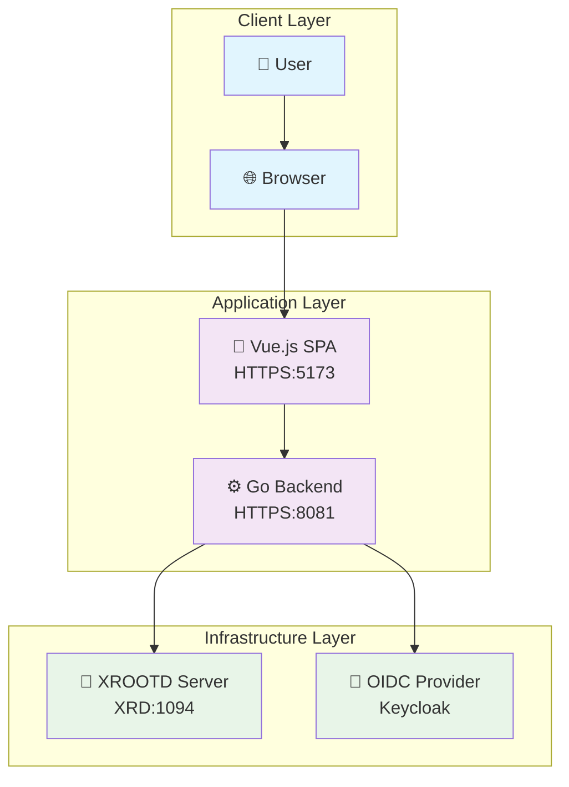
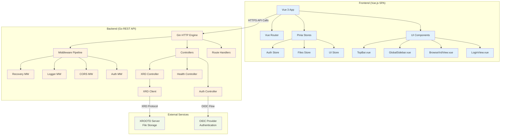
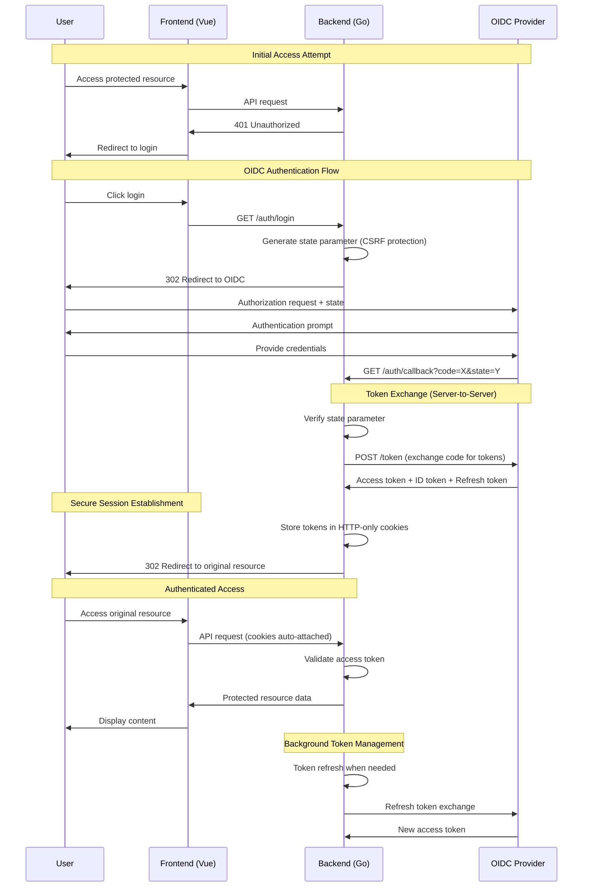
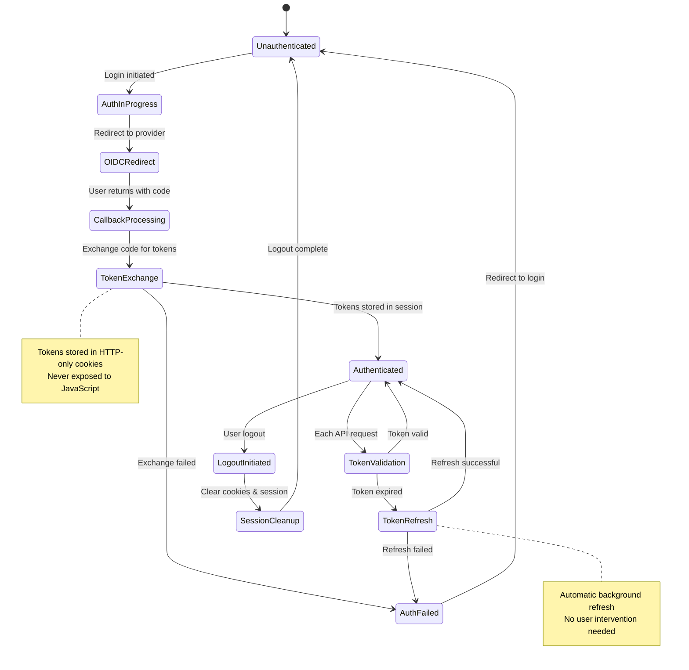
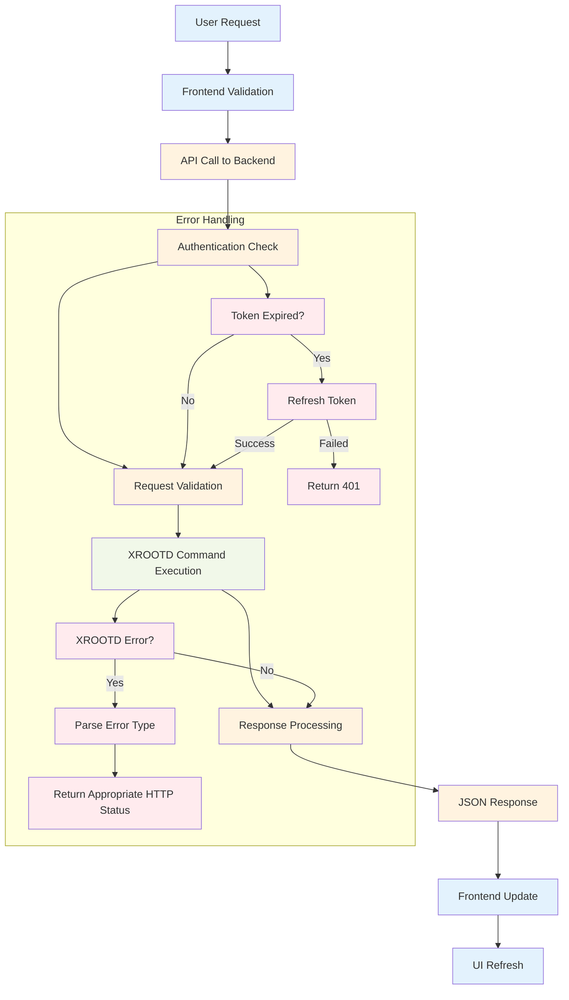
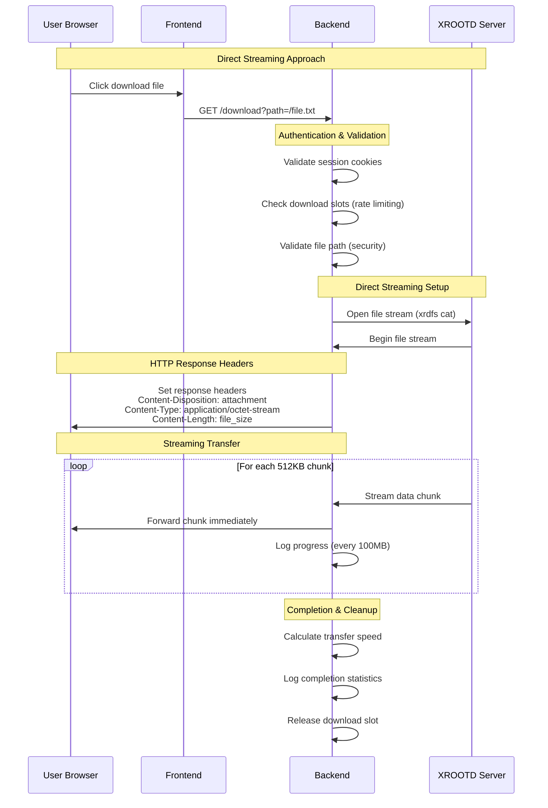
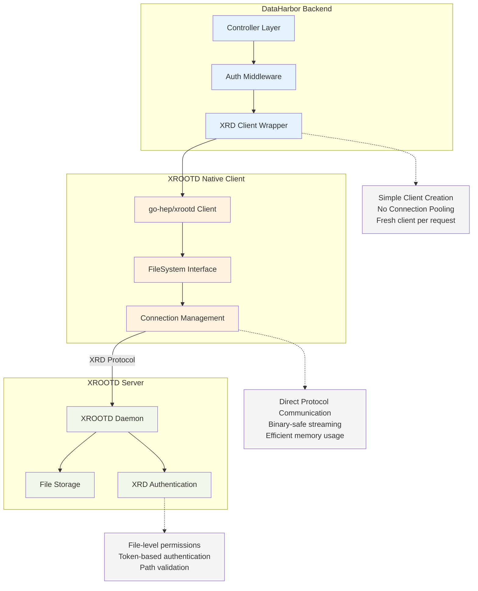

# System Architecture

[← Back to Documentation](./README.md)

This document describes the overall architecture, design patterns, and technical decisions for DataHarbor.

## Overview

DataHarbor follows a modern web application architecture with a clear separation between frontend and backend components, implementing security best practices and scalable design patterns.

## Architecture Diagrams

### System Overview



### Detailed Component Architecture



## Components

### Frontend (Vue.js SPA)

**Technology Stack:** Vue 3, Vite, Element Plus, Pinia, Vue Router, Axios

> For detailed frontend technology information, see **[Frontend Development](./FRONTEND.md)**.

**Key Features:**

- Single Page Application (SPA) architecture
- Responsive design with modern UI components
- Client-side routing for seamless navigation
- State management for user session and application data
- HTTPS-only communication with backend

**Key Directories:** `web/src/components/`, `web/src/views/`, `web/src/store/`, `web/src/api/`

> For complete directory structure, see **[Frontend Development → Project Structure](./FRONTEND.md#project-structure)**.

### Backend (Go REST API)

**Technology Stack:** Go 1.24+, Gin, Viper, Zap, Gorilla Sessions, Go XROOTD Client

> For detailed backend technology information, see **[Backend Development](./BACKEND.md)**.

**Key Features:**

- RESTful API design
- Middleware-based architecture
- Structured logging and monitoring
- Configuration-driven deployment
- Asynchronous file operations with timeouts
- Session-based authentication

**Key Directories:** `app/controller/`, `app/middleware/`, `app/config/`, `app/common/`

> For complete directory structure, see **[Backend Development → Project Structure](./BACKEND.md#project-structure)**.

## Authentication Architecture

DataHarbor implements the **Backend-For-Frontend (BFF)** pattern with OpenID Connect (OIDC) for secure authentication.

### BFF Authentication Flow



### Advanced Authentication States



### Security Benefits

1. **Token Security**: Tokens stored in HTTP-only cookies, inaccessible to JavaScript
2. **XSS Protection**: Prevents token theft through client-side attacks
3. **CSRF Protection**: State parameter validation and SameSite cookies
4. **Token Refresh**: Server-side token refresh without user intervention
5. **Session Management**: Centralized session control and logout

## Data Flow

### File Operations Flow



### File Download Process (Streaming Architecture)



### XROOTD Client Integration Patterns



### File Download Process

**Direct Streaming Approach:**

1. **Request**: User initiates file download via GET request with file path
2. **Authentication**: Backend validates user session and XROOTD token
3. **Path Validation**: File path validated for security (no directory traversal)
4. **Concurrency Check**: Ensures only one download per user session
5. **Direct Streaming**: File streamed from XROOTD to client using `xrdfs cat`
6. **Cleanup**: Download slot released upon completion or error

**Benefits:**

- No temporary storage required
- Immediate download start
- Secure per-request authentication
- Memory efficient streaming

## Design Patterns

### Backend Patterns

#### Middleware Pattern

```go
// Request processing pipeline
router.Use(
    middleware.Recovery(),
    middleware.Logger(),
    middleware.CORS(),
    middleware.Auth(),
)
```

#### Handler Pattern

```go
// Standardized request handling
func (c *Controller) HandleRequest(ctx *gin.Context) {
    // 1. Parse request
    // 2. Validate input
    // 3. Execute business logic
    // 4. Format response
    // 5. Return JSON
}
```

#### Configuration Pattern

```go
// Centralized configuration management
type Config struct {
    Server ServerConfig `yaml:"server"`
    Auth   AuthConfig   `yaml:"auth"`
    XRD    XRDConfig    `yaml:"xrd"`
}
```

### Frontend Patterns

#### Composition API Pattern

```javascript
// Reusable logic with composables
import { useFileOperations } from '@/composables/useFileOperations'

export default {
  setup() {
    const { files, loading, loadDirectory } = useFileOperations()
    return { files, loading, loadDirectory }
  }
}
```

#### Store Pattern (Pinia)

```javascript
// Centralized state management
export const useUserStore = defineStore('user', {
  state: () => ({
    user: null,
    isAuthenticated: false
  }),
  actions: {
    async login() { /* ... */ },
    async logout() { /* ... */ }
  }
})
```

## Configuration Management

### Environment-Specific Configurations

```yaml
# application.development.yaml
server:
  port: 8081
  debug: true
auth:
  enabled: false
xrd:
  timeout: 30s

# application.production.yaml
server:
  port: 8080
  debug: false
auth:
  enabled: true
xrd:
  timeout: 60s
```

### Configuration Hierarchy

1. **Command-line arguments**: `--config=path/to/config.yaml`
2. **Environment variables**: `DATAHARBOR_*`
3. **Configuration files**: YAML format
4. **Default values**: Hardcoded fallbacks

---

## Related Documentation

- **[Authentication System](./AUTHENTICATION.md)** - Security and OIDC integration details
- **[Backend Development](./BACKEND.md)** - Backend implementation guide
- **[Frontend Development](./FRONTEND.md)** - Frontend implementation guide
- **[API Reference](./API.md)** - Complete REST API documentation

---

[← Back to Documentation](./README.md) | [↑ Top](#system-architecture)
