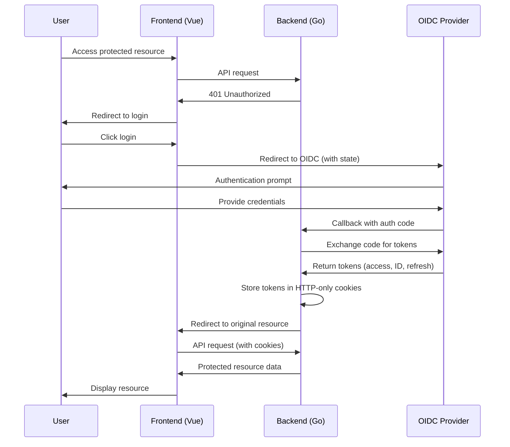
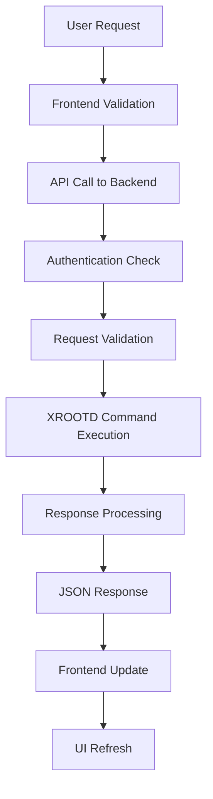

# System Architecture

This document describes the overall architecture, design patterns, and technical decisions for DataHarbor.

## Overview

DataHarbor follows a modern web application architecture with a clear separation between frontend and backend components, implementing security best practices and scalable design patterns.

## Architecture Diagram

```text
┌─────────────────┐    HTTPS     ┌─────────────────┐    XRD     ┌─────────────────┐
│                 │◄────────────►│                 │◄──────────►│                 │
│   Vue.js SPA    │              │   Go Backend    │            │  XROOTD Server  │
│   (Frontend)    │              │   (REST API)    │            │  (File System)  │
│                 │              │                 │            │                 │
└─────────────────┘              └─────────────────┘            └─────────────────┘
         │                                │
         │                                │
         ▼                                ▼
┌─────────────────┐              ┌─────────────────┐
│   Browser       │              │   OIDC Provider │
│   (User Agent)  │              │   (Keycloak)    │
└─────────────────┘              └─────────────────┘
```

## Components

### Frontend (Vue.js SPA)

**Technology Stack:**

- **Vue 3**: Progressive JavaScript framework with Composition API
- **Vite**: Fast build tool and development server
- **Element Plus**: UI component library
- **Pinia**: State management
- **Vue Router**: Client-side routing
- **Axios**: HTTP client for API communication

**Key Features:**

- Single Page Application (SPA) architecture
- Responsive design with modern UI components
- Client-side routing for seamless navigation
- State management for user session and application data
- HTTPS-only communication with backend

**Directory Structure:**

```text
web/
├── src/
│   ├── components/     # Reusable Vue components
│   ├── views/          # Page-level components
│   ├── api/            # API client and request handlers
│   ├── store/          # Pinia stores for state management
│   ├── router/         # Vue Router configuration
│   ├── composables/    # Vue composables for shared logic
│   └── utils/          # Utility functions
├── public/             # Static assets
└── dist/               # Built application (production)
```

### Backend (Go REST API)

**Technology Stack:**

- **Go 1.24+**: Modern, compiled language with excellent concurrency
- **Gin**: High-performance HTTP web framework
- **Viper**: Configuration management
- **Zap**: Structured logging
- **Gorilla Sessions**: Session management
- **XROOTD Client**: File system operations

**Key Features:**

- RESTful API design
- Middleware-based architecture
- Structured logging and monitoring
- Configuration-driven deployment
- Asynchronous file operations with timeouts
- Session-based authentication

**Directory Structure:**

```text
app/
├── controller/         # HTTP request handlers
├── middleware/         # Request processing middleware
├── route/             # API route definitions
├── config/            # Configuration management
├── common/            # Shared utilities (logger, XROOTD client)
├── core/              # Business logic (file sanitation)
├── request/           # Request DTO structures
├── response/          # Response DTO structures
└── util/              # General utility functions
```

## Authentication Architecture

DataHarbor implements the **Backend-For-Frontend (BFF)** pattern with OpenID Connect (OIDC) for secure authentication.

### BFF Authentication Flow



### Security Benefits

1. **Token Security**: Tokens stored in HTTP-only cookies, inaccessible to JavaScript
2. **XSS Protection**: Prevents token theft through client-side attacks
3. **CSRF Protection**: State parameter validation and SameSite cookies
4. **Token Refresh**: Server-side token refresh without user intervention
5. **Session Management**: Centralized session control and logout

## Data Flow

### File Operations Flow



### File Staging Process

1. **Request**: User requests file staging
2. **Validation**: Backend validates file path and permissions
3. **Staging**: File copied to temporary public directory
4. **Response**: Staged file path returned to frontend
5. **Download**: User can download from public location
6. **Cleanup**: Sanitation job removes expired staged files

## Design Patterns

### Backend Patterns

#### Middleware Pattern

```go
// Request processing pipeline
router.Use(
    middleware.Recovery(),
    middleware.Logger(),
    middleware.CORS(),
    middleware.Auth(),
)
```

#### Handler Pattern

```go
// Standardized request handling
func (c *Controller) HandleRequest(ctx *gin.Context) {
    // 1. Parse request
    // 2. Validate input
    // 3. Execute business logic
    // 4. Format response
    // 5. Return JSON
}
```

#### Configuration Pattern

```go
// Centralized configuration management
type Config struct {
    Server ServerConfig `yaml:"server"`
    Auth   AuthConfig   `yaml:"auth"`
    XRD    XRDConfig    `yaml:"xrd"`
}
```

### Frontend Patterns

#### Composition API Pattern

```javascript
// Reusable logic with composables
import { useFileOperations } from '@/composables/useFileOperations'

export default {
  setup() {
    const { files, loading, loadDirectory } = useFileOperations()
    return { files, loading, loadDirectory }
  }
}
```

#### Store Pattern (Pinia)

```javascript
// Centralized state management
export const useUserStore = defineStore('user', {
  state: () => ({
    user: null,
    isAuthenticated: false
  }),
  actions: {
    async login() { /* ... */ },
    async logout() { /* ... */ }
  }
})
```

## Configuration Management

### Environment-Specific Configurations

```yaml
# application.development.yaml
server:
  port: 8081
  debug: true
auth:
  enabled: false
xrd:
  timeout: 30s

# application.production.yaml
server:
  port: 8080
  debug: false
auth:
  enabled: true
xrd:
  timeout: 60s
```

### Configuration Hierarchy

1. **Command-line arguments**: `--config=path/to/config.yaml`
2. **Environment variables**: `DATAHARBOR_*`
3. **Configuration files**: YAML format
4. **Default values**: Hardcoded fallbacks

## Performance Considerations

### Backend Optimizations

- **Goroutines**: Concurrent request handling
- **Connection Pooling**: Efficient resource usage
- **Timeouts**: Prevent blocking operations
- **Caching**: Response caching where appropriate
- **Structured Logging**: Efficient log processing

### Frontend Optimizations

- **Code Splitting**: Lazy loading of routes
- **Component Optimization**: Vue 3 performance features
- **Asset Optimization**: Vite build optimizations
- **HTTP/2**: Multiplexed connections
- **Gzip Compression**: Reduced payload sizes

## Security Architecture

### Security Layers

1. **Transport Security**: HTTPS/TLS encryption
2. **Authentication**: OIDC-based user verification
3. **Authorization**: Role-based access control
4. **Session Security**: HTTP-only cookies, SameSite
5. **Input Validation**: Request sanitization
6. **CORS**: Cross-origin request protection
7. **CSP**: Content Security Policy headers

### File System Security

- **Path Validation**: Prevent directory traversal
- **Permission Checks**: XROOTD-level access control
- **Staged File Cleanup**: Automatic removal of temporary files
- **Audit Logging**: File operation tracking

## Scalability Considerations

### Horizontal Scaling

- **Stateless Backend**: Session data in external store
- **Load Balancing**: Multiple backend instances
- **Database Clustering**: If database is added
- **CDN Integration**: Static asset distribution

### Vertical Scaling

- **Resource Optimization**: Memory and CPU efficiency
- **Connection Limits**: Proper resource management
- **Caching Strategies**: Reduce computational overhead

## Monitoring and Observability

### Logging Strategy

- **Structured Logging**: JSON format with Zap
- **Log Levels**: DEBUG, INFO, WARN, ERROR
- **Request Tracing**: Correlation IDs
- **Error Tracking**: Detailed error information

### Metrics Collection

- **HTTP Metrics**: Request/response times, status codes
- **System Metrics**: CPU, memory, disk usage
- **Application Metrics**: File operations, user sessions
- **Custom Metrics**: Business-specific measurements

## Future Architecture Considerations

### Potential Enhancements

1. **Database Integration**: User preferences, audit logs
2. **Caching Layer**: Redis for session storage
3. **Message Queue**: Asynchronous job processing
4. **Microservices**: Service decomposition
5. **Container Orchestration**: Kubernetes deployment
6. **API Gateway**: Centralized API management

### Migration Strategies

- **Blue-Green Deployment**: Zero-downtime updates
- **Database Migrations**: Schema versioning
- **API Versioning**: Backward compatibility
- **Feature Flags**: Gradual feature rollout
