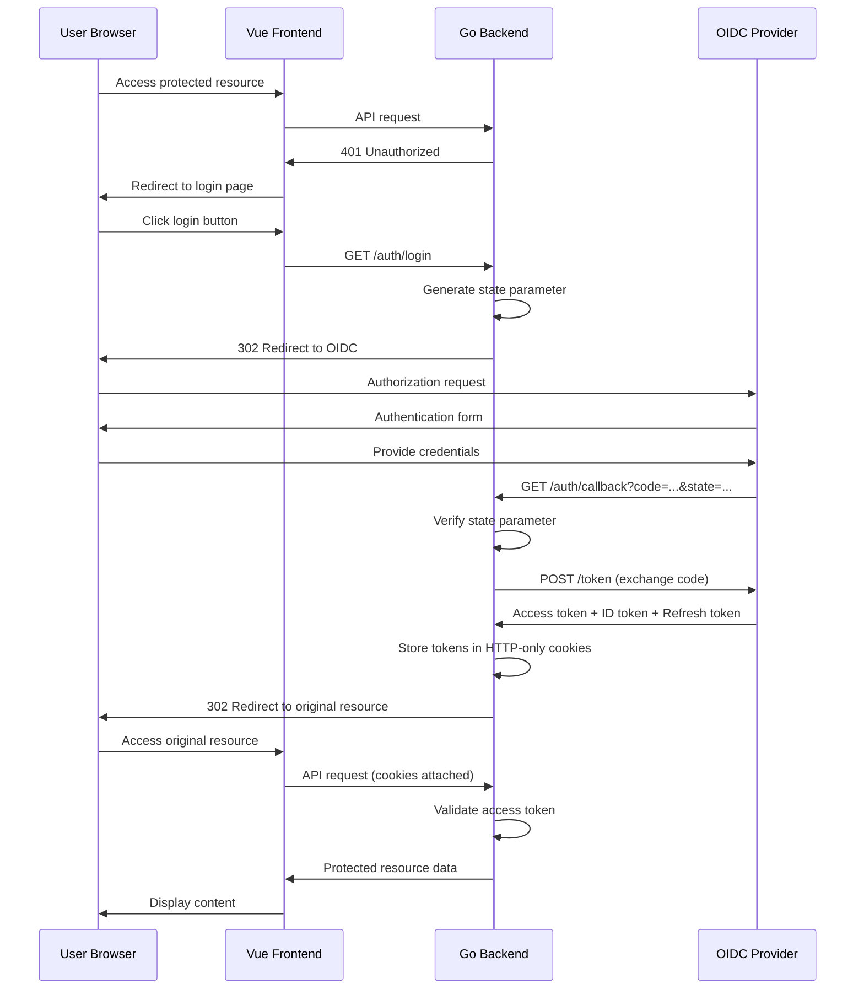

# Authentication and Security

This document details the authentication mechanisms, security architecture, and security best practices implemented in DataHarbor.

## Authentication Overview

DataHarbor implements OpenID Connect (OIDC) authentication using the Backend-For-Frontend (BFF) pattern. This approach enhances security by keeping sensitive authentication tokens on the server side, away from client-side JavaScript.

## OIDC Authentication Flow

### Complete Authentication Sequence



### Authentication Components

#### 1. OIDC Provider Configuration

```yaml
# Configuration example
auth:
  enabled: true
  oidc:
    issuer: "https://keycloak.example.com/realms/dataharbor"
    client_id: "dataharbor-client"
    client_secret: "${OIDC_CLIENT_SECRET}"
    redirect_uri: "https://dataharbor.example.com/api/v1/auth/callback"
    scopes: ["openid", "profile", "email"]
  session:
    secret: "${SESSION_SECRET}"
    max_age: 3600  # 1 hour
    secure: true
    http_only: true
    same_site: "strict"
```

#### 2. Backend Implementation

```go
// Authentication middleware
func AuthMiddleware() gin.HandlerFunc {
    return func(ctx *gin.Context) {
        session := sessions.Default(ctx)
        
        // Check for access token
        accessToken := session.Get("access_token")
        if accessToken == nil {
            ctx.JSON(http.StatusUnauthorized, gin.H{
                "code": 401,
                "message": "Authentication required"
            })
            ctx.Abort()
            return
        }
        
        // Validate token
        if !isTokenValid(accessToken.(string)) {
            // Attempt token refresh
            if !refreshToken(ctx, session) {
                ctx.JSON(http.StatusUnauthorized, gin.H{
                    "code": 401,
                    "message": "Token expired"
                })
                ctx.Abort()
                return
            }
        }
        
        // Add user context
        userInfo := getUserFromToken(accessToken.(string))
        ctx.Set("user", userInfo)
        ctx.Next()
    }
}

// OIDC login handler
func (c *AuthController) Login(ctx *gin.Context) {
    // Generate CSRF state
    state := generateRandomState()
    session := sessions.Default(ctx)
    session.Set("oauth_state", state)
    session.Set("original_url", ctx.Query("redirect"))
    session.Save()
    
    // Build authorization URL
    authURL := c.buildAuthorizationURL(state)
    ctx.Redirect(http.StatusFound, authURL)
}

// OIDC callback handler
func (c *AuthController) Callback(ctx *gin.Context) {
    session := sessions.Default(ctx)
    
    // Verify state parameter (CSRF protection)
    expectedState := session.Get("oauth_state")
    if expectedState == nil || expectedState != ctx.Query("state") {
        ctx.JSON(http.StatusBadRequest, gin.H{
            "code": 400,
            "message": "Invalid state parameter"
        })
        return
    }
    
    // Exchange authorization code for tokens
    code := ctx.Query("code")
    tokens, err := c.exchangeCodeForTokens(code)
    if err != nil {
        ctx.JSON(http.StatusInternalServerError, gin.H{
            "code": 500,
            "message": "Token exchange failed"
        })
        return
    }
    
    // Store tokens securely
    session.Set("access_token", tokens.AccessToken)
    session.Set("id_token", tokens.IDToken)
    session.Set("refresh_token", tokens.RefreshToken)
    session.Save()
    
    // Redirect to original destination
    originalURL := session.Get("original_url")
    if originalURL == nil {
        originalURL = "/"
    }
    ctx.Redirect(http.StatusFound, originalURL.(string))
}
```

#### 3. Frontend Integration

```javascript
// Authentication store (Pinia)
export const useAuthStore = defineStore('auth', () => {
  const user = ref(null)
  const isAuthenticated = ref(false)
  const loading = ref(false)
  
  const checkAuth = async () => {
    try {
      const response = await api.get('/api/v1/auth/user')
      if (response.status === 200) {
        user.value = response.data.data
        isAuthenticated.value = true
        return true
      }
    } catch (error) {
      if (error.response?.status === 401) {
        isAuthenticated.value = false
        user.value = null
      }
      return false
    }
  }
  
  const login = () => {
    // Redirect to backend login endpoint
    const currentUrl = encodeURIComponent(window.location.href)
    window.location.href = `/api/v1/auth/login?redirect=${currentUrl}`
  }
  
  const logout = async () => {
    loading.value = true
    try {
      await api.post('/api/v1/auth/logout')
      user.value = null
      isAuthenticated.value = false
      window.location.href = '/login'
    } finally {
      loading.value = false
    }
  }
  
  return { user, isAuthenticated, loading, checkAuth, login, logout }
})

// Route guards
router.beforeEach(async (to, from, next) => {
  const authStore = useAuthStore()
  
  if (to.meta.requiresAuth) {
    const isAuthenticated = await authStore.checkAuth()
    if (!isAuthenticated) {
      authStore.login()
      return
    }
  }
  
  next()
})
```

## Security Architecture

### Security Layers

1. **Transport Security**
   - HTTPS/TLS encryption for all communications
   - HTTP Strict Transport Security (HSTS) headers
   - Certificate pinning in production

2. **Authentication Security**
   - OIDC standard compliance
   - State parameter for CSRF protection
   - Secure token storage in HTTP-only cookies

3. **Session Security**
   - HTTP-only cookies prevent XSS access
   - Secure flag ensures HTTPS-only transmission
   - SameSite attribute prevents CSRF attacks
   - Configurable session timeout

4. **Authorization Security**
   - Token-based authorization
   - Role-based access control (RBAC)
   - Resource-level permissions

5. **Input Security**
   - Request validation and sanitization
   - Path traversal protection
   - SQL injection prevention (when database is used)

### Cookie Security Configuration

```go
// Session configuration
func configureSession(router *gin.Engine) {
    store := cookie.NewStore([]byte(config.SessionSecret))
    store.Options(sessions.Options{
        Path:     "/",
        Domain:   config.Domain,
        MaxAge:   config.SessionMaxAge,
        Secure:   config.IsProduction,  // HTTPS only in production
        HttpOnly: true,                 // Prevent XSS access
        SameSite: http.SameSiteStrictMode, // CSRF protection
    })
    router.Use(sessions.Sessions("dataharbor-session", store))
}
```

### CSRF Protection

```go
// State parameter generation
func generateRandomState() string {
    b := make([]byte, 32)
    rand.Read(b)
    return base64.URLEncoding.EncodeToString(b)
}

// State verification
func verifyState(session sessions.Session, receivedState string) bool {
    expectedState := session.Get("oauth_state")
    if expectedState == nil {
        return false
    }
    
    // Constant-time comparison to prevent timing attacks
    return subtle.ConstantTimeCompare(
        []byte(expectedState.(string)),
        []byte(receivedState),
    ) == 1
}
```

## Token Management

### Token Types and Usage

1. **Access Token**
   - Used for API authorization
   - Short-lived (typically 15-60 minutes)
   - Contains user permissions and roles
   - Validated on each API request

2. **ID Token**
   - Contains user identity information
   - Used for user profile display
   - JWT format with signature verification

3. **Refresh Token**
   - Used to obtain new access tokens
   - Longer-lived (hours to days)
   - Securely stored and rotated

### Token Refresh Implementation

```go
func refreshToken(ctx *gin.Context, session sessions.Session) bool {
    refreshToken := session.Get("refresh_token")
    if refreshToken == nil {
        return false
    }
    
    // Request new tokens
    newTokens, err := exchangeRefreshToken(refreshToken.(string))
    if err != nil {
        logger.Error("Token refresh failed", zap.Error(err))
        return false
    }
    
    // Update session with new tokens
    session.Set("access_token", newTokens.AccessToken)
    if newTokens.RefreshToken != "" {
        session.Set("refresh_token", newTokens.RefreshToken)
    }
    session.Save()
    
    return true
}

func exchangeRefreshToken(refreshToken string) (*TokenResponse, error) {
    data := url.Values{}
    data.Set("grant_type", "refresh_token")
    data.Set("refresh_token", refreshToken)
    data.Set("client_id", config.OIDC.ClientID)
    data.Set("client_secret", config.OIDC.ClientSecret)
    
    resp, err := http.PostForm(config.OIDC.TokenEndpoint, data)
    if err != nil {
        return nil, err
    }
    defer resp.Body.Close()
    
    var tokens TokenResponse
    if err := json.NewDecoder(resp.Body).Decode(&tokens); err != nil {
        return nil, err
    }
    
    return &tokens, nil
}
```

### Token Validation

```go
func validateAccessToken(token string) (*UserInfo, error) {
    // Parse JWT token
    parsedToken, err := jwt.Parse(token, func(token *jwt.Token) (interface{}, error) {
        // Verify signing method
        if _, ok := token.Method.(*jwt.SigningMethodRSA); !ok {
            return nil, fmt.Errorf("unexpected signing method: %v", token.Header["alg"])
        }
        
        // Return public key for verification
        return getPublicKey(), nil
    })
    
    if err != nil || !parsedToken.Valid {
        return nil, fmt.Errorf("invalid token: %w", err)
    }
    
    // Extract claims
    claims, ok := parsedToken.Claims.(jwt.MapClaims)
    if !ok {
        return nil, fmt.Errorf("invalid token claims")
    }
    
    // Verify expiration
    if exp, ok := claims["exp"].(float64); ok {
        if time.Now().Unix() > int64(exp) {
            return nil, fmt.Errorf("token expired")
        }
    }
    
    // Extract user information
    userInfo := &UserInfo{
        ID:    claims["sub"].(string),
        Name:  claims["name"].(string),
        Email: claims["email"].(string),
        Roles: extractRoles(claims),
    }
    
    return userInfo, nil
}
```

## Role-Based Access Control (RBAC)

### Role Definition

```go
type Role string

const (
    RoleUser  Role = "user"
    RoleAdmin Role = "admin"
    RolePowerUser Role = "power_user"
)

type UserInfo struct {
    ID    string   `json:"id"`
    Name  string   `json:"name"`
    Email string   `json:"email"`
    Roles []Role   `json:"roles"`
}

// Check if user has required role
func (u *UserInfo) HasRole(requiredRole Role) bool {
    for _, role := range u.Roles {
        if role == requiredRole {
            return true
        }
    }
    return false
}

// Check if user has any of the required roles
func (u *UserInfo) HasAnyRole(requiredRoles ...Role) bool {
    for _, requiredRole := range requiredRoles {
        if u.HasRole(requiredRole) {
            return true
        }
    }
    return false
}
```

### Authorization Middleware

```go
func RequireRole(requiredRoles ...Role) gin.HandlerFunc {
    return func(ctx *gin.Context) {
        user, exists := ctx.Get("user")
        if !exists {
            ctx.JSON(http.StatusUnauthorized, gin.H{
                "code": 401,
                "message": "Authentication required"
            })
            ctx.Abort()
            return
        }
        
        userInfo := user.(*UserInfo)
        if !userInfo.HasAnyRole(requiredRoles...) {
            ctx.JSON(http.StatusForbidden, gin.H{
                "code": 403,
                "message": "Insufficient permissions"
            })
            ctx.Abort()
            return
        }
        
        ctx.Next()
    }
}

// Usage in routes
func registerProtectedRoutes(router *gin.RouterGroup) {
    // User-level access
    router.POST("/dir", AuthMiddleware(), controller.ListDirectory)
    
    // Admin-only access
    admin := router.Group("/admin")
    admin.Use(AuthMiddleware(), RequireRole(RoleAdmin))
    admin.GET("/users", controller.ListUsers)
    admin.DELETE("/users/:id", controller.DeleteUser)
}
```

## Security Headers

### HTTP Security Headers

```go
func SecurityMiddleware() gin.HandlerFunc {
    return func(ctx *gin.Context) {
        // Prevent XSS attacks
        ctx.Header("X-XSS-Protection", "1; mode=block")
        
        // Prevent MIME type sniffing
        ctx.Header("X-Content-Type-Options", "nosniff")
        
        // Prevent clickjacking
        ctx.Header("X-Frame-Options", "DENY")
        
        // Force HTTPS
        if config.IsProduction {
            ctx.Header("Strict-Transport-Security", "max-age=31536000; includeSubDomains")
        }
        
        // Content Security Policy
        csp := "default-src 'self'; " +
               "script-src 'self' 'unsafe-inline'; " +
               "style-src 'self' 'unsafe-inline'; " +
               "img-src 'self' data:; " +
               "connect-src 'self'"
        ctx.Header("Content-Security-Policy", csp)
        
        // Referrer Policy
        ctx.Header("Referrer-Policy", "strict-origin-when-cross-origin")
        
        ctx.Next()
    }
}
```

### CORS Configuration

```go
func CORSMiddleware() gin.HandlerFunc {
    return cors.New(cors.Config{
        AllowOrigins:     []string{config.FrontendURL},
        AllowMethods:     []string{"GET", "POST", "PUT", "DELETE", "OPTIONS"},
        AllowHeaders:     []string{"Origin", "Content-Type", "Accept", "Authorization"},
        ExposeHeaders:    []string{"Content-Length"},
        AllowCredentials: true,
        MaxAge:          12 * time.Hour,
    })
}
```

## Input Validation and Sanitization

### Request Validation

```go
type DirectoryRequest struct {
    Path     string `json:"path" binding:"required,min=1,max=4096"`
    PageSize int    `json:"pageSize" binding:"required,min=1,max=1000"`
}

func validateDirectoryPath(path string) error {
    // Check for path traversal attempts
    if strings.Contains(path, "..") {
        return fmt.Errorf("path traversal not allowed")
    }
    
    // Ensure absolute path
    if !strings.HasPrefix(path, "/") {
        return fmt.Errorf("path must be absolute")
    }
    
    // Check for invalid characters
    if matched, _ := regexp.MatchString(`[<>:"|?*]`, path); matched {
        return fmt.Errorf("path contains invalid characters")
    }
    
    return nil
}

func (c *Controller) ListDirectory(ctx *gin.Context) {
    var req DirectoryRequest
    if err := ctx.ShouldBindJSON(&req); err != nil {
        ctx.JSON(http.StatusBadRequest, gin.H{
            "code": 400,
            "message": "Invalid request parameters"
        })
        return
    }
    
    // Additional path validation
    if err := validateDirectoryPath(req.Path); err != nil {
        ctx.JSON(http.StatusBadRequest, gin.H{
            "code": 400,
            "message": err.Error()
        })
        return
    }
    
    // Process request...
}
```

## Audit Logging

### Security Event Logging

```go
type SecurityEvent struct {
    Timestamp time.Time `json:"timestamp"`
    Event     string    `json:"event"`
    UserID    string    `json:"user_id,omitempty"`
    IP        string    `json:"ip_address"`
    UserAgent string    `json:"user_agent"`
    Resource  string    `json:"resource,omitempty"`
    Success   bool      `json:"success"`
    Details   string    `json:"details,omitempty"`
}

func logSecurityEvent(event string, ctx *gin.Context, success bool, details string) {
    user, _ := ctx.Get("user")
    var userID string
    if user != nil {
        userID = user.(*UserInfo).ID
    }
    
    secEvent := SecurityEvent{
        Timestamp: time.Now().UTC(),
        Event:     event,
        UserID:    userID,
        IP:        ctx.ClientIP(),
        UserAgent: ctx.GetHeader("User-Agent"),
        Resource:  ctx.Request.URL.Path,
        Success:   success,
        Details:   details,
    }
    
    // Log to security audit log
    securityLogger.Info("Security event", zap.Any("event", secEvent))
}

// Usage in authentication handlers
func (c *AuthController) Login(ctx *gin.Context) {
    logSecurityEvent("login_attempt", ctx, true, "User initiated login")
    // ... login logic
}

func (c *AuthController) Logout(ctx *gin.Context) {
    logSecurityEvent("logout", ctx, true, "User logged out")
    // ... logout logic
}
```

## Security Best Practices

### Development Guidelines

1. **Authentication**
   - Always use HTTPS in production
   - Implement proper session timeout
   - Use secure cookie attributes
   - Validate all tokens on each request

2. **Authorization**
   - Implement principle of least privilege
   - Check permissions at multiple layers
   - Use role-based access control
   - Validate resource ownership

3. **Input Handling**
   - Validate all input parameters
   - Sanitize user-provided data
   - Use parameterized queries (when using databases)
   - Implement rate limiting

4. **Error Handling**
   - Don't expose sensitive information in errors
   - Use generic error messages for security
   - Log detailed errors server-side
   - Implement proper error boundaries

5. **Logging and Monitoring**
   - Log all security-relevant events
   - Monitor for suspicious activities
   - Implement alerting for security events
   - Regular security audits

### Production Security Checklist

- [ ] HTTPS enabled with valid certificates
- [ ] Security headers properly configured
- [ ] Session security properly configured
- [ ] Rate limiting implemented
- [ ] Input validation comprehensive
- [ ] Error handling secure
- [ ] Audit logging enabled
- [ ] Security monitoring in place
- [ ] Regular security updates applied
- [ ] Penetration testing conducted

### Common Vulnerabilities Prevention

1. **Cross-Site Scripting (XSS)**
   - Use Content Security Policy headers
   - Sanitize user input
   - Use framework's built-in protections

2. **Cross-Site Request Forgery (CSRF)**
   - Use SameSite cookie attribute
   - Implement state parameter in OIDC flow
   - Validate origin headers

3. **Injection Attacks**
   - Validate and sanitize all inputs
   - Use parameterized queries
   - Implement input length limits

4. **Insecure Authentication**
   - Use strong session management
   - Implement proper token validation
   - Use secure cookie attributes

5. **Security Misconfiguration**
   - Remove default credentials
   - Disable unnecessary features
   - Keep software updated
   - Use security headers
