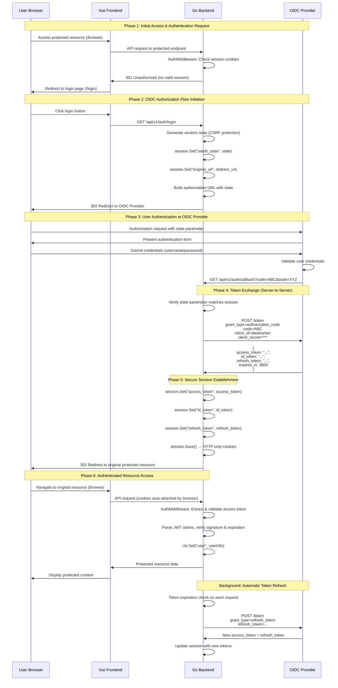
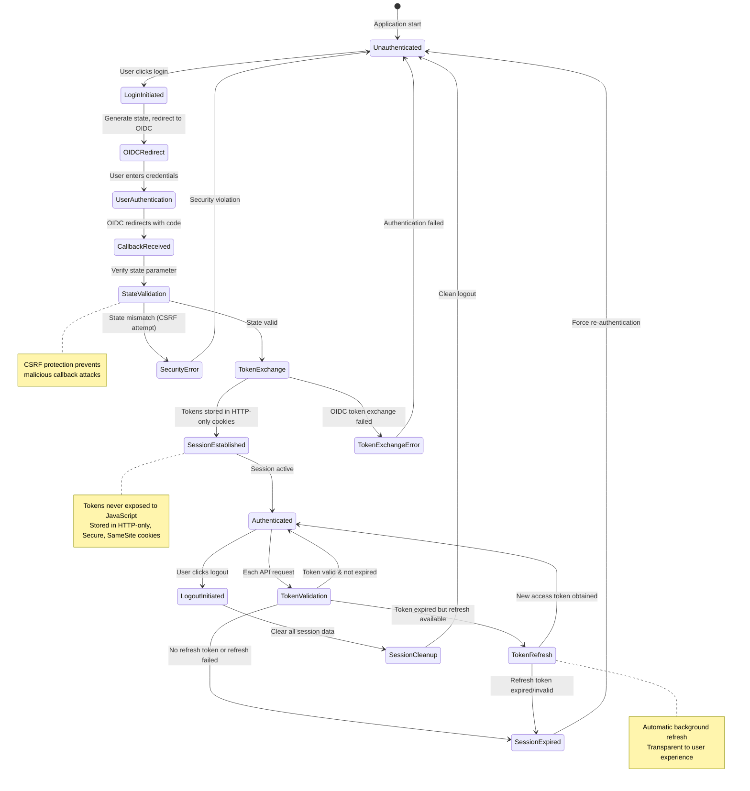
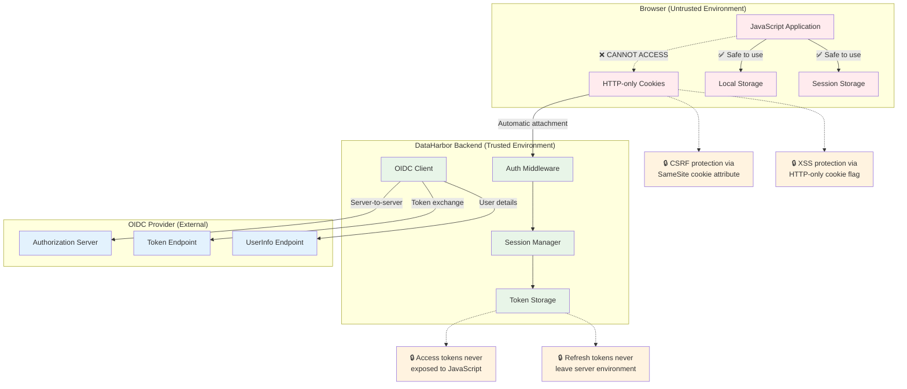

# Authentication and Security

[← Back to Documentation](./README.md)

This document details the authentication mechanisms, security architecture, and security best practices implemented in DataHarbor.

## Authentication Overview

DataHarbor implements OpenID Connect (OIDC) authentication using the Backend-For-Frontend (BFF) pattern. This approach enhances security by keeping sensitive authentication tokens on the server side, away from client-side JavaScript.

## Authentication Architecture Diagrams

### Complete OIDC Authentication Sequence (Technical)



### Session Management & Token Lifecycle



### Backend-for-Frontend (BFF) Security Architecture



### Authentication Components

#### OIDC Provider Configuration

```yaml
# Configuration example
auth:
  enabled: true
  oidc:
    issuer: "https://keycloak.example.com/realms/dataharbor"
    client_id: "dataharbor-client"
    client_secret: "${OIDC_CLIENT_SECRET}"
    redirect_uri: "https://dataharbor.example.com/api/v1/auth/callback"
    scopes: ["openid", "profile", "email"]
  session:
    secret: "${SESSION_SECRET}"
    max_age: 3600  # 1 hour
    secure: true
    http_only: true
    same_site: "strict"
```

## Security Architecture

### Security Layers

1. **Transport Security**
   - HTTPS/TLS encryption for all communications
   - HTTP Strict Transport Security (HSTS) headers
   - Certificate pinning in production

2. **Authentication Security**
   - OIDC standard compliance
   - State parameter for CSRF protection
   - Secure token storage in HTTP-only cookies

3. **Session Security**
   - HTTP-only cookies prevent XSS access
   - Secure flag ensures HTTPS-only transmission
   - SameSite attribute prevents CSRF attacks
   - Configurable session timeout

4. **Authorization Security**
   - Token-based authorization
   - Role-based access control (RBAC)
   - Resource-level permissions

5. **Input Security**
   - Request validation and sanitization
   - Path traversal protection
   - SQL injection prevention (when database is used)

## Token Management

### Token Types and Usage

1. **Access Token**
   - Used for API authorization
   - Short-lived (typically 15-60 minutes)
   - Contains user permissions and roles
   - Validated on each API request

2. **ID Token**
   - Contains user identity information
   - Used for user profile display
   - JWT format with signature verification

3. **Refresh Token**
   - Used to obtain new access tokens
   - Longer-lived (hours to days)
   - Securely stored and rotated

---

## Related Documentation

- **[System Architecture](./ARCHITECTURE.md)** - Overall system design
- **[Backend Development](./BACKEND.md)** - Auth middleware implementation
- **[API Reference](./API.md)** - Authentication endpoints
- **[Troubleshooting](./TROUBLESHOOTING.md)** - Auth issues and solutions

---

[← Back to Documentation](./README.md) | [↑ Top](#authentication-and-security)
