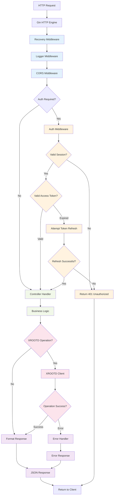
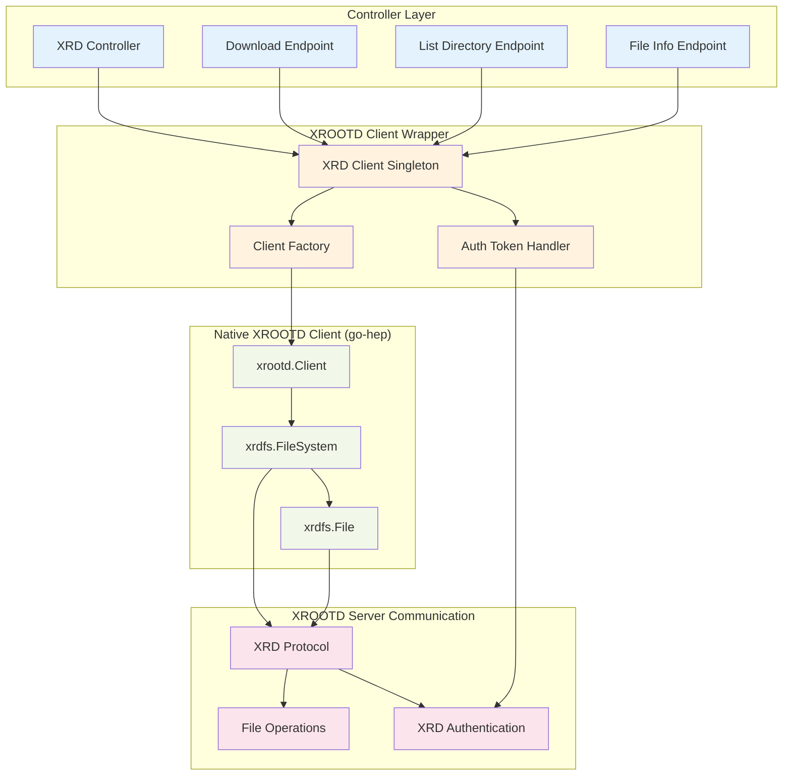
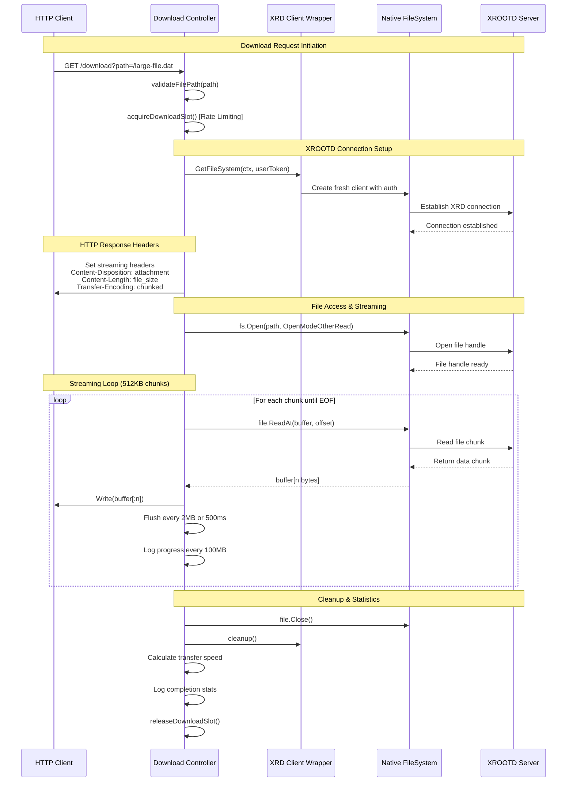
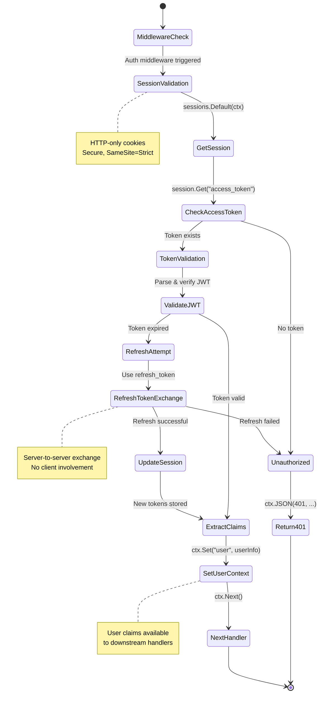

# Backend Development Guide

This guide covers backend development for DataHarbor's Go-based REST API server.

## Backend Architecture Diagrams

### HTTP Request Processing Pipeline



### XROOTD Client Architecture (Detailed)



## Technology Stack

- **Go 1.24+**: Main programming language
- **Gin**: HTTP web framework
- **Viper**: Configuration management
- **Zap**: Structured logging
- **Gorilla Sessions**: Session management
- **XROOTD Client**: File system operations
- **testify**: Testing framework

## Project Structure

```text
app/
├── main.go                 # Application entry point
├── go.mod                  # Go module definition
├── go.sum                  # Dependency checksums
├── config/                 # Configuration management
│   ├── config.go           # Configuration structures
│   ├── cmd.go              # Command-line argument parsing
│   └── application.*.yaml  # Environment-specific configs
├── controller/             # HTTP request handlers
│   ├── auth.go             # Authentication endpoints
│   ├── fs.go               # File system operations
│   ├── health.go           # Health check endpoint
│   ├── user.go             # User management
│   └── xrd.go              # XROOTD-specific operations
├── middleware/             # HTTP middleware
│   ├── auth_middleware.go  # Authentication middleware
│   ├── cors.go             # CORS handling
│   ├── common_middleware.go # Common middleware utilities
│   └── recovery.go         # Panic recovery
├── route/                  # API route definitions
│   └── routes.go           # Route registration
├── common/                 # Shared utilities
│   ├── logger.go           # Logging configuration
│   ├── sysconf.go          # System configuration
│   └── xrd.go              # XROOTD client wrapper
├── core/                   # Business logic
│   └── sanitation.go       # File cleanup operations
├── request/                # Request DTOs
│   └── fs.go               # File system request structures
├── response/               # Response DTOs
│   ├── response.go         # Common response structures
│   ├── error.go            # Error response handling
│   └── fs.go               # File system response structures
└── util/                   # General utilities
    └── util.go             # Helper functions
```

## Getting Started

### Prerequisites

1. **Go 1.24+** installed
2. **XROOTD client** tools available in PATH
3. **Git** for version control

### Setup

```shell
# Clone and navigate to backend
cd app

# Install dependencies
go mod download
go mod tidy

# Copy configuration template
cd config
copy application.template.yaml application.development.yaml

# Edit configuration as needed
notepad application.development.yaml
```

### Running the Backend

```shell
# Development mode (with hot reload via air if installed)
go run .

# With custom configuration
go run . --config=config/application.development.yaml

# Build and run
go build -o dataharbor-backend .
./dataharbor-backend
```

## Configuration

### Configuration Structure

```go
type Config struct {
    Server ServerConfig `yaml:"server"`
    Auth   AuthConfig   `yaml:"auth"`
    XRD    XRDConfig    `yaml:"xrd"`
    Log    LogConfig    `yaml:"log"`
}

type ServerConfig struct {
    Port    int    `yaml:"port"`
    Host    string `yaml:"host"`
    Debug   bool   `yaml:"debug"`
    Timeout int    `yaml:"timeout"`
}

type AuthConfig struct {
    Enabled bool       `yaml:"enabled"`
    OIDC    OIDCConfig `yaml:"oidc"`
    Session SessionConfig `yaml:"session"`
}
```

### Environment-Specific Configs

Create configuration files for different environments:

- `application.development.yaml` - Development settings
- `application.production.yaml` - Production settings
- `application.testing.yaml` - Test settings

## API Development

### Creating New Endpoints

1. **Define Request/Response DTOs**:

    ```go
    // request/example.go
    type ExampleRequest struct {
        Name        string `json:"name" binding:"required"`
        Description string `json:"description"`
    }

    // response/example.go
    type ExampleResponse struct {
        ID          int    `json:"id"`
        Name        string `json:"name"`
        Description string `json:"description"`
        CreatedAt   string `json:"created_at"`
    }
    ```

1. **Create Controller Handler**:

    ```go
    // controller/example.go
    func (c *Controller) HandleExample(ctx *gin.Context) {
        var req request.ExampleRequest
        
        // Parse and validate request
        if err := ctx.ShouldBindJSON(&req); err != nil {
            response.ErrorResponse(ctx, http.StatusBadRequest, "Invalid request", err)
            return
        }
        
        // Business logic
        result, err := c.processExample(req)
        if err != nil {
            response.ErrorResponse(ctx, http.StatusInternalServerError, "Processing failed", err)
            return
        }
        
        // Success response
        response.SuccessResponse(ctx, result)
    }
    ```

1. **Register Route**:

    ```go
    // route/routes.go
    func RegisterRoutes(router *gin.Engine) {
        api := router.Group("/api/v1")
        
        // Protected routes
        protected := api.Group("/")
        protected.Use(middleware.AuthRequired())
        protected.POST("/example", controller.HandleExample)
    }
    ```

### Request/Response Patterns

#### Standard Response Structure

```go
type Response struct {
    Code    int         `json:"code"`
    Message string      `json:"message"`
    Data    interface{} `json:"data,omitempty"`
}

// Usage
response.SuccessResponse(ctx, data)
response.ErrorResponse(ctx, statusCode, message, err)
```

#### Error Handling

```go
// Standardized error responses
func ErrorResponse(ctx *gin.Context, statusCode int, message string, err error) {
    logger.Error("Request failed", 
        zap.String("path", ctx.Request.URL.Path),
        zap.Error(err),
    )
    
    ctx.JSON(statusCode, Response{
        Code:    statusCode,
        Message: message,
    })
}
```

### File Streaming Implementation (Technical Deep Dive)



### Authentication Flow (Backend Focus)




**Key Features:**

- **Direct Streaming**: Files stream from XROOTD to client without intermediate storage
- **Authentication**: Uses user's XROOTD access token for secure file access
- **Concurrency Control**: Limits one download per user session
- **Binary Safe**: Handles any file type without corruption
- **Memory Efficient**: Uses 32KB buffer with immediate flushing
- **Proper Headers**: Sets MIME type and Content-Disposition for browser downloads

**Performance Benefits:**

- **Zero Disk Usage**: No temporary files or staging directory
- **Low Memory Footprint**: Streaming with small buffers
- **Immediate Start**: Download begins as soon as first bytes are available
- **Scalable**: Multiple users can download simultaneously without disk contention

**Security Advantages:**

- **No Public Exposure**: Files never exist in publicly accessible locations
- **Per-Request Authentication**: Each download validated against user permissions
- **Audit Trail**: All download attempts logged with masked user tokens
- **Path Validation**: Prevents directory traversal attacks

## Testing

### Running Tests

```shell
# Run all tests
go test -v ./...

# Run tests with coverage
go test -cover ./...

# Generate coverage report
go test -coverprofile=coverage.out ./...
go tool cover -html=coverage.out

# Run specific tests
go test -v ./controller -run TestHealthController
```

## Logging

### Log Levels and Contexts

- **DEBUG**: Detailed debugging information
- **INFO**: General information about operations
- **WARN**: Warning conditions that should be noted
- **ERROR**: Error conditions that require attention

## Backend Error Handling Patterns

### Error Types

```go
type AppError struct {
    Code    int    `json:"code"`
    Message string `json:"message"`
    Details string `json:"details,omitempty"`
    Err     error  `json:"-"`
}

func (e *AppError) Error() string {
    return e.Message
}

// Common errors
var (
    ErrInvalidPath     = &AppError{Code: 400, Message: "Invalid file path"}
    ErrFileNotFound    = &AppError{Code: 404, Message: "File not found"}
    ErrPermissionDenied = &AppError{Code: 403, Message: "Permission denied"}
    ErrInternalServer  = &AppError{Code: 500, Message: "Internal server error"}
)
```

## Deployment

### Building for Production

```shell
# Build statically linked binary
$env:CGO_ENABLED=0
$env:GOOS="linux"
go build -a -installsuffix cgo -o dataharbor-backend .

# Build for current platform
go build -o dataharbor-backend .
```

### Configuration for Production

```yaml
# application.production.yaml
server:
  port: 8080
  host: "0.0.0.0"
  debug: false
  timeout: 60

log:
  level: "info"
  output: ["stdout", "/var/log/dataharbor/app.log"]

auth:
  enabled: true
  oidc:
    issuer: "https://auth.example.com"
    client_id: "${OIDC_CLIENT_ID}"
    client_secret: "${OIDC_CLIENT_SECRET}"

xrd:
  server: "xrootd.example.com"
  timeout: 120
```

## Monitoring

### Health Checks

```go
func (c *HealthController) HealthCheck(ctx *gin.Context) {
    health := map[string]interface{}{
        "status":    "ok",
        "timestamp": time.Now().UTC(),
        "version":   BuildVersion,
        "uptime":    time.Since(StartTime),
    }
    
    // Check dependencies
    if err := c.checkXRDConnection(); err != nil {
        health["xrd_status"] = "error"
        health["status"] = "degraded"
    } else {
        health["xrd_status"] = "ok"
    }
    
    response.SuccessResponse(ctx, health)
}
```

### Metrics Collection

```go
var (
    requestDuration = prometheus.NewHistogramVec(
        prometheus.HistogramOpts{
            Name: "http_request_duration_seconds",
            Help: "HTTP request duration in seconds",
        },
        []string{"method", "path", "status"},
    )
    
    requestCount = prometheus.NewCounterVec(
        prometheus.CounterOpts{
            Name: "http_requests_total",
            Help: "Total number of HTTP requests",
        },
        []string{"method", "path", "status"},
    )
)
```
