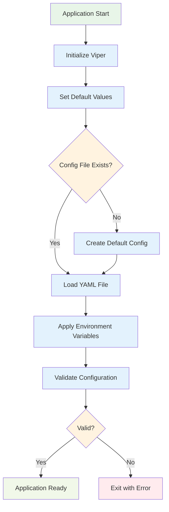

# Backend Configuration Guide

[← Back to Documentation](./README.md)

DataHarbor's Go backend uses a unified configuration system built on [Viper](https://github.com/spf13/viper) that supports YAML files, environment variables, and validation. This guide provides a complete reference for all backend configuration options.

## Quick Start

### Basic Setup

1. **Copy a template configuration**:

   ```bash
   # For development
   cp app/config/application.development.yaml app/config/application.yaml

   # For production
   cp app/config/application.production.yaml app/config/application.yaml
   ```

2. **Set environment variables** (optional):

   ```bash
   export DATAHARBOR_SERVER_ADDRESS=":8081"
   export DATAHARBOR_AUTH_ENABLED="true"
   ```

3. **Run with custom config**:

   ```bash
   # Start backend dev server (uses default config)
   make dev-backend

   # Or run with a specific config file
   cd app && go run . --config=config/application.yaml
   ```

## Configuration Architecture

### Loading Priority

Configuration values are loaded in the following order (highest to lowest priority):

1. **Environment Variables** (`DATAHARBOR_*`)
2. **YAML Configuration File**
3. **Default Values** (hardcoded)

### Configuration Flow



## Complete Configuration Reference

### Global Settings

| Key   | Type   | Default         | Description                                                      |
| ----- | ------ | --------------- | ---------------------------------------------------------------- |
| `env` | string | `"development"` | Application environment (`development`, `production`, `testing`) |

### Server Configuration (`server`)

| Key                       | Type   | Default   | Description                             |
| ------------------------- | ------ | --------- | --------------------------------------- |
| `server.address`          | string | `":8080"` | Server bind address and port            |
| `server.debug`            | bool   | `false`   | Enable debug mode with detailed logging |
| `server.shutdown_timeout` | string | `"30s"`   | Graceful shutdown timeout duration      |

#### CORS Settings (`server.cors`)

| Key                             | Type     | Default | Description                        |
| ------------------------------- | -------- | ------- | ---------------------------------- |
| `server.cors.allow_credentials` | bool     | `false` | Allow credentials in CORS requests |
| `server.cors.allow_origins`     | []string | `[]`    | Allowed origin domains for CORS    |
| `server.cors.allow_methods`     | []string | `[]`    | Allowed HTTP methods for CORS      |
| `server.cors.allow_headers`     | []string | `[]`    | Allowed HTTP headers for CORS      |

#### SSL Configuration (`server.ssl`)

| Key                    | Type   | Default | Description                  |
| ---------------------- | ------ | ------- | ---------------------------- |
| `server.ssl.enabled`   | bool   | `false` | Enable HTTPS/TLS encryption  |
| `server.ssl.cert_file` | string | `""`    | Path to SSL certificate file |
| `server.ssl.key_file`  | string | `""`    | Path to SSL private key file |

### Logging Configuration (`logging`)

| Key              | Type   | Default  | Description                                         |
| ---------------- | ------ | -------- | --------------------------------------------------- |
| `logging.level`  | string | `"info"` | Global log level (`debug`, `info`, `warn`, `error`) |
| `logging.format` | string | `"json"` | Global log format (`json`, `text`)                  |

#### Console Logging (`logging.console`)

| Key                       | Type   | Default  | Description                                   |
| ------------------------- | ------ | -------- | --------------------------------------------- |
| `logging.console.enabled` | bool   | `true`   | Enable console output                         |
| `logging.console.level`   | string | `"info"` | Console-specific log level (overrides global) |
| `logging.console.format`  | string | `"text"` | Console-specific format (overrides global)    |

#### File Logging (`logging.file`)

| Key                       | Type   | Default                  | Description                                |
| ------------------------- | ------ | ------------------------ | ------------------------------------------ |
| `logging.file.enabled`    | bool   | `false`                  | Enable file logging                        |
| `logging.file.level`      | string | `"info"`                 | File-specific log level (overrides global) |
| `logging.file.format`     | string | `"json"`                 | File-specific format (overrides global)    |
| `logging.file.filename`   | string | `"./log/dataharbor.log"` | Log file path                              |
| `logging.file.maxsize`    | int    | `10`                     | Maximum log file size in MB                |
| `logging.file.maxbackups` | int    | `5`                      | Number of backup files to retain           |
| `logging.file.maxage`     | int    | `30`                     | Days to retain old log files               |
| `logging.file.compress`   | bool   | `true`                   | Compress rotated log files                 |

### XRootD Configuration (`xrd`)

| Key                 | Type   | Default       | Description                               |
| ------------------- | ------ | ------------- | ----------------------------------------- |
| `xrd.host`          | string | `"localhost"` | **Required** XRootD server hostname       |
| `xrd.port`          | uint   | `1094`        | **Required** XRootD server port           |
| `xrd.initial_dir`   | string | `"/tmp"`      | Default directory for file operations     |
| `xrd.user`          | string | `""`          | XRootD username for authentication        |
| `xrd.usergroup`     | string | `""`          | XRootD user group                         |
| `xrd.user_required` | bool   | `false`       | Require user authentication for XRootD    |
| `xrd.tls`           | bool   | `false`       | Enable TLS for XRootD connections         |
| `xrd.client_cert`   | string | `""`          | Path to client certificate for XRootD TLS |
| `xrd.client_key`    | string | `""`          | Path to client key for XRootD TLS         |

### Authentication Configuration (`auth`)

| Key                    | Type     | Default       | Description                      |
| ---------------------- | -------- | ------------- | -------------------------------- |
| `auth.enabled`         | bool     | `false`       | Enable authentication system     |
| `auth.skip_auth_paths` | []string | `["/health"]` | Paths that bypass authentication |

#### OIDC Settings (`auth.oidc`)

| Key                                  | Type     | Default | Description                                    |
| ------------------------------------ | -------- | ------- | ---------------------------------------------- |
| `auth.oidc.issuer`                   | string   | `""`    | **Required if auth enabled** OIDC issuer URL   |
| `auth.oidc.client_id`                | string   | `""`    | **Required if auth enabled** OIDC client ID    |
| `auth.oidc.client_secret`            | string   | `""`    | OIDC client secret (use env var in production) |
| `auth.oidc.discovery_url`            | string   | `""`    | OIDC discovery endpoint URL                    |
| `auth.oidc.allowed_roles`            | []string | `[]`    | List of allowed user roles                     |
| `auth.oidc.session_secret`           | string   | `""`    | Secret for session encryption (use env var)    |
| `auth.oidc.token_refresh_buffer_sec` | int64    | `60`    | Seconds before token expiry to refresh         |

### Frontend Configuration (`frontend`)

| Key                    | Type     | Default                   | Description                                                                                                                                                    |
| ---------------------- | -------- | ------------------------- | -------------------------------------------------------------------------------------------------------------------------------------------------------------- |
| `frontend.url`         | string   | `"http://localhost:5173"` | Frontend application URL. **IMPORTANT**: Set to production URL (e.g., `https://yourdomain.com`) for production deployments. This controls OAuth redirect URIs. |
| `frontend.asset_paths` | []string | `[]`                      | Additional paths to search for frontend assets                                                                                                                 |
| `frontend.dist_dir`    | string   | `"dist"`                  | Frontend build output directory                                                                                                                                |

**Note**: The `frontend.url` must match where users access your application. For development, use `http://localhost:5173` or `https://localhost:5173`. For production, use your actual domain like `https://yourdomain.com` or `https://punch2.gsi.de`. This URL is used for OAuth/OIDC redirect URIs after authentication.

## Environment Variables

All configuration values can be overridden using environment variables with the `DATAHARBOR_` prefix.

### Naming Convention

- Prefix: `DATAHARBOR_`
- Replace dots (`.`) with underscores (`_`)
- Use UPPERCASE letters

### Common Environment Variables

```bash
# Server Configuration
export DATAHARBOR_SERVER_ADDRESS=":8081"
export DATAHARBOR_SERVER_DEBUG="true"

# Logging Configuration
export DATAHARBOR_LOGGING_LEVEL="debug"
export DATAHARBOR_LOGGING_CONSOLE_ENABLED="true"
export DATAHARBOR_LOGGING_FILE_ENABLED="true"

# XRootD Configuration
export DATAHARBOR_XRD_HOST="xrootd.example.com"
export DATAHARBOR_XRD_PORT="1094"
export DATAHARBOR_XRD_USER_REQUIRED="true"

# Authentication Configuration
export DATAHARBOR_AUTH_ENABLED="true"
export DATAHARBOR_AUTH_OIDC_CLIENT_SECRET="your-secret-here"
export DATAHARBOR_AUTH_OIDC_SESSION_SECRET="your-session-secret"

# Frontend Configuration
export DATAHARBOR_FRONTEND_URL="https://yourdomain.com"  # Use production domain, not localhost:5173
```

**Important**: When deploying to production, always set `DATAHARBOR_FRONTEND_URL` to your actual domain. Using `localhost:5173` in production will cause OAuth/OIDC redirect failures.

## Configuration Validation

The application validates critical settings on startup:

### Required Fields

- `server.address` - Must not be empty
- `xrd.host` - Must not be empty
- `xrd.port` - Must be greater than 0

### Conditional Requirements

When `auth.enabled = true`:

- `auth.oidc.issuer` - Must not be empty
- `auth.oidc.client_id` - Must not be empty

### Validation Rules

- `logging.level` - Must be one of: `debug`, `info`, `warn`, `error`
- `logging.console.level` - Same as above (if specified)
- `logging.file.level` - Same as above (if specified)

### Error Handling

If validation fails:

1. Application logs the specific validation error
2. Application exits with error code 1
3. No fallback or default substitution occurs

## Example Configurations

### Development Configuration

```yaml
env: development

server:
  address: ":22000"
  debug: true
  cors:
    allow_credentials: true
    allow_origins:
      - "http://localhost:5173"
      - "https://localhost:5173"

logging:
  level: debug
  format: text
  console:
    enabled: true
    level: debug
    format: text
  file:
    enabled: true
    level: debug
    filename: "./log/dataharbor_dev.log"
    maxsize: 10
    maxbackups: 2
    maxage: 7

xrd:
  host: "localhost"
  port: 1094
  initial_dir: "/tmp"
  user_required: false

auth:
  enabled: true
  oidc:
    issuer: "https://id.gsi.de/realms/wl"
    client_id: "xrootd"
    session_secret: "dev-session-secret"
```

### Production Configuration

```yaml
env: production

server:
  address: ":8080"
  debug: false
  ssl:
    enabled: true
    cert_file: "/etc/ssl/dataharbor/server.crt"
    key_file: "/etc/ssl/dataharbor/server.key"
  cors:
    allow_credentials: true
    allow_origins:
      - "https://yourdomain.com"

logging:
  level: info
  format: json
  console:
    enabled: true
    level: info
    format: json
  file:
    enabled: true
    level: info
    filename: "/var/log/dataharbor/app.log"
    maxsize: 100
    maxbackups: 10
    maxage: 30

xrd:
  host: "xrootd-server.yourdomain.com"
  port: 1094
  initial_dir: "/data"
  user_required: true
  tls: true
  client_cert: "/etc/ssl/dataharbor/client.crt"
  client_key: "/etc/ssl/dataharbor/client.key"

auth:
  enabled: true
  oidc:
    issuer: "https://id.yourdomain.com/realms/prod"
    client_id: "dataharbor-prod"
    client_secret: "${DATAHARBOR_CLIENT_SECRET}"
    session_secret: "${DATAHARBOR_SESSION_SECRET}"

frontend:
  url: "https://yourdomain.com"  # CRITICAL: Must match your production domain
  asset_paths:
    - "/var/www/dataharbor"
```

## Common Configuration Issues

### OAuth/OIDC Redirect to Wrong URL

**Symptom**: After successful Keycloak authentication, the application redirects to `https://localhost:5173` instead of your production domain.

**Cause**: The `frontend.url` configuration is set to the development URL instead of the production URL.

**Solution**:

1. Edit your backend configuration file:
   ```bash
   sudo nano /root/dataharbor/config/backend-config-gsi-test-server.yaml
   ```

2. Update the `frontend.url` to match your production domain:
   ```yaml
   frontend:
     url: "https://punch2.gsi.de"  # Or your actual domain
   ```

3. Restart the backend service:
   ```bash
   sudo systemctl restart dataharbor-backend
   ```

**Prevention**: Always verify `frontend.url` matches where users access your application before deploying to production.

### Need Help?

For troubleshooting backend configuration issues, see the **[Troubleshooting Guide](./TROUBLESHOOTING.md)**.

## Related Documentation

- **[Frontend Configuration](./FRONTEND_CONFIGURATION.md)** - Vue.js application configuration
- **[Development Guide](./DEVELOPMENT.md)** - Development environment setup
- **[Deployment Guide](./DEPLOYMENT.md)** - Production deployment configuration

---

[← Back to Documentation](./README.md) | [↑ Top](#backend-configuration-guide)
