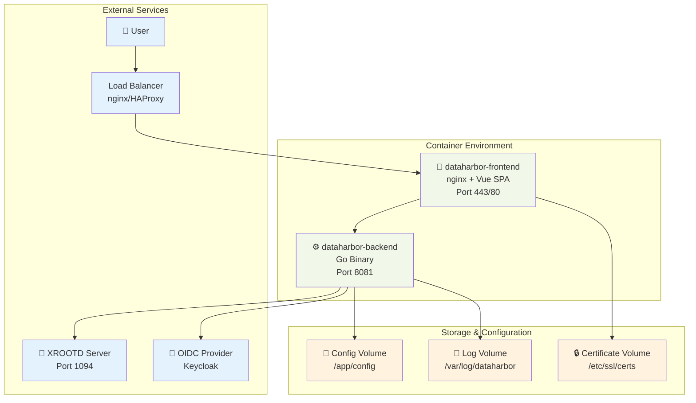
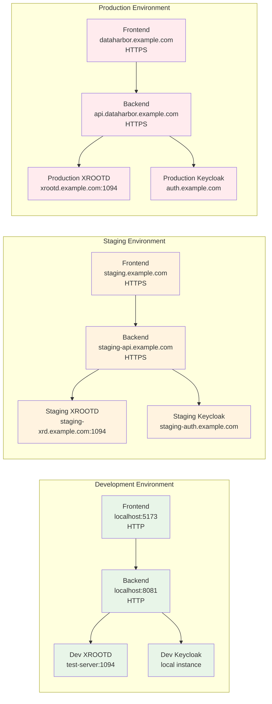
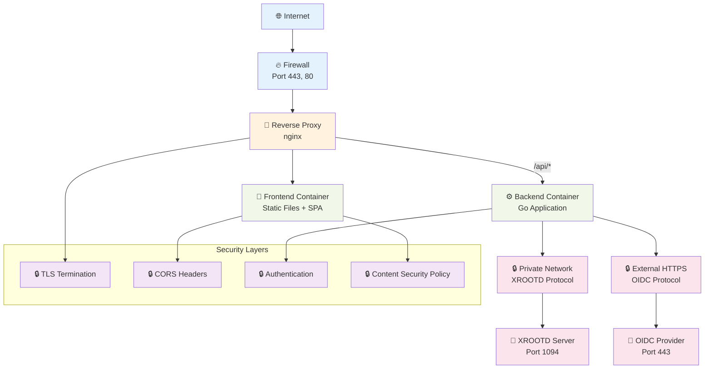

# Deployment Guide

This document covers production deployment, containerization, and packaging for DataHarbor.

**Note**: This is the general deployment guide. For environment-specific deployments, see:
- **[GSI Deployment Guide](./DEPLOYMENT_GSI.md)** - Specific instructions for GSI servers with XRootD on port 80

## Deployment Architecture Diagrams

### Container Deployment Architecture



### Multi-Environment Deployment Strategy



### Network Flow & Security



## Container Deployment

### Prerequisites

- Podman or Docker
- XROOTD client tools installed in container environment
- SSL certificates for HTTPS
- OIDC provider configuration

### Building Containers

#### Backend Container

```bash
cd app
podman build -t dataharbor-backend:latest .
```

#### Frontend Container

```bash
cd web
podman build -t dataharbor-frontend:latest .
```

### Running Containers

#### Production Stack

Create a `docker-compose.yml` or similar orchestration file:

```yaml
version: '3.8'
services:
  dataharbor-backend:
    image: dataharbor-backend:latest
    ports:
      - "8081:8081"
    environment:
      - CONFIG_FILE=/app/config/application.production.yaml
    volumes:
      - ./config:/app/config
      - ./certs:/app/certs
    restart: unless-stopped

  dataharbor-frontend:
    image: dataharbor-frontend:latest
    ports:
      - "443:443"
      - "80:80"
    volumes:
      - ./nginx.conf:/etc/nginx/nginx.conf
      - ./certs:/etc/nginx/certs
    depends_on:
      - dataharbor-backend
    restart: unless-stopped
```

#### Single Container Command

```bash
# Backend
podman run -d --name dataharbor-backend \
  -p 8081:8081 \
  -v ./config:/app/config \
  -v ./certs:/app/certs \
  dataharbor-backend:latest

# Frontend  
podman run -d --name dataharbor-frontend \
  -p 443:443 -p 80:80 \
  -v ./nginx.conf:/etc/nginx/nginx.conf \
  -v ./certs:/etc/nginx/certs \
  dataharbor-frontend:latest
```

## RPM Package Deployment

### Building RPM Packages

DataHarbor includes RPM spec files for creating system packages:

```bash
# Build backend RPM
cd packaging
python3 build_rpm.py --component backend

# Build frontend RPM
python3 build_rpm.py --component frontend
```

### Installing RPM Packages

```bash
# Install backend
sudo rpm -ivh dataharbor-backend-*.rpm

# Install frontend
sudo rpm -ivh dataharbor-frontend-*.rpm
```

### Post-Installation Setup

#### Backend Quick Setup

**New in this version:** The backend RPM now includes a systemd service file, example configuration, and creates standard directories automatically!

**Quick Setup Steps:**

1. **Create your configuration from the example:**
   ```bash
   sudo cp /etc/dataharbor/application.yaml.example /etc/dataharbor/application.yaml
   sudo nano /etc/dataharbor/application.yaml
   ```

2. **Update required settings in the config:**
   - OIDC `client_secret` (get from your OIDC provider)
   - OIDC `session_secret` (generate with: `openssl rand -base64 32`)
   - `frontend.url` (your actual domain, e.g., `https://your-domain.com`)
   - SSL certificate paths
   - XRootD server settings

3. **Enable and start the service:**
   ```bash
   sudo systemctl enable dataharbor-backend
   sudo systemctl start dataharbor-backend
   sudo systemctl status dataharbor-backend
   ```

4. **Verify deployment:**
   ```bash
   # Test health endpoint
   curl -k https://localhost:8081/health
   
   # Expected: {"code":200,"data":"ok","message":"success"}
   
   # Check logs
   sudo journalctl -u dataharbor-backend -n 50
   ```

**What's included automatically:**
- ✅ SystemD service file at `/usr/lib/systemd/system/dataharbor-backend.service`
- ✅ Configuration directory at `/etc/dataharbor/`
- ✅ Log directory at `/var/log/dataharbor/`
- ✅ Example configuration with detailed comments

**Note:** If you need a custom config path, you can override it with a systemd drop-in file (see [SystemD Services](#systemd-services) section).

#### Frontend Quick Setup

**New in this version:** The frontend RPM now includes multiple nginx configuration templates for different deployment scenarios!

**Installation Locations:**
- Frontend files: `/usr/share/dataharbor-frontend/`
- Nginx templates: `/etc/dataharbor-frontend/nginx/templates/`
- Example config: `/usr/share/dataharbor-frontend/config.json.example`

**Quick Setup Steps:**

1. **Choose and copy the appropriate nginx template:**

   **For production with HTTPS (recommended):**
   ```bash
   sudo cp /etc/dataharbor-frontend/nginx/templates/nginx-https-proxy.conf \
           /etc/nginx/conf.d/dataharbor.conf
   ```

   **For simple HTTP (development/testing):**
   ```bash
   sudo cp /etc/dataharbor-frontend/nginx/templates/nginx-http-simple.conf \
           /etc/nginx/conf.d/dataharbor.conf
   ```

   **For GSI deployment (HTTPS on port 443, backend on port 22000):**
   ```bash
   sudo cp /etc/dataharbor-frontend/nginx/templates/nginx-gsi.conf \
           /etc/nginx/conf.d/dataharbor.conf
   ```

2. **Edit the nginx config for your environment:**
   ```bash
   sudo nano /etc/nginx/conf.d/dataharbor.conf
   ```
   Update:
   - `server_name` (your actual hostname/domain)
   - SSL certificate paths (for HTTPS templates)
   - Backend `proxy_pass` URL and port if different

3. **Create frontend configuration:**
   ```bash
   sudo cp /usr/share/dataharbor-frontend/config.json.example \
           /usr/share/dataharbor-frontend/config.json
   sudo nano /usr/share/dataharbor-frontend/config.json
   ```
   Update:
   - `apiBaseUrl` (`"/api"` for reverse proxy, or direct backend URL)
   - OIDC settings (authority, client_id, redirect_uri)

4. **Test and reload nginx:**
   ```bash
   sudo nginx -t
   sudo systemctl enable nginx
   sudo systemctl reload nginx
   ```

5. **Test in browser:**
   ```bash
   # Open browser: https://your-hostname/
   ```

**Available templates:**
- ✅ `nginx-http-simple.conf` - Basic HTTP (development/testing)
- ✅ `nginx-https-proxy.conf` - HTTPS with reverse proxy (production)
- ✅ `nginx-gsi.conf` - GSI-specific configuration

See the **[Frontend Deployment](#frontend-deployment-using-rpm)** section below for detailed instructions.

### Default Installation Locations

After installation, the packages are deployed to the following locations:

#### Backend Package

```bash
# Binary location
/usr/local/bin/dataharbor-backend

# SystemD service file
/usr/lib/systemd/system/dataharbor-backend.service

# Configuration directory and example
/etc/dataharbor/
/etc/dataharbor/application.yaml.example

# Log directory
/var/log/dataharbor/

# Documentation
/usr/share/doc/dataharbor-backend/README.md

# Additional files
/usr/local/share/dataharbor/arch-info.txt
```

#### Frontend Package

```bash
# Web application files
/usr/share/dataharbor-frontend/index.html
/usr/share/dataharbor-frontend/config.json.example
/usr/share/dataharbor-frontend/silent-renew.html
/usr/share/dataharbor-frontend/assets/

# Nginx configuration templates
/etc/dataharbor-frontend/nginx/templates/nginx-http-simple.conf
/etc/dataharbor-frontend/nginx/templates/nginx-https-proxy.conf
/etc/dataharbor-frontend/nginx/templates/nginx-gsi.conf

# Default nginx configuration (for backward compatibility)
/etc/dataharbor-frontend/nginx/nginx.conf
```

You can verify the installation locations using:

```bash
# List backend package contents
rpm -ql dataharbor-backend

# List frontend package contents
rpm -ql dataharbor-frontend
```

### SystemD Services

#### Creating SystemD Service File for Backend

Since the RPM package doesn't include a systemd service file, you need to create one manually:

1. **Create the systemd service file:**

   ```bash
   sudo tee /etc/systemd/system/dataharbor-backend.service << 'EOF'
   [Unit]
   Description=DataHarbor Backend Service
   After=network.target

   [Service]
   Type=simple
   ExecStart=/usr/local/bin/dataharbor-backend --config=/path/to/your/config.yaml
   Restart=always
   RestartSec=5
   StandardOutput=journal
   StandardError=journal

   [Install]
   WantedBy=multi-user.target
   EOF
   ```

   **Important:** Replace `/path/to/your/config.yaml` with your actual config file path. For example:
   - `/etc/dataharbor/application.yaml`
   - `/opt/dataharbor/config/application.production.yaml`
   - `/root/dataharbor/config/backend-config.yaml`

2. **Create the log directory (if using file logging):**

   Before starting the service, ensure the log directory specified in your config file exists:

   ```bash
   # Check your config file for the log path, then create the directory
   # Example if your log path is /var/log/dataharbor/dataharbor-backend.log:
   sudo mkdir -p /var/log/dataharbor
   sudo chmod 755 /var/log/dataharbor
   
   # Or if using a custom path:
   # mkdir -p /opt/dataharbor/logs
   ```

3. **Reload systemd, enable and start the service:**

   ```bash
   # Reload systemd to recognize the new service file
   sudo systemctl daemon-reload
   
   # Enable the service to start on boot
   sudo systemctl enable dataharbor-backend
   
   # Start the service
   sudo systemctl start dataharbor-backend
   
   # Check service status
   sudo systemctl status dataharbor-backend
   ```

4. **Verify the deployment:**

   ```bash
   # Test the health endpoint (use correct paths: /health or /api/health)
   curl -k https://localhost:8081/health
   # or
   curl -k https://localhost:8081/api/health
   
   # Expected response:
   # {"code":200,"data":"ok","message":"success"}
   
   # Check the logs
   sudo journalctl -u dataharbor-backend -f
   
   # If file logging is enabled, check the log file
   # tail -f /var/log/dataharbor/dataharbor-backend.log
   ```

5. **Troubleshooting:**

   ```bash
   # View recent logs
   sudo journalctl -u dataharbor-backend -n 50
   
   # Check if the service is running
   sudo systemctl is-active dataharbor-backend
   
   # Restart the service if needed
   sudo systemctl restart dataharbor-backend
   
   # Check which config file is being used
   ps aux | grep dataharbor-backend
   ```

#### Frontend Deployment (Using RPM)

If you've installed the frontend RPM package, follow these steps:

**Installation Locations:**
- Frontend files: `/usr/share/dataharbor-frontend/`
- Nginx templates: `/etc/dataharbor-frontend/nginx/templates/`
- Example config: `/usr/share/dataharbor-frontend/config.json.example`

1. **Choose the appropriate nginx template:**

   The RPM includes three nginx templates for different scenarios:

   - **`nginx-http-simple.conf`** - Basic HTTP on port 80 (development/testing)
   - **`nginx-https-proxy.conf`** - HTTPS with reverse proxy (recommended for production)
   - **`nginx-gsi.conf`** - GSI-specific: HTTPS on port 443, backend on port 22000

2. **Create the frontend config.json:**

   The frontend needs to know where your backend API is located. Copy your custom config:

   ```bash
   # Copy your frontend config to the installed location
   sudo cp /path/to/your/frontend-config.json \
           /usr/share/dataharbor-frontend/config.json
   ```

   Or edit it directly:

   ```bash
   sudo nano /usr/share/dataharbor-frontend/config.json
   ```

   Example configuration:
   ```json
   {
     "apiBaseUrl": "https://your-backend-server:8081/api",
     "features": {
       "enableDocumentation": true
     }
   }
   ```

   **Important:** The `apiBaseUrl` should point to your backend server. If frontend and backend are on the same server, you can use:
   - `https://localhost:8081/api` (for local testing)
   - `https://your-server-hostname:8081/api` (for remote access)
   - Or use nginx as a reverse proxy (see option 2 below)

2. **Configure Nginx:**

   You have two options:

   **Option A: Direct Backend Access (Simple)**

   Use the installed nginx config template and modify it:

   ```bash
   # Copy the template to nginx sites
   sudo cp /etc/dataharbor-frontend/nginx/nginx.conf /etc/nginx/conf.d/dataharbor.conf
   
   # Edit to customize (optional - change server_name, add SSL, etc.)
   sudo nano /etc/nginx/conf.d/dataharbor.conf
   ```

   The default config serves the frontend on port 80. Your `config.json` should point directly to the backend:
   ```json
   {
     "apiBaseUrl": "https://your-backend-server:8081/api"
   }
   ```

   **Option B: Nginx as Reverse Proxy (Recommended for Production)**

   Configure nginx to proxy API requests to the backend:

   ```bash
   sudo tee /etc/nginx/conf.d/dataharbor.conf << 'EOF'
   server {
       listen 80;
       server_name your-hostname;  # Change to your hostname

       root /usr/share/dataharbor-frontend;
       index index.html;

       # Serve frontend static files
       location / {
           try_files $uri $uri/ /index.html;
       }

       location /assets/ {
           alias /usr/share/dataharbor-frontend/assets/;
           expires max;
           access_log off;
           add_header Cache-Control "public";
       }

       # Proxy API requests to backend
       location /api/ {
           proxy_pass https://localhost:8081;
           proxy_ssl_verify off;
           proxy_set_header Host $host;
           proxy_set_header X-Real-IP $remote_addr;
           proxy_set_header X-Forwarded-For $proxy_add_x_forwarded_for;
           proxy_set_header X-Forwarded-Proto $scheme;
       }

       error_log /var/log/nginx/dataharbor-frontend-error.log;
       access_log /var/log/nginx/dataharbor-frontend-access.log;
   }
   EOF
   ```

   With this setup, your `config.json` should use a relative path:
   ```json
   {
     "apiBaseUrl": "/api"
   }
   ```

3. **Test nginx configuration:**

   ```bash
   # Test configuration syntax
   sudo nginx -t
   
   # If test passes, reload nginx
   sudo systemctl reload nginx
   
   # Or restart if needed
   sudo systemctl restart nginx
   
   # Check nginx status
   sudo systemctl status nginx
   
   # Enable nginx to start on boot
   sudo systemctl enable nginx
   ```

4. **Configure firewall (if needed):**

   ```bash
   # Allow HTTP traffic
   sudo firewall-cmd --permanent --add-service=http
   
   # Allow HTTPS traffic (if using SSL)
   sudo firewall-cmd --permanent --add-service=https
   
   # Reload firewall
   sudo firewall-cmd --reload
   
   # Or for iptables:
   # sudo iptables -A INPUT -p tcp --dport 80 -j ACCEPT
   # sudo iptables -A INPUT -p tcp --dport 443 -j ACCEPT
   ```

5. **Test the deployment:**

   ```bash
   # Test frontend is accessible
   curl http://localhost/
   
   # Should return HTML content
   
   # Test from another machine (replace with your hostname)
   curl http://your-hostname/
   
   # Open in browser
   # http://your-hostname/
   ```

6. **Verify end-to-end:**

   Open your browser and navigate to:
   - `http://your-hostname/` (or your server's hostname/IP)
   
   Then check:
   - [ ] Frontend loads successfully
   - [ ] No console errors in browser DevTools (F12)
   - [ ] API calls to backend work (check Network tab in DevTools)
   - [ ] Can authenticate with OIDC
   - [ ] Can browse XRootD directories

7. **Check logs if issues occur:**

   ```bash
   # Nginx error logs
   sudo tail -f /var/log/nginx/dataharbor-frontend-error.log
   
   # Nginx access logs
   sudo tail -f /var/log/nginx/dataharbor-frontend-access.log
   
   # Backend logs (to see API requests)
   sudo journalctl -u dataharbor-backend -f
   ```

8. **Common Issues:**

   **Issue:** "Cannot connect to backend"
   - **Solution:** Check `config.json` has correct `apiBaseUrl`
   - Verify backend is running: `sudo systemctl status dataharbor-backend`
   - Test backend health: `curl -k https://localhost:8081/health`

   **Issue:** CORS errors in browser console
   - **Solution:** Check backend CORS configuration allows your frontend origin
   - Update `cors.allow_origins` in backend config

   **Issue:** 502 Bad Gateway
   - **Solution:** Backend might be down or nginx proxy config is wrong
   - Check backend is running on the expected port

   **Issue:** Static files not loading (CSS, JS)
   - **Solution:** Check file permissions on `/usr/share/dataharbor-frontend/`
   - Ensure nginx has read access: `sudo chmod -R 755 /usr/share/dataharbor-frontend/`

## Manual Deployment

### Backend Deployment

1. **Build the backend**

   ```bash
   cd app
   go build -o dataharbor-backend .
   ```

2. **Create deployment directory structure**

   ```bash
   sudo mkdir -p /opt/dataharbor/{bin,config,logs,data}
   sudo cp dataharbor-backend /opt/dataharbor/bin/
   sudo cp config/application.production.yaml /opt/dataharbor/config/
   ```

3. **Create systemd service file**

   ```bash
   sudo tee /etc/systemd/system/dataharbor-backend.service << EOF
   [Unit]
   Description=DataHarbor Backend Service
   After=network.target

   [Service]
   Type=simple
   User=dataharbor
   Group=dataharbor
   WorkingDirectory=/opt/dataharbor
   ExecStart=/opt/dataharbor/bin/dataharbor-backend --config=/opt/dataharbor/config/application.production.yaml
   Restart=always
   RestartSec=5

   [Install]
   WantedBy=multi-user.target
   EOF
   ```

### Frontend Deployment

1. **Build the frontend**

   ```bash
   cd web
   npm run build
   ```

2. **Deploy to web server**

   ```bash
   # Copy built files to web server
   sudo cp -r dist/* /var/www/html/dataharbor/
   ```

3. **Configure Web Server**

   #### Option A: Nginx Configuration

   ```nginx
   server {
       listen 443 ssl http2;
       server_name your-domain.com;
       
       ssl_certificate /path/to/ssl/cert.pem;
       ssl_certificate_key /path/to/ssl/private.key;
       
       root /var/www/html/dataharbor;
       index index.html;
       
       # API proxy
       location /api/ {
           proxy_pass http://localhost:8081;
           proxy_set_header Host $host;
           proxy_set_header X-Real-IP $remote_addr;
           proxy_set_header X-Forwarded-For $proxy_add_x_forwarded_for;
           proxy_set_header X-Forwarded-Proto $scheme;
       }
       
       # SPA routing
       location / {
           try_files $uri $uri/ /index.html;
       }
   }
   ```

   #### Option B: Apache Configuration

   Create a virtual host configuration file (e.g., `/etc/httpd/conf.d/dataharbor.conf` or `/etc/apache2/sites-available/dataharbor.conf`):

   ```apache
   <VirtualHost *:443>
       ServerName your-domain.com
       
       SSLEngine on
       SSLCertificateFile /path/to/ssl/cert.pem
       SSLCertificateKeyFile /path/to/ssl/private.key
       
       DocumentRoot /var/www/html/dataharbor
       
       <Directory /var/www/html/dataharbor>
           Options -Indexes +FollowSymLinks
           AllowOverride All
           Require all granted
           
           # SPA routing - redirect all requests to index.html
           RewriteEngine On
           RewriteBase /
           RewriteRule ^index\.html$ - [L]
           RewriteCond %{REQUEST_FILENAME} !-f
           RewriteCond %{REQUEST_FILENAME} !-d
           RewriteRule . /index.html [L]
       </Directory>
       
       # API proxy configuration
       ProxyPreserveHost On
       ProxyPass /api/ http://localhost:8081/api/
       ProxyPassReverse /api/ http://localhost:8081/api/
       
       # Set headers for proxied requests
       RequestHeader set X-Forwarded-Proto "https"
       RequestHeader set X-Forwarded-Port "443"
       
       # Enable HTTP/2
       Protocols h2 http/1.1
       
       # Logging
       ErrorLog ${APACHE_LOG_DIR}/dataharbor-error.log
       CustomLog ${APACHE_LOG_DIR}/dataharbor-access.log combined
   </VirtualHost>
   
   # Redirect HTTP to HTTPS
   <VirtualHost *:80>
       ServerName your-domain.com
       Redirect permanent / https://your-domain.com/
   </VirtualHost>
   ```

   **Enable required Apache modules:**

   ```bash
   # On Debian/Ubuntu
   sudo a2enmod ssl rewrite proxy proxy_http headers http2
   sudo a2ensite dataharbor
   sudo systemctl restart apache2
   
   # On RHEL/CentOS/Fedora
   # Modules are typically enabled by default, just restart
   sudo systemctl restart httpd
   ```

## Configuration

### Production Configuration

#### Backend Configuration

Update `config/application.production.yaml`:

```yaml
server:
  host: "0.0.0.0"
  port: 8081
  debug: false

security:
  cors:
    allowed_origins: 
      - "https://your-domain.com"
    allowed_headers: ["Content-Type", "Authorization"]
    
auth:
  oidc:
    issuer: "https://your-oidc-provider.com/realms/your-realm"
    client_id: "dataharbor-prod"
    client_secret: "${OIDC_CLIENT_SECRET}"
    redirect_uri: "https://your-domain.com/api/v1/auth/callback"

xrootd:
  host: "your-xrootd-server.com"
  port: 1094
  initial_dir: "/"
  enable_ztn: true  # Enable ZTN protocol (TLS + OAuth) for authenticated XRootD access

logging:
  level: "info"
  format: "json"
```

#### Frontend Configuration

Update `web/public/config.json`:

```json
{
  "apiBaseUrl": "https://your-domain.com/api/v1",
  "oidc": {
    "authority": "https://your-oidc-provider.com/realms/your-realm",
    "client_id": "dataharbor-prod",
    "redirect_uri": "https://your-domain.com/auth/callback",
    "scope": "openid profile email"
  },
  "features": {
    "directStreaming": true,
    "directoryListing": true,
    "fileDownload": true
  }
}
```

## SSL/TLS Configuration

### Generate SSL Certificates

For production, use certificates from a trusted CA. For internal use:

```bash
# Generate self-signed certificate
openssl req -x509 -newkey rsa:4096 -keyout private.key -out cert.pem -days 365 -nodes

# Or use Let's Encrypt
certbot certonly --standalone -d your-domain.com
```

### Certificate Installation

```bash
# Copy certificates to appropriate locations
sudo cp cert.pem /opt/dataharbor/certs/
sudo cp private.key /opt/dataharbor/certs/
sudo chmod 600 /opt/dataharbor/certs/private.key
sudo chown dataharbor:dataharbor /opt/dataharbor/certs/*
```

## Environment Variables

### Required Environment Variables

```bash
# OIDC Configuration
export OIDC_CLIENT_SECRET="your-oidc-client-secret"

# Database (if using persistent storage)
export DB_CONNECTION_STRING="your-database-connection"

# SSL Certificates
export SSL_CERT_PATH="/opt/dataharbor/certs/cert.pem"
export SSL_KEY_PATH="/opt/dataharbor/certs/private.key"

# XROOTD Configuration
export XROOTD_SERVERS="root://server1.com:1094,root://server2.com:1094"

# XRootD ZTN Protocol (TLS + OAuth authentication)
# Set to true for production XRootD servers with ZTN enabled
# Set to false for local development without authentication
export XROOTD_ENABLE_ZTN="true"
```

## Monitoring & Logging

### Health Checks

DataHarbor provides health check endpoints:

```bash
# Backend health endpoints (use /health or /api/health, NOT /api/v1/health)
curl -k https://your-domain.com/health
# or
curl -k https://your-domain.com/api/health

# Expected response:
# {"code":200,"data":"ok","message":"success"}

# If using a custom port:
curl -k https://your-domain.com:8081/health
```

### Log Locations

DataHarbor logs can be found in multiple locations depending on your configuration:

1. **SystemD Journal Logs:**
   ```bash
   # View real-time logs
   sudo journalctl -u dataharbor-backend -f
   
   # View last 100 lines
   sudo journalctl -u dataharbor-backend -n 100
   
   # View logs since last hour
   sudo journalctl -u dataharbor-backend --since "1 hour ago"
   ```

2. **File Logs (if enabled in config):**
   ```bash
   # Common log locations:
   # - /var/log/dataharbor/dataharbor-backend.log
   # - /opt/dataharbor/logs/dataharbor-backend.log
   # - Custom path specified in your config file
   
   # View file logs
   tail -f /var/log/dataharbor/dataharbor-backend.log
   ```

3. **Check Log Configuration:**
   ```bash
   # Verify log path in your config file
   grep -A 10 "logging:" /path/to/your/config.yaml
   ```

### Log Rotation Configuration

Configure log rotation to prevent disk space issues:

```bash
# Logrotate configuration for standard log location
sudo tee /etc/logrotate.d/dataharbor << EOF
/var/log/dataharbor/*.log {
    daily
    rotate 30
    compress
    delaycompress
    missingok
    notifempty
    copytruncate
}
EOF

# For custom log locations, adjust the path accordingly:
# /opt/dataharbor/logs/*.log
# /root/dataharbor/config/cert/log/*.log
```

### Testing Log Configuration

After service restart, verify logs are being written:

```bash
# Restart the service
sudo systemctl restart dataharbor-backend

# Check systemd logs immediately
sudo journalctl -u dataharbor-backend --since "1 minute ago"

# If file logging is enabled, check the log file exists and is being written
ls -lh /var/log/dataharbor/
tail -20 /var/log/dataharbor/dataharbor-backend.log

# Test the service with a health check
curl -k https://localhost:8081/health
```

## Backup & Recovery

### Configuration Backup

```bash
# Backup configuration
tar -czf dataharbor-config-backup-$(date +%Y%m%d).tar.gz \
  /opt/dataharbor/config/ \
  /etc/systemd/system/dataharbor-*.service
```

### Data Backup

```bash
# Backup files and temporary data
tar -czf dataharbor-data-backup-$(date +%Y%m%d).tar.gz \
  /opt/dataharbor/data/
```

## Performance Tuning

### Backend Optimization

- Adjust Go runtime settings: `GOMAXPROCS`, `GOGC`
- Configure connection pooling for XROOTD operations
- Enable HTTP/2 for improved performance
- Implement caching for frequently accessed data

### Frontend Optimization

- Enable Nginx gzip compression
- Configure browser caching headers
- Use CDN for static assets if applicable
- Implement lazy loading for large directory listings

### System Optimization

- Configure appropriate ulimits
- Tune kernel parameters for network performance
- Monitor system resources (CPU, memory, disk I/O)
- Set up log rotation to prevent disk space issues

### Need Help?

For troubleshooting deployment and production issues, see the **[Troubleshooting Guide](./TROUBLESHOOTING.md)**.

## Related Documentation

- **[Backend Configuration](./BACKEND_CONFIGURATION.md)** - Complete backend configuration reference
- **[Frontend Configuration](./FRONTEND_CONFIGURATION.md)** - Frontend deployment and configuration
- **[Setup Guide](./SETUP.md)** - Development environment setup
- **[Architecture Guide](./ARCHITECTURE.md)** - System architecture overview
- **[XROOTD Integration](./xrootd.md)** - XROOTD server configuration and integration
