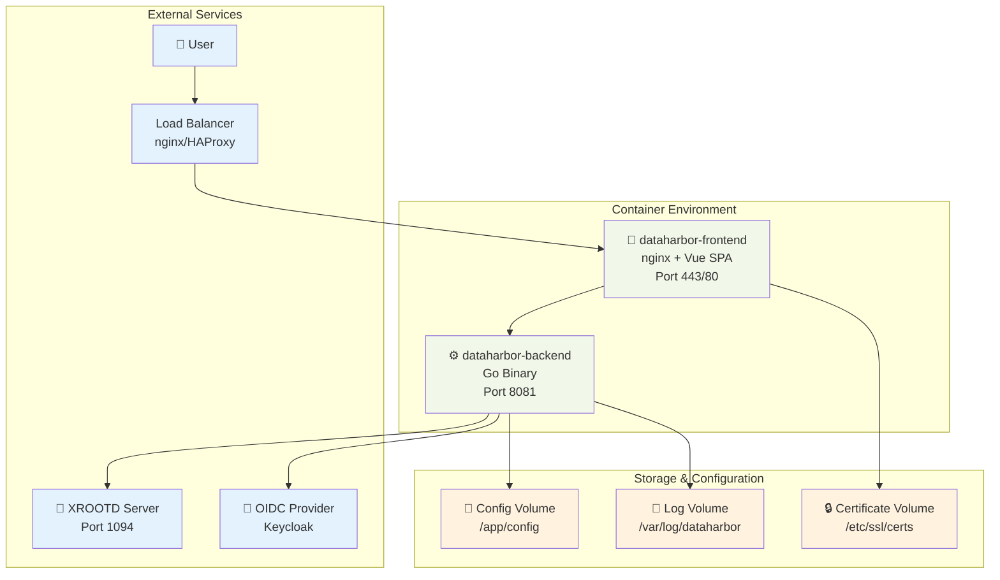
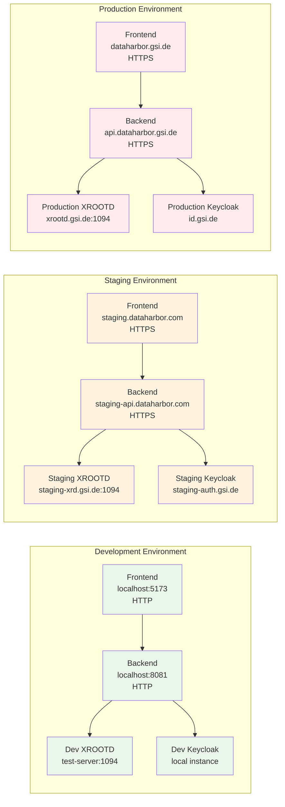
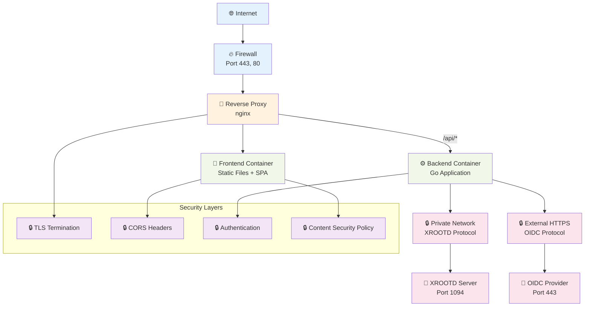

# Deployment Guide

This document covers production deployment, containerization, and packaging for DataHarbor.

## Deployment Architecture Diagrams

### Container Deployment Architecture



### Multi-Environment Deployment Strategy



### Network Flow & Security



## Container Deployment

### Prerequisites

- Podman or Docker
- XROOTD client tools installed in container environment
- SSL certificates for HTTPS
- OIDC provider configuration

### Building Containers

#### Backend Container

```bash
cd app
podman build -t dataharbor-backend:latest .
```

#### Frontend Container

```bash
cd web
podman build -t dataharbor-frontend:latest .
```

### Running Containers

#### Production Stack

Create a `docker-compose.yml` or similar orchestration file:

```yaml
version: '3.8'
services:
  dataharbor-backend:
    image: dataharbor-backend:latest
    ports:
      - "8081:8081"
    environment:
      - CONFIG_FILE=/app/config/application.production.yaml
    volumes:
      - ./config:/app/config
      - ./certs:/app/certs
    restart: unless-stopped

  dataharbor-frontend:
    image: dataharbor-frontend:latest
    ports:
      - "443:443"
      - "80:80"
    volumes:
      - ./nginx.conf:/etc/nginx/nginx.conf
      - ./certs:/etc/nginx/certs
    depends_on:
      - dataharbor-backend
    restart: unless-stopped
```

#### Single Container Command

```bash
# Backend
podman run -d --name dataharbor-backend \
  -p 8081:8081 \
  -v ./config:/app/config \
  -v ./certs:/app/certs \
  dataharbor-backend:latest

# Frontend  
podman run -d --name dataharbor-frontend \
  -p 443:443 -p 80:80 \
  -v ./nginx.conf:/etc/nginx/nginx.conf \
  -v ./certs:/etc/nginx/certs \
  dataharbor-frontend:latest
```

## RPM Package Deployment

### Building RPM Packages

DataHarbor includes RPM spec files for creating system packages:

```bash
# Build backend RPM
cd packaging
python3 build_rpm.py --component backend

# Build frontend RPM
python3 build_rpm.py --component frontend
```

### Installing RPM Packages

```bash
# Install backend
sudo rpm -ivh dataharbor-backend-*.rpm

# Install frontend
sudo rpm -ivh dataharbor-frontend-*.rpm
```

### Default Installation Locations

After installation, the packages are deployed to the following locations:

#### Backend Package

```bash
# Binary location
/usr/local/bin/dataharbor-backend

# Additional files
/usr/local/share/dataharbor/arch-info.txt
```

#### Frontend Package

```bash
# Web application files
/usr/share/dataharbor-frontend/index.html
/usr/share/dataharbor-frontend/config.json
/usr/share/dataharbor-frontend/silent-renew.html
/usr/share/dataharbor-frontend/assets/

# Nginx configuration
/etc/dataharbor-frontend/nginx/nginx.conf
```

You can verify the installation locations using:

```bash
# List backend package contents
rpm -ql dataharbor-backend

# List frontend package contents
rpm -ql dataharbor-frontend
```

### SystemD Services

The RPM packages include systemd service files:

```bash
# Enable and start backend service
sudo systemctl enable dataharbor-backend
sudo systemctl start dataharbor-backend

# Enable and start frontend service
sudo systemctl enable dataharbor-frontend
sudo systemctl start dataharbor-frontend

# Check status
sudo systemctl status dataharbor-backend
sudo systemctl status dataharbor-frontend
```

## Manual Deployment

### Backend Deployment

1. **Build the backend**

   ```bash
   cd app
   go build -o dataharbor-backend .
   ```

2. **Create deployment directory structure**

   ```bash
   sudo mkdir -p /opt/dataharbor/{bin,config,logs,data}
   sudo cp dataharbor-backend /opt/dataharbor/bin/
   sudo cp config/application.production.yaml /opt/dataharbor/config/
   ```

3. **Create systemd service file**

   ```bash
   sudo tee /etc/systemd/system/dataharbor-backend.service << EOF
   [Unit]
   Description=DataHarbor Backend Service
   After=network.target

   [Service]
   Type=simple
   User=dataharbor
   Group=dataharbor
   WorkingDirectory=/opt/dataharbor
   ExecStart=/opt/dataharbor/bin/dataharbor-backend --config=/opt/dataharbor/config/application.production.yaml
   Restart=always
   RestartSec=5

   [Install]
   WantedBy=multi-user.target
   EOF
   ```

### Frontend Deployment

1. **Build the frontend**

   ```bash
   cd web
   npm run build
   ```

2. **Deploy to web server**

   ```bash
   # Copy built files to web server
   sudo cp -r dist/* /var/www/html/dataharbor/
   ```

3. **Configure Web Server**

   #### Option A: Nginx Configuration

   ```nginx
   server {
       listen 443 ssl http2;
       server_name your-domain.com;
       
       ssl_certificate /path/to/ssl/cert.pem;
       ssl_certificate_key /path/to/ssl/private.key;
       
       root /var/www/html/dataharbor;
       index index.html;
       
       # API proxy
       location /api/ {
           proxy_pass http://localhost:8081;
           proxy_set_header Host $host;
           proxy_set_header X-Real-IP $remote_addr;
           proxy_set_header X-Forwarded-For $proxy_add_x_forwarded_for;
           proxy_set_header X-Forwarded-Proto $scheme;
       }
       
       # SPA routing
       location / {
           try_files $uri $uri/ /index.html;
       }
   }
   ```

   #### Option B: Apache Configuration

   Create a virtual host configuration file (e.g., `/etc/httpd/conf.d/dataharbor.conf` or `/etc/apache2/sites-available/dataharbor.conf`):

   ```apache
   <VirtualHost *:443>
       ServerName your-domain.com
       
       SSLEngine on
       SSLCertificateFile /path/to/ssl/cert.pem
       SSLCertificateKeyFile /path/to/ssl/private.key
       
       DocumentRoot /var/www/html/dataharbor
       
       <Directory /var/www/html/dataharbor>
           Options -Indexes +FollowSymLinks
           AllowOverride All
           Require all granted
           
           # SPA routing - redirect all requests to index.html
           RewriteEngine On
           RewriteBase /
           RewriteRule ^index\.html$ - [L]
           RewriteCond %{REQUEST_FILENAME} !-f
           RewriteCond %{REQUEST_FILENAME} !-d
           RewriteRule . /index.html [L]
       </Directory>
       
       # API proxy configuration
       ProxyPreserveHost On
       ProxyPass /api/ http://localhost:8081/api/
       ProxyPassReverse /api/ http://localhost:8081/api/
       
       # Set headers for proxied requests
       RequestHeader set X-Forwarded-Proto "https"
       RequestHeader set X-Forwarded-Port "443"
       
       # Enable HTTP/2
       Protocols h2 http/1.1
       
       # Logging
       ErrorLog ${APACHE_LOG_DIR}/dataharbor-error.log
       CustomLog ${APACHE_LOG_DIR}/dataharbor-access.log combined
   </VirtualHost>
   
   # Redirect HTTP to HTTPS
   <VirtualHost *:80>
       ServerName your-domain.com
       Redirect permanent / https://your-domain.com/
   </VirtualHost>
   ```

   **Enable required Apache modules:**

   ```bash
   # On Debian/Ubuntu
   sudo a2enmod ssl rewrite proxy proxy_http headers http2
   sudo a2ensite dataharbor
   sudo systemctl restart apache2
   
   # On RHEL/CentOS/Fedora
   # Modules are typically enabled by default, just restart
   sudo systemctl restart httpd
   ```

## Configuration

### Production Configuration

#### Backend Configuration

Update `config/application.production.yaml`:

```yaml
server:
  host: "0.0.0.0"
  port: 8081
  debug: false

security:
  cors:
    allowed_origins: 
      - "https://your-domain.com"
    allowed_headers: ["Content-Type", "Authorization"]
    
auth:
  oidc:
    issuer: "https://your-oidc-provider.com/realms/your-realm"
    client_id: "dataharbor-prod"
    client_secret: "${OIDC_CLIENT_SECRET}"
    redirect_uri: "https://your-domain.com/api/v1/auth/callback"

xrootd:
  servers:
    - "root://your-xrootd-server.com:1094"

logging:
  level: "info"
  format: "json"
```

#### Frontend Configuration

Update `web/public/config.json`:

```json
{
  "apiBaseUrl": "https://your-domain.com/api/v1",
  "oidc": {
    "authority": "https://your-oidc-provider.com/realms/your-realm",
    "client_id": "dataharbor-prod",
    "redirect_uri": "https://your-domain.com/auth/callback",
    "scope": "openid profile email"
  },
  "features": {
    "directStreaming": true,
    "directoryListing": true,
    "fileDownload": true
  }
}
```

## SSL/TLS Configuration

### Generate SSL Certificates

For production, use certificates from a trusted CA. For internal use:

```bash
# Generate self-signed certificate
openssl req -x509 -newkey rsa:4096 -keyout private.key -out cert.pem -days 365 -nodes

# Or use Let's Encrypt
certbot certonly --standalone -d your-domain.com
```

### Certificate Installation

```bash
# Copy certificates to appropriate locations
sudo cp cert.pem /opt/dataharbor/certs/
sudo cp private.key /opt/dataharbor/certs/
sudo chmod 600 /opt/dataharbor/certs/private.key
sudo chown dataharbor:dataharbor /opt/dataharbor/certs/*
```

## Environment Variables

### Required Environment Variables

```bash
# OIDC Configuration
export OIDC_CLIENT_SECRET="your-oidc-client-secret"

# Database (if using persistent storage)
export DB_CONNECTION_STRING="your-database-connection"

# SSL Certificates
export SSL_CERT_PATH="/opt/dataharbor/certs/cert.pem"
export SSL_KEY_PATH="/opt/dataharbor/certs/private.key"

# XROOTD Configuration
export XROOTD_SERVERS="root://server1.com:1094,root://server2.com:1094"
```

## Monitoring & Logging

### Health Checks

DataHarbor provides health check endpoints:

```bash
# Backend health
curl https://your-domain.com/api/v1/health

# Application metrics (if enabled)
curl https://your-domain.com/api/v1/metrics
```

### Log Configuration

Configure log rotation and monitoring:

```bash
# Logrotate configuration
sudo tee /etc/logrotate.d/dataharbor << EOF
/opt/dataharbor/logs/*.log {
    daily
    rotate 30
    compress
    delaycompress
    missingok
    notifempty
    copytruncate
}
EOF
```

## Backup & Recovery

### Configuration Backup

```bash
# Backup configuration
tar -czf dataharbor-config-backup-$(date +%Y%m%d).tar.gz \
  /opt/dataharbor/config/ \
  /etc/systemd/system/dataharbor-*.service
```

### Data Backup

```bash
# Backup files and temporary data
tar -czf dataharbor-data-backup-$(date +%Y%m%d).tar.gz \
  /opt/dataharbor/data/
```

## Performance Tuning

### Backend Optimization

- Adjust Go runtime settings: `GOMAXPROCS`, `GOGC`
- Configure connection pooling for XROOTD operations
- Enable HTTP/2 for improved performance
- Implement caching for frequently accessed data

### Frontend Optimization

- Enable Nginx gzip compression
- Configure browser caching headers
- Use CDN for static assets if applicable
- Implement lazy loading for large directory listings

### System Optimization

- Configure appropriate ulimits
- Tune kernel parameters for network performance
- Monitor system resources (CPU, memory, disk I/O)
- Set up log rotation to prevent disk space issues

### Need Help?

For troubleshooting deployment and production issues, see the **[Troubleshooting Guide](./TROUBLESHOOTING.md)**.

## Related Documentation

- **[Backend Configuration](./BACKEND_CONFIGURATION.md)** - Complete backend configuration reference
- **[Frontend Configuration](./FRONTEND_CONFIGURATION.md)** - Frontend deployment and configuration
- **[Setup Guide](./SETUP.md)** - Development environment setup
- **[Architecture Guide](./ARCHITECTURE.md)** - System architecture overview
- **[XROOTD Integration](./xrootd.md)** - XROOTD server configuration and integration
