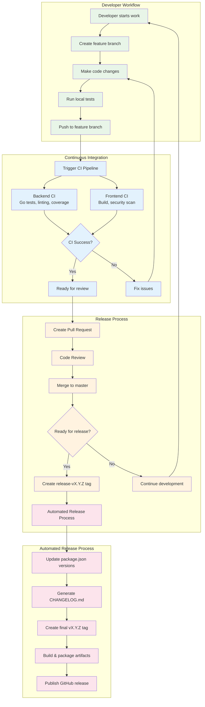
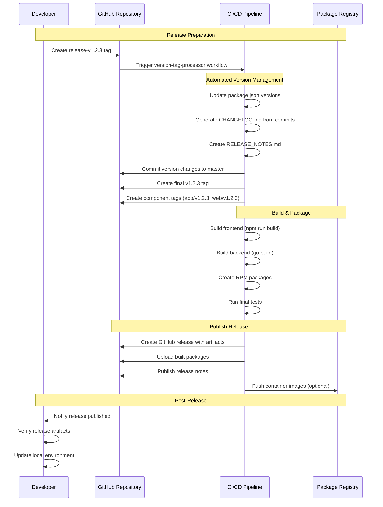

# Development Guide

This document covers the development workflow, contribution guidelines, CI/CD processes, and best practices for DataHarbor developers.

## Development Workflow Diagrams

### Git Workflow & Branch Strategy

```mermaid
gitGraph
    commit id: "Initial"
    branch feature/auth-improvement
    checkout feature/auth-improvement
    commit id: "Add OIDC support"
    commit id: "Add session management"
    commit id: "Add tests"
    
    checkout master
    commit id: "Hotfix: security patch"
    
    checkout feature/auth-improvement
    commit id: "Fix merge conflicts"
    
    checkout master
    merge feature/auth-improvement
    commit id: "Merge auth improvements"
    
    branch release-prep
    checkout release-prep
    commit id: "Bump version to v1.2.0"
    commit id: "Update changelog"
    
    checkout master
    merge release-prep
    commit id: "Release v1.2.0"
    commit tag: "v1.2.0"
```

### CI/CD Pipeline Architecture



### Release Management Process



### Getting Started

1. **Fork and Clone**

   ```bash
   git clone https://github.com/AnarManafov/dataharbor.git
   cd dataharbor
   ```

1. **Install Dependencies**

   ```bash
   # Install all dependencies (uses npm workspaces)
   npm install
   
   # Or install individually
   cd web && npm install && cd ..
   cd app && go mod download && cd ..
   ```

1. **Start Development Environment**

   ```bash
   # Start both frontend and backend with hot reload
   npm run dev
   
   # Or start separately
   npm run dev:frontend  # https://localhost:5173
   npm run dev:backend   # http://localhost:8081
   ```

### Branch Strategy

- **`master`**: Main development branch, always deployable
- **Feature branches**: `feature/description` or `feature/issue-number`
- **Bug fixes**: `fix/description` or `fix/issue-number`
- **Releases**: Tagged with semantic versioning (`v1.2.3`)

### Development Environment Configuration

#### Backend Configuration

Create or modify `app/config/application.development.yaml`:

```yaml
server:
  host: "localhost"
  port: 8081
  debug: true

logging:
  level: "debug"
  format: "console"

auth:
  oidc:
    # Use development OIDC settings
    issuer: "https://dev-keycloak.gsi.de/realms/dataharbor"
    client_id: "dataharbor-dev"

xrootd:
  servers:
    - "root://dev-xrootd.gsi.de:1094"
  timeout: "30s"
```

#### Frontend Configuration

Set environment variables or create `.env.local`:

```bash
# Optional: Custom backend URL
VITE_API_BASE_URL=http://localhost:8081/api/v1

# SSL Certificate paths (for HTTPS development)
VITE_SSL_KEY=/path/to/server.key
VITE_SSL_CERT=/path/to/server.crt
```

### Code Style and Standards

#### Go Backend Standards

- Follow [Go Code Review Comments](https://github.com/golang/go/wiki/CodeReviewComments)
- Use `gofmt` and `goimports` for formatting
- Run linting with `golangci-lint`
- Maintain test coverage > 80%

#### Vue.js Frontend Standards

- Follow [Vue.js Style Guide](https://vuejs.org/style-guide/)
- Use ESLint and Prettier for code formatting
- Follow TypeScript best practices where applicable
- Use composition API for new components

#### Commit Message Format

Follow [Conventional Commits](https://www.conventionalcommits.org/):

```text
type(scope): description

[optional body]

[optional footer]
```

Examples:

```text
feat(backend): add file download endpoint
fix(frontend): resolve authentication redirect loop
docs(readme): update installation instructions
```

### Dependency Management

DataHarbor uses different package managers for different components. This section covers how to update dependencies safely and maintain compatibility.

#### Frontend Dependencies (npm workspaces)

The project uses npm workspaces with a single `package-lock.json` at the root level for consistent dependency resolution.

**Check for updates:**

```bash
# Check all workspaces from root (recommended)
npx npm-check-updates --workspaces

# Check only web dependencies
npx npm-check-updates --workspace=web

# Or from web directory
cd web && npx npm-check-updates
```

**Update dependencies:**

```bash
# Update all workspaces (recommended approach)
npx npm-check-updates --workspaces -u
npm install

# Update only web dependencies
npx npm-check-updates --workspace=web -u
npm install

# Update specific packages only
npx npm-check-updates --workspace=web -u vue axios element-plus
npm install
```

**Best practices:**

- Always run `npm install` from the root after updating package.json files
- Test the application after dependency updates
- Update dependencies in small batches to isolate potential issues
- Check breaking changes in changelogs before major version updates

#### Backend Dependencies (Go modules)

Go uses modules for dependency management with semantic versioning.

**Check for updates:**

```bash
cd app

# List all dependencies and their versions
go list -m all

# Check for available updates
go list -u -m all

# Check for updates of specific module
go list -u -m github.com/gin-gonic/gin
```

**Update dependencies:**

```bash
cd app

# Update all dependencies to latest compatible versions
go get -u ./...

# Update specific dependency
go get -u github.com/gin-gonic/gin

# Update to specific version
go get github.com/gin-gonic/gin@v1.9.1

# Update to latest patch version only
go get -u=patch ./...

# Clean up unused dependencies
go mod tidy
```

**Verify updates:**

```bash
cd app

# Run tests after updates
go test -v ./...

# Check for security vulnerabilities
go list -json -deps ./... | nancy sleuth

# Build to ensure compilation works
go build .
```

**Best practices:**

- Always run `go mod tidy` after updating dependencies
- Test thoroughly after updates, especially for major version changes
- Read release notes for breaking changes before updating
- Update dependencies regularly but in controlled batches
- Pin versions for critical production dependencies

#### Full Project Dependency Update Workflow

**Complete update process:**

```bash
# 1. Update frontend dependencies
npx npm-check-updates --workspaces -u
npm install

# 2. Update backend dependencies
cd app
go get -u ./...
go mod tidy
cd ..

# 3. Test everything
npm run build
cd app && go test -v ./... && cd ..

# 4. Commit changes
git add .
git commit -m "chore: update dependencies

- Updated frontend dependencies to latest versions
- Updated Go modules to latest compatible versions
- All tests passing after updates"
```

#### Security Updates

**Check for security vulnerabilities:**

```bash
# Frontend security audit
npm audit
npm audit fix  # Apply automatic fixes

# Backend security check (requires nancy)
cd app
go list -json -deps ./... | nancy sleuth
```

**Handle security issues:**

- Address `npm audit` warnings promptly
- For Go modules, update to patched versions immediately
- Monitor security advisories for critical dependencies
- Consider using automated tools like Dependabot for alerts

#### Dependency Version Constraints

**Frontend (package.json):**

```json
{
  "dependencies": {
    "vue": "^3.5.18",        // Compatible version updates
    "axios": "~1.11.0",      // Patch-level updates only
    "element-plus": "2.10.5" // Exact version (use sparingly)
  }
}
```

**Backend (go.mod):**

```go
require (
    github.com/gin-gonic/gin v1.9.1
    // Go modules use minimal version selection
    // Major version changes require import path changes
)
```

### Testing Requirements

#### Before Submitting PR

```bash
# Run all backend tests
cd app && go test -v ./...

# Run frontend tests (when available)
cd web && npm test

# Check code coverage
cd app && go test -cover ./...

# Run linting
cd app && golangci-lint run
cd web && npm run lint
```

#### Test Coverage Requirements

- **Backend**: Minimum 80% overall coverage
- **Critical paths** (auth, file operations): 90% coverage
- **New features**: Must include tests
- **Bug fixes**: Must include regression tests## Release Management

### Versioning Strategy

DataHarbor follows [Semantic Versioning](https://semver.org/) with the following structure:

- **Global Versions**: `vX.Y.Z` (e.g., `v1.0.0`) for complete releases
- **Component Versions**: Automatically generated from global versions
  - Backend: `app/vX.Y.Z`
  - Frontend: `web/vX.Y.Z`

### Creating a Release

DataHarbor uses a **pre-release trigger** approach to ensure consistent repository state and proper documentation updates.

1. **Prepare Release**

   ```bash
   # Ensure all changes are committed and pushed
   git checkout master
   git pull origin master
   
   # Run tests and build to verify everything works
   npm run test
   npm run build
   ```

2. **Create Pre-Release Trigger Tag**

   Instead of creating the final release tag directly, create a **trigger tag** that initiates the release preparation process:

   ```bash
   # For regular releases
   git tag -a release-v1.2.3 -m "Prepare release v1.2.3
   
   Features:
   - Added file streaming improvements
   - Enhanced authentication security
   
   Bug Fixes:
   - Fixed directory navigation issue
   - Resolved authentication timeout"
   
   # For hotfix releases
   git tag -a hotfix-v1.2.4 -m "Prepare hotfix v1.2.4"
   
   # For pre-releases
   git tag -a prerelease-v1.3.0-beta.1 -m "Prepare pre-release v1.3.0-beta.1"
   
   # Push trigger tag to start the automated release process
   git push origin release-v1.2.3
   ```

3. **Automated Release Process**

   The CI/CD pipeline automatically:
   - **Updates all version files** (package.json, web/package.json)
   - **Generates and updates CHANGELOG.md** with commit history
   - **Creates RELEASE_NOTES.md** with release-specific notes
   - **Commits all changes** to master branch
   - **Creates the actual release tag** (`v1.2.3`) pointing to the prepared commit
   - **Creates component tags** (`app/v1.2.3`, `web/v1.2.3`)
   - **Builds and packages components**
   - **Publishes GitHub release** with artifacts and changelog

#### Release Tag Types

- **`release-v1.2.3`** → Creates final release `v1.2.3`
- **`hotfix-v1.2.4`** → Creates hotfix release `v1.2.4`  
- **`prerelease-v1.3.0-beta.1`** → Creates pre-release `v1.3.0-beta.1`

#### Why Pre-Release Triggers?

This approach ensures:

- ✅ **Consistent State**: Release tags always point to commits with updated changelog and versions
- ✅ **Automated Documentation**: CHANGELOG.md and version files are automatically maintained
- ✅ **No Manual Steps**: No need to manually update package.json or changelog files
- ✅ **Rollback Safety**: Failed preparation doesn't create invalid release tags
- ✅ **Clear Audit Trail**: Separate commits for preparation vs. development changes

### CI/CD Workflows

#### Main Workflows

1. **Backend CI** (`.github/workflows/backend.yml`)
   - Triggers on changes to `app/**` files
   - Runs tests, linting, coverage reporting
   - Builds RPM packages for deployment

2. **Frontend CI** (`.github/workflows/frontend.yml`)
   - Triggers on changes to `web/**` files
   - Runs build, security scanning
   - Creates deployable artifacts

3. **Release Automation** (`.github/workflows/version-tag-processor.yml`)
   - Triggers on version tag pushes
   - Manages versioning across components
   - Generates changelogs and release notes

#### Workflow Dependencies

```text
Trigger Tag Push (release-vX.Y.Z)
    ↓
version-tag-processor.yml
    ├─ Update package versions
    ├─ Generate changelog & release notes
    ├─ Commit all changes
    ├─ Create actual release tag (vX.Y.Z)
    └─ Create component tags (app/vX.Y.Z, web/vX.Y.Z)
    ↓
publish-release.yml (triggered by vX.Y.Z tag)
    ├─ Build frontend & backend
    ├─ Create RPM packages
    └─ Publish GitHub release with artifacts
```

## Contributing Guidelines

### Pull Request Process

1. **Create Feature Branch**

   ```bash
   git checkout -b feature/your-feature-name
   ```

2. **Make Changes**
   - Follow coding standards
   - Add appropriate tests
   - Update documentation

3. **Test Changes**

   ```bash
   # Run all tests
   cd app && go test -v ./...
   cd web && npm test
   
   # Check code coverage
   cd app && go test -cover ./...
   ```

4. **Submit Pull Request**
   - Use descriptive title and description
   - Reference related issues
   - Ensure CI checks pass

### Need Help?

For troubleshooting development issues, see the **[Troubleshooting Guide](./TROUBLESHOOTING.md)**.

## Related Documentation

- **[Backend Configuration](./BACKEND_CONFIGURATION.md)** - Complete backend configuration reference
- **[Frontend Configuration](./FRONTEND_CONFIGURATION.md)** - Frontend development and deployment configuration
- **[Setup Guide](./SETUP.md)** - Initial environment setup
- **[Testing Guide](./TESTING.md)** - Testing strategies and practices
- **[Architecture Guide](./ARCHITECTURE.md)** - System architecture overview
