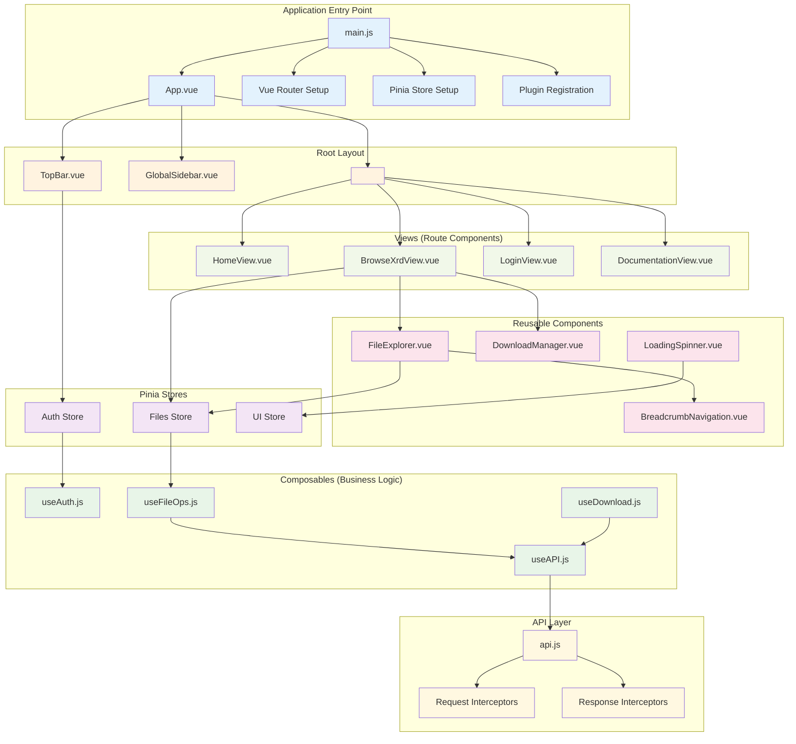
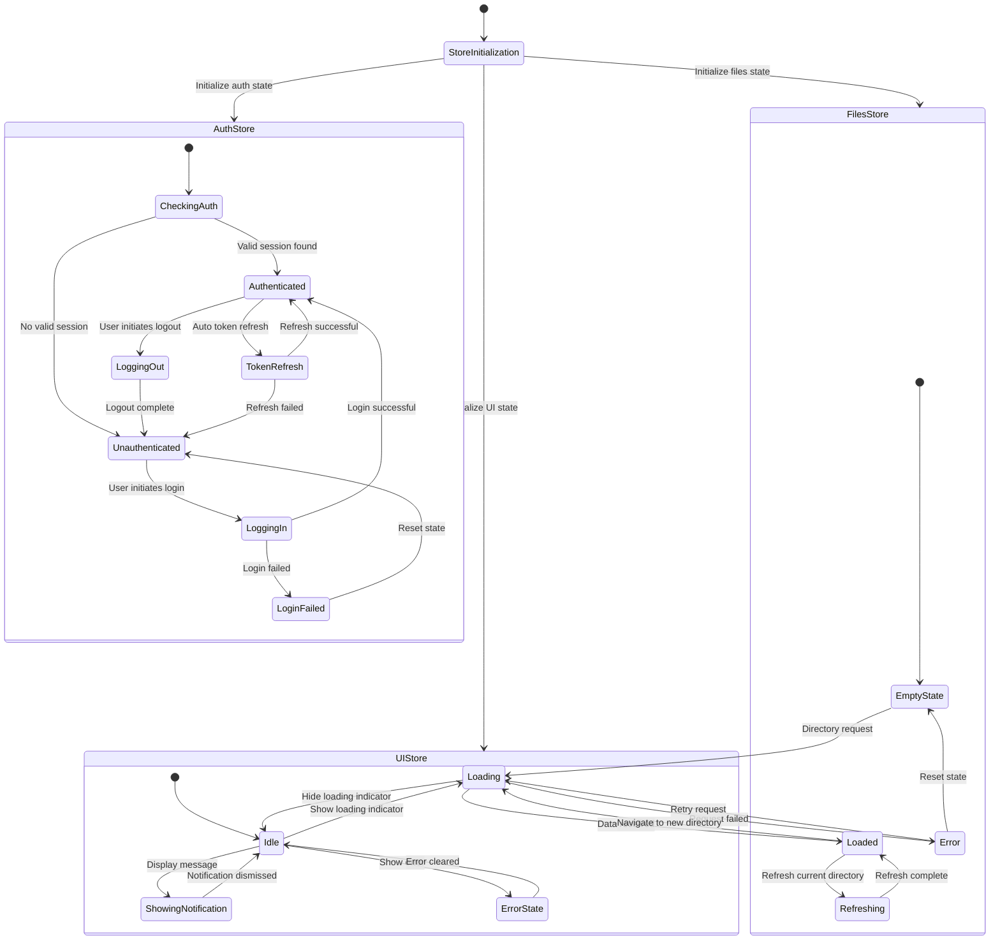
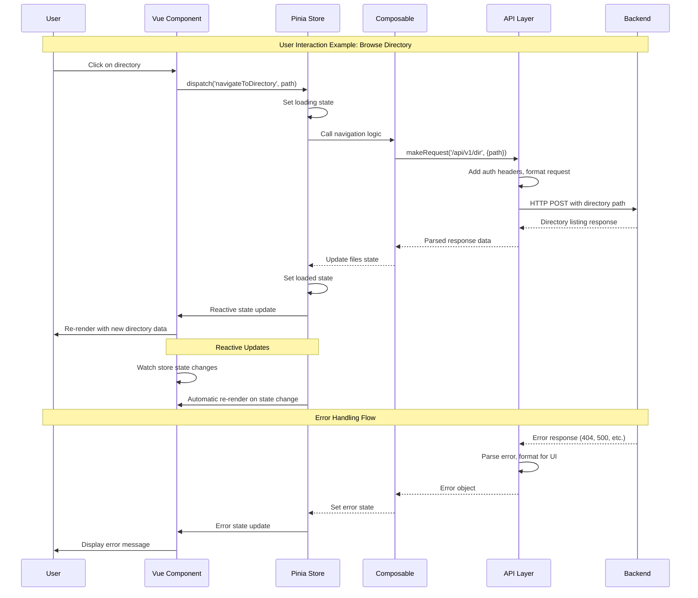
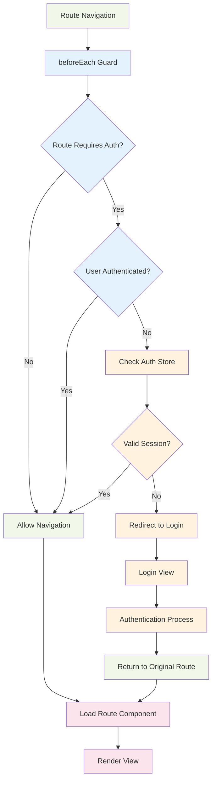

# Frontend Development Guide

[← Back to Documentation](./README.md)

This guide covers frontend development for DataHarbor's Vue.js single-page application, focusing on architecture, patterns, and development workflows.

## Overview

The frontend is a modern Vue 3 single-page application (SPA) that provides an intuitive interface for browsing GSI Lustre cluster data. Built with Vite for fast development and Element Plus for professional UI components, it emphasizes security, performance, and developer experience.

## Technology Stack

| Technology       | Purpose                                              |
| ---------------- | ---------------------------------------------------- |
| **Vue 3**        | Modern reactive framework with Composition API       |
| **Vite**         | Fast build tool with Hot Module Replacement (HMR)    |
| **Element Plus** | Enterprise-grade Vue 3 component library             |
| **Pinia**        | Lightweight state management with TypeScript support |
| **Vue Router**   | Client-side routing with navigation guards           |
| **Axios**        | HTTP client with request/response interceptors       |
| **Bulma**        | CSS framework for responsive design foundation       |

> See **[System Architecture](./ARCHITECTURE.md)** for how these components fit together.

## Project Structure

The frontend follows a modular architecture optimized for maintainability and developer productivity:

```text
web/
├── src/
│   ├── main.js             # Application entry point with plugins
│   ├── App.vue             # Root component with global layout
│   │
│   ├── components/         # Reusable Vue components
│   │   ├── TopBar.vue      # Application header with auth controls
│   │   ├── GlobalSidebar.vue # Navigation sidebar
│   │   └── partials/       # Small, focused UI components
│   │
│   ├── views/              # Page-level route components
│   │   ├── HomeView.vue    # Landing page
│   │   ├── BrowseXrdView.vue # File system browser
│   │   ├── LoginView.vue   # Authentication interface
│   │   └── DocumentationView.vue # Help and documentation
│   │
│   ├── composables/        # Vue 3 composables for reusable logic
│   │   ├── useAuth.js      # Authentication state and methods
│   │   └── useFileOps.js   # File system operations
│   │
│   ├── stores/             # Pinia stores for global state
│   │   ├── auth.js         # User authentication state
│   │   ├── files.js        # File browser state and operations
│   │   └── ui.js           # UI state (loading, notifications)
│   │
│   ├── router/             # Vue Router configuration
│   │   └── index.js        # Routes with authentication guards
│   │
│   ├── api/                # HTTP client and backend integration
│   │   ├── api.js          # API endpoint definitions
│   │   └── request.js      # Axios configuration and interceptors
│   │
│   ├── utils/              # Utility functions and helpers
│   │   ├── format.js       # Data formatting (file sizes, dates)
│   │   ├── validation.js   # Input validation utilities
│   │   └── constants.js    # Application constants
│   │
│   ├── styles/             # Global styles and theming
│   │   ├── theme.css       # Custom CSS variables and theming
│   │   └── main.css        # Global application styles
│   │
│   └── config/             # Configuration management
│       └── config.js       # Runtime configuration handling
│
├── public/                 # Static assets served directly
│   ├── index.html          # HTML template
│   ├── config.json         # Runtime configuration file
│   └── assets/             # Images, icons, static resources
│
├── dist/                   # Production build output
├── package.json            # Dependencies and build scripts
├── vite.config.js          # Vite bundler configuration
└── cert-config.js          # HTTPS certificate management
```

### Architecture Principles

- **Component-based**: Reusable UI components with clear responsibilities
- **Composable Logic**: Vue 3 composables for sharing logic across components
- **Centralized State**: Pinia stores for global application state
- **Type Safety**: JSDoc comments and structured data validation
- **Security First**: Secure authentication flow with HTTP-only cookies

## Development Workflow

### Prerequisites

- **Node.js 18+** - Modern JavaScript runtime
- **npm** - Package manager for dependency management
- **Git** - Version control system

### Quick Start

```shell
# Install dependencies (from repo root)
make deps-frontend

# Start development server with HTTPS
make dev-frontend

# Alternative: Development with custom certificates
cd web && npm run dev:env-certs
```

The development server runs on `https://localhost:5173` with automatic HTTPS configuration for secure local development.

### Development Commands

| Command               | Purpose                                  |
| --------------------- | ---------------------------------------- |
| `make dev-frontend`   | Start development server with hot reload |
| `make build-frontend` | Create production build                  |
| `npm run preview`     | Preview production build locally         |
| `npm run cert:check`  | Verify SSL certificate configuration     |
| `npm test`            | Run unit tests (when available)          |
| `npm run lint`        | Check code style and quality             |

## Frontend Architecture Diagrams

### Vue.js Application Architecture



### Pinia State Management Flow



### Component Communication & Data Flow



### Vue Router & Authentication Guards



- **Reactive State Management**: Using `ref()` and `reactive()` for component state
- **Lifecycle Hooks**: Modern `onMounted()`, `onBeforeUnmount()` patterns
- **Computed Properties**: Reactive computations with `computed()`
- **Side Effect Management**: Clean handling with `watch()` and `watchEffect()`

### Component Design Principles

**Single Responsibility**: Each component has a focused purpose

- `TopBar.vue` - Application header and user controls
- `GlobalSidebar.vue` - Navigation and routing
- `BrowseXrdView.vue` - File system interaction

**Props and Events**: Clear parent-child communication

- Props for data flow down
- Events for actions flowing up
- Custom events for complex interactions

**Slot Pattern**: Flexible content composition for layout components

### Composables for Logic Reuse

Composables extract reusable logic into functions that can be shared across components:

**Authentication Composable** (`useAuth.js`)

- Manages authentication state across the application
- Provides login, logout, and session validation methods
- Handles OIDC callback processing securely

**File Operations Composable** (`useFileOps.js`)

- Encapsulates file system interactions
- Provides directory navigation and file download capabilities
- Manages loading states and error handling

**Benefits of Composables**:

- Better code organization and reusability
- Easier unit testing of business logic
- Cleaner component templates focused on presentation

## State Management with Pinia

### Store Architecture

DataHarbor uses Pinia for predictable state management with a modular approach:

**Authentication Store** (`stores/auth.js`)

- Manages user authentication status and session data
- Provides authentication methods (login, logout, session validation)
- Integrates with OIDC Backend-for-Frontend (BFF) pattern
- Maintains secure session state without exposing tokens to JavaScript

**File System Store** (`stores/files.js`)

- Tracks current directory path and navigation history
- Manages file listings with pagination support
- Handles file selection and bulk operations
- Provides breadcrumb navigation data

**UI State Store** (`stores/ui.js`)

- Global loading states and progress indicators
- Notification and alert message management
- Theme and user interface preferences
- Error message handling and display

### Store Design Patterns

**Composition API Integration**: Stores return computed properties and methods for use in components

**Reactive State**: All store state is reactive and automatically updates components

**Action-based Mutations**: Direct state mutations through actions, maintaining predictability

**Error Handling**: Centralized error handling with user-friendly message display

## Routing and Authentication

### Route Configuration

The application uses Vue Router with declarative route definitions and metadata-driven access control:

**Route Structure**:

- **Public Routes**: Accessible without authentication (`/`, `/about`, `/docs`, `/login`)
- **Protected Routes**: Require authentication (`/browse`)
- **Callback Routes**: Handle OIDC authentication flow (`/oidc-callback`)

### Navigation Guards

**Global Authentication Guard**: Automatically checks authentication status before route navigation

**Route Metadata**: Defines access requirements with `meta.requiresAuth` and `meta.isPublic`

**Redirect Handling**: Maintains intended destination during authentication flow

### Authentication Flow Integration

**Session Validation**: Automatic check of authentication status on protected route access

**Login Redirection**: Seamless redirect to login with return URL preservation

**OIDC Callback Processing**: Secure handling of authentication provider callbacks

## API Integration

### HTTP Client Configuration

**Axios Configuration**: Centralized HTTP client with consistent timeout and header settings

**Request/Response Interceptors**: Automatic authentication header injection and error handling

**Cookie-based Authentication**: Secure session management with HTTP-only cookies

### API Layer Organization

**Endpoint Definitions** (`api/api.js`):

- File system operations (directory listing, file downloads)
- Authentication endpoints (login, logout, user info)
- System information (host details, health checks)

**Error Handling**: Consistent error processing with user-friendly messages

**Request Configuration**: Environment-specific base URLs and timeout settings

### Backend Integration Patterns

**RESTful API Design**: Standard HTTP methods and status codes

**Pagination Support**: Efficient handling of large directory listings

**File Download Flow**: Direct streaming download process for files of any size

> For detailed information about the download system architecture and implementation, see [System Architecture](./ARCHITECTURE.md#file-download-process-streaming-architecture) and [Backend Implementation](./BACKEND.md#file-streaming-implementation-technical-deep-dive).

**Health Monitoring**: Periodic backend status checks for user feedback

## Component Development

### Core Components

**TopBar Component**: Application header with authentication controls and user menu

**GlobalSidebar Component**: Navigation menu with collapsible layout and route highlighting

**BrowseXrdView Component**: Main file browser with directory navigation, pagination, and file operations

### Component Development Guidelines

**Template Organization**:

- Clear template structure with semantic HTML
- Element Plus components for consistent UI
- Proper accessibility attributes and ARIA labels

**Script Setup Pattern**:

- Use `<script setup>` for cleaner component syntax
- Import composables for shared logic
- Define props and emits explicitly

**Styling Approach**:

- Scoped styles for component-specific CSS
- CSS variables for consistent theming
- Responsive design with mobile-first approach

### File Browser Architecture

The file browser demonstrates advanced component patterns:

**Data Management**: Integration with Pinia stores for state persistence

**Pagination**: Efficient handling of large directory listings

**User Interactions**: File selection, navigation, and download operations

**Loading States**: Visual feedback during API operations

**Error Handling**: User-friendly error messages and recovery options

## Testing Strategy

### Testing Approach

DataHarbor's frontend testing strategy focuses on practical testing that provides confidence in core functionality:

**Unit Testing**: Test composables and utility functions in isolation

**Component Testing**: Verify component behavior and user interactions

**Integration Testing**: Ensure proper communication between components and stores

**End-to-End Testing**: Validate complete user workflows

### Recommended Testing Tools

**Vitest**: Fast unit testing framework with Vue 3 support

**Vue Test Utils**: Vue-specific testing utilities for component testing

**Cypress** (optional): End-to-end testing for critical user flows

### Testing Priorities

1. **Authentication Flow**: Login, logout, and session management
2. **File Operations**: Directory navigation and file downloads
3. **Error Handling**: Network failures and invalid responses
4. **Responsive Design**: Mobile and desktop layout functionality

### Testing Best Practices

- Focus on testing behavior, not implementation details
- Mock external dependencies (API calls, browser APIs)
- Use realistic test data that reflects production scenarios
- Maintain tests alongside feature development

## Build and Deployment

### Build Configuration

DataHarbor uses Vite for fast builds and optimized production bundles:

**Development Build**: Hot module replacement and fast refresh for efficient development

**Production Build**: Optimized assets, code splitting, and compression for performance

**Build Features**:

- Automatic code splitting for vendor libraries
- CSS extraction and optimization
- Asset compression and caching
- Source map generation for debugging

### Build Commands

```shell
# Development build with hot reload
make dev-frontend

# Production build
make build-frontend

# Preview production build locally
cd web && npm run preview
```

### SSL Certificate Management

DataHarbor supports automatic HTTPS configuration for secure local development:

**Certificate Sources**:

1. Environment variables (`VITE_SSL_KEY`, `VITE_SSL_CERT`)
2. Workspace-relative certificate files
3. Home directory certificate locations
4. Fallback to HTTP mode

**Certificate Verification**: Use `npm run cert:check` to verify SSL configuration

### Deployment Strategies

**Static Site Hosting**: Deploy build output to any static hosting service

**RPM Packaging**: Generate RPM packages for Red Hat-based systems

**CDN Integration**: Optimized assets ready for content delivery networks

## Performance Optimization

### Code Optimization Strategies

**Lazy Loading**: Route-based code splitting for faster initial page loads

**Bundle Optimization**: Vendor library separation and tree shaking for smaller bundles

**Component Optimization**: Efficient re-rendering with computed properties and proper reactivity

**Asset Optimization**: Image compression and efficient asset loading

### Runtime Performance

**Virtual Scrolling**: For large file lists to maintain smooth scrolling performance

**Debounced Operations**: Prevent excessive API calls during user interactions

**Caching Strategy**: Smart caching of directory listings and user preferences

**Memory Management**: Proper cleanup of event listeners and timeouts

### Loading Optimization

**Progressive Loading**: Show content as it becomes available

**Skeleton Screens**: Visual placeholders during data loading

**Error Boundaries**: Graceful degradation when components fail

**Pagination**: Efficient handling of large datasets with server-side pagination

## Related Documentation

- **[Frontend Configuration](./FRONTEND_CONFIGURATION.md)** - Configuration and deployment settings
- **[Backend Development](./BACKEND.md)** - Backend API development and integration
- **[Authentication](./AUTHENTICATION.md)** - OIDC authentication flow and security
- **[API Reference](./API.md)** - Complete API documentation
- **[Setup Guide](./SETUP.md)** - Development environment setup
- **[Deployment](./DEPLOYMENT.md)** - Production deployment strategies
- **[Troubleshooting](./TROUBLESHOOTING.md)** - Common issues and solutions

---

[← Back to Documentation](./README.md) | [↑ Top](#frontend-development-guide)
