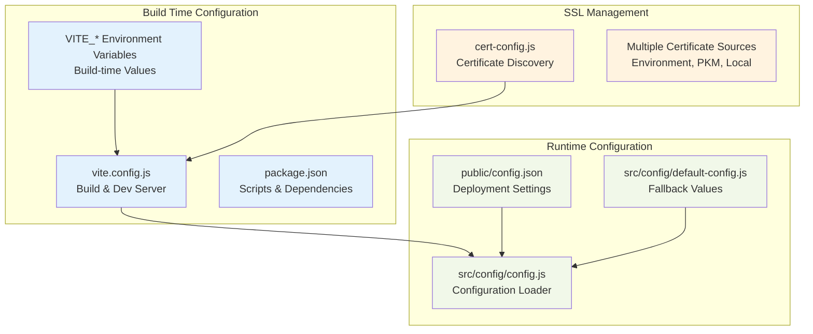
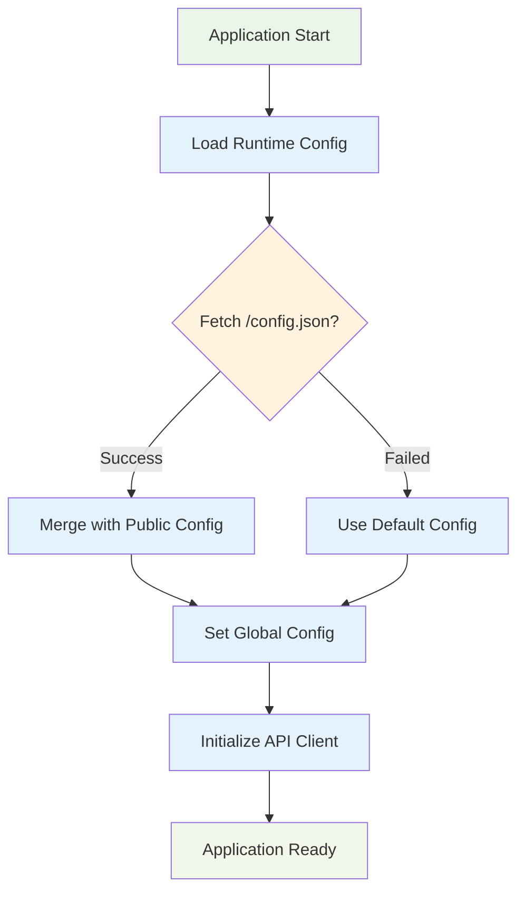

# Frontend Configuration Guide

DataHarbor's Vue.js frontend uses a multi-layered configuration system with build-time variables, runtime configuration, and SSL certificate management. This guide covers all frontend configuration options and deployment strategies.

## Quick Start

### Development Setup

1. **Install dependencies**:

   ```bash
   cd web
   npm install
   ```

2. **Start development server**:

   ```bash
   # Basic development server
   npm run dev
   
   # With PKM certificates (if available)
   npm run dev:pkm-certs
   
   # With custom SSL certificates
   VITE_SSL_KEY="path/to/server.key" VITE_SSL_CERT="path/to/server.crt" npm run dev
   ```

3. **Access the application**:
   - Open `https://localhost:5173` (with SSL) or `http://localhost:5173`
   - Accept certificate warnings for development

## Configuration Architecture

### Configuration Layers



### Configuration Loading Flow



## Complete Configuration Reference

### Build Configuration (`vite.config.js`)

#### Development Server Settings

| Setting        | Type           | Default            | Description                         |
| -------------- | -------------- | ------------------ | ----------------------------------- |
| `server.port`  | number         | `5173`             | Development server port             |
| `server.https` | object/boolean | `getHttpsConfig()` | HTTPS configuration (auto-detected) |
| `server.proxy` | object         | `/api` proxy setup | API proxy to backend server         |

#### Build Settings

| Setting                      | Type   | Default           | Description                    |
| ---------------------------- | ------ | ----------------- | ------------------------------ |
| `define.__APP_VERSION__`     | string | `frontendVersion` | Frontend version from git tags |
| `define.__GLOBAL_VERSION__`  | string | `globalVersion`   | Global project version         |
| `define.__BACKEND_VERSION__` | string | `backendVersion`  | Backend version from git tags  |

#### Proxy Configuration

```javascript
proxy: {
  '/api': {
    target: 'https://localhost:22000',
    changeOrigin: true,
    secure: false,
    ws: true,
    xfwd: true,
    cookieDomainRewrite: { '*': '' }
  }
}
```

### SSL Certificate Configuration (`cert-config.js`)

#### Certificate Discovery Priority

1. **Environment Variables** (highest priority)
2. **PKM Workspace** (relative paths)
3. **User Home PKM** (common locations)  
4. **Local app/config** (fallback)

#### Environment Variables

| Variable        | Type   | Description                  |
| --------------- | ------ | ---------------------------- |
| `VITE_SSL_KEY`  | string | Path to SSL private key file |
| `VITE_SSL_CERT` | string | Path to SSL certificate file |

#### PKM Workspace Integration

Automatic discovery of certificates in PKM workspace:

```javascript
// Relative PKM paths
'../../pkm/docs/gsi/dataharbor/test/cert/server.key'
'../../pkm/docs/gsi/dataharbor/test/cert/server.crt'

// User home PKM paths  
'~/Documents/workspace/pkm/docs/gsi/dataharbor/test/cert/'
```

### Runtime Configuration

#### Public Configuration (`public/config.json`)

| Key                            | Type    | Default  | Description                   |
| ------------------------------ | ------- | -------- | ----------------------------- |
| `apiBaseUrl`                   | string  | `"/api"` | Base URL for API requests     |
| `features.enableDocumentation` | boolean | `true`   | Enable documentation features |

#### Default Configuration (`src/config/default-config.js`)

| Key                            | Type    | Default                | Description                        |
| ------------------------------ | ------- | ---------------------- | ---------------------------------- |
| `apiBaseUrl`                   | string  | `"/api"`               | Base URL for API requests          |
| `apiTimeout`                   | number  | `30000`                | API request timeout (milliseconds) |
| `auth.redirectUrl`             | string  | `"/api/auth/callback"` | Authentication redirect URL        |
| `features.enableDocumentation` | boolean | `true`                 | Enable documentation features      |
| `features.enableFileDownload`  | boolean | `true`                 | Enable file download functionality |
| `ui.appTitle`                  | string  | `"DataHarbor"`         | Application title                  |
| `ui.initialPageSize`           | number  | `100`                  | Initial pagination size            |

### Environment Variables

#### Build-Time Variables (`VITE_*`)

| Variable                | Type   | Default  | Description             |
| ----------------------- | ------ | -------- | ----------------------- |
| `VITE_API_BASE_URL`     | string | `"/api"` | API base URL override   |
| `VITE_SSL_KEY`          | string | -        | SSL private key path    |
| `VITE_SSL_CERT`         | string | -        | SSL certificate path    |
| `VITE_CONFIG_FILE_PATH` | string | -        | Custom config file path |

#### Development Scripts Environment Variables

```bash
# SSL certificate paths
export VITE_SSL_KEY="$HOME/Documents/workspace/pkm/docs/gsi/dataharbor/test/cert/server.key"
export VITE_SSL_CERT="$HOME/Documents/workspace/pkm/docs/gsi/dataharbor/test/cert/server.crt"

# Custom config file
export VITE_CONFIG_FILE_PATH="/config.json"

# API base URL override
export VITE_API_BASE_URL="https://api.yourdomain.com"
```

## Package Scripts Reference

### Development Scripts

| Script            | Description                          | Usage                     |
| ----------------- | ------------------------------------ | ------------------------- |
| `dev`             | Standard development server          | `npm run dev`             |
| `dev:with-config` | Dev server with custom config        | `npm run dev:with-config` |
| `dev:env-certs`   | Dev server with env certificate vars | `npm run dev:env-certs`   |
| `dev:pkm-certs`   | Dev server with PKM certificates     | `npm run dev:pkm-certs`   |

### Production Scripts

| Script    | Description              | Usage             |
| --------- | ------------------------ | ----------------- |
| `build`   | Production build         | `npm run build`   |
| `preview` | Preview production build | `npm run preview` |

### Certificate Management

| Script       | Description                    | Usage                |
| ------------ | ------------------------------ | -------------------- |
| `cert:check` | Check certificate availability | `npm run cert:check` |
| `cert:setup` | Setup certificate example      | `npm run cert:setup` |

### Sandbox Environment

| Script              | Description                   | Usage                       |
| ------------------- | ----------------------------- | --------------------------- |
| `sandbox`           | Sandbox development server    | `npm run sandbox`           |
| `sandbox:env-certs` | Sandbox with env certificates | `npm run sandbox:env-certs` |
| `sandbox:pkm-certs` | Sandbox with PKM certificates | `npm run sandbox:pkm-certs` |

## Deployment Configuration

### Development Deployment

```json
{
  "apiBaseUrl": "/api",
  "features": {
    "enableDocumentation": true,
    "enableFileDownload": true
  },
  "ui": {
    "appTitle": "DataHarbor (Development)",
    "initialPageSize": 50
  }
}
```

### Production Deployment

```json
{
  "apiBaseUrl": "https://api.yourdomain.com",
  "features": {
    "enableDocumentation": false,
    "enableFileDownload": true
  },
  "ui": {
    "appTitle": "DataHarbor",
    "initialPageSize": 100
  },
  "auth": {
    "redirectUrl": "https://yourdomain.com/api/auth/callback"
  }
}
```

### Container Deployment

For container deployments, mount configuration as volume:

```bash
# Mount external config
docker run -v /path/to/config.json:/app/public/config.json dataharbor-frontend

# Environment-based config
docker run -e VITE_API_BASE_URL="https://api.example.com" dataharbor-frontend
```

## SSL Certificate Management

### Certificate Sources Priority

1. **Environment Variables**:
   ```bash
   export VITE_SSL_KEY="/path/to/server.key"
   export VITE_SSL_CERT="/path/to/server.crt"
   ```

2. **PKM Workspace** (automatic discovery):
   - `../../pkm/docs/gsi/dataharbor/test/cert/`
   - `~/Documents/workspace/pkm/docs/gsi/dataharbor/test/cert/`

3. **Local Fallback**:
   - `../app/config/server.key`
   - `../app/config/server.crt`

### Certificate Troubleshooting

#### Check Certificate Availability

```bash
npm run cert:check
```

#### Manual Certificate Setup

```bash
# Create certificate directory
mkdir -p ../app/config

# Generate self-signed certificates (development only)
openssl req -x509 -newkey rsa:4096 -keyout ../app/config/server.key \
  -out ../app/config/server.crt -days 365 -nodes \
  -subj "/CN=localhost"
```

#### Certificate Debugging

Enable certificate debugging in `cert-config.js`:

```javascript
console.log('🔒 Using SSL certificates from:', location.source);
console.log('    Key:', location.key);
console.log('    Cert:', location.cert);
```

## API Integration Configuration

### API Client Setup

The frontend automatically configures API client with:

```javascript
// API client configuration
const config = getConfig();

const instance = axios.create({
  baseURL: config.apiBaseUrl,
  timeout: config.apiTimeout || 30000,
  withCredentials: true
});
```

### Development Proxy Configuration

Development proxy routes API calls to backend:

```javascript
'/api': {
  target: 'https://localhost:22000',  // Backend server
  changeOrigin: true,
  secure: false,                      // Allow self-signed certs
  ws: true,                          // WebSocket support
  xfwd: true                         // Forward headers
}
```

## Version Management

### Version Injection

Build process injects versions into application:

```javascript
// Available globally in application
__APP_VERSION__      // Frontend version (web/v*)
__GLOBAL_VERSION__   // Global version (v*)
__BACKEND_VERSION__  // Backend version (app/v*)
```

### Version Display

Versions are available in Vue components:

```javascript
// In Vue components
export default {
  mounted() {
    console.log('Frontend Version:', __APP_VERSION__);
    console.log('Global Version:', __GLOBAL_VERSION__);
    console.log('Backend Version:', __BACKEND_VERSION__);
  }
}
```

### Need Help?

For troubleshooting frontend configuration issues, see the **[Troubleshooting Guide](./TROUBLESHOOTING.md)**.

## Related Documentation

- **[Backend Configuration](./BACKEND_CONFIGURATION.md)** - Go backend configuration
- **[Frontend Development](./FRONTEND.md)** - Frontend development guide
- **[Development Guide](./DEVELOPMENT.md)** - Development environment setup
- **[Deployment Guide](./DEPLOYMENT.md)** - Production deployment configuration
