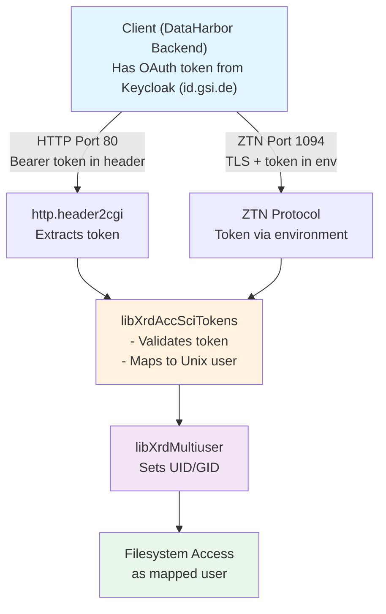

# XRootD ZTN Protocol Configuration Guide

**Purpose**: Enable OAuth token authentication on native XRootD protocol (port 1094)

**Date**: October 2025

> **Note**: This guide is for configuring external XRootD servers (e.g., punch2.gsi.de).
> For Docker-based deployments, see the pre-configured files:
> - `docker/xrootd/configs/xrootd-dev.cfg` (development)
> - `docker/xrootd/configs/xrootd-prod.cfg` (production)

---

## Problem

The XRootD server currently only has HTTP authentication configured. The native protocol (port 1094) has **no authentication** (missing `sec.protocol` directive), causing "Anonymous client" errors when the DataHarbor backend attempts to connect.

---

## Solution: Enable ZTN (Zero-Trust Networking) Protocol

ZTN enables token-based authentication on the native XRootD protocol using the same SciTokens infrastructure already configured for HTTP.

**Requirements**:

- TLS encryption (mandatory for ZTN)
- Existing scitokens.cfg and mapfile (already configured ✓)
- TLS certificates (self-signed or real certificates)

---

## Architecture Overview

**Authentication & Authorization Flow**:



**Key Components**:

1. **SciTokens Library** (`libXrdAccSciTokens.so`):
   - Validates OAuth tokens from Keycloak
   - Maps token subject to Unix user via `/etc/xrootd/mapfile`
   - Same library used for both HTTP and ZTN protocols

2. **Multiuser Plugin** (`libXrdMultiuser.so`):
   - Takes the mapped Unix username
   - Sets filesystem UID/GID for file operations
   - Files are created/accessed as the actual user, not as 'xrootd'

3. **Token Mapping** (`/etc/xrootd/mapfile`):
   - JSON file: `{"sub": "keycloak.username", "result": "unix_user"}`
   - Example: `{"sub": "a.manafov", "result": "anarman"}`
   - Shared between HTTP and ZTN protocols

---

## Step 1: Verify/Create TLS Certificates

### Option A: Using Self-Signed Certificates (Development/Testing)

If you don't have real certificates, create self-signed ones:

```bash
# Create self-signed certificate valid for 365 days
openssl req -x509 -nodes -days 365 -newkey rsa:2048 \
  -keyout /etc/xrootd/hostkey.pem \
  -out /etc/xrootd/hostcert.pem \
  -subj "/C=DE/ST=Hesse/L=Darmstadt/O=GSI/CN=punch2.gsi.de"

# Set correct permissions
chown xrootd:xrootd /etc/xrootd/hostcert.pem /etc/xrootd/hostkey.pem
chmod 644 /etc/xrootd/hostcert.pem
chmod 600 /etc/xrootd/hostkey.pem

# Create CA certificate directory (use self-signed cert as CA)
mkdir -p /etc/grid-security/certificates
cp /etc/xrootd/hostcert.pem /etc/grid-security/certificates/
c_rehash /etc/grid-security/certificates/
```

**Note**: Self-signed certificates work fine for ZTN protocol. Clients connecting to port 1094 will need to trust this certificate or disable TLS verification.

### Option B: Using Real Certificates (Production)

If you have real certificates from your GSI CA or Let's Encrypt:

```bash
# Verify certificates exist
ls -la /etc/xrootd/hostcert.pem /etc/xrootd/hostkey.pem
ls -la /etc/grid-security/certificates/

# Set correct permissions
chown xrootd:xrootd /etc/xrootd/hostcert.pem /etc/xrootd/hostkey.pem
chmod 644 /etc/xrootd/hostcert.pem
chmod 600 /etc/xrootd/hostkey.pem
```

---

## Step 2: Update XRootD Configuration

Edit `/etc/xrootd/xrootd-http.cfg` and add the following lines:

```bash
# ============================================
# TLS Configuration (Required for ZTN)
# ============================================
xrd.tlsca certdir /etc/grid-security/certificates
xrd.tls /etc/xrootd/hostcert.pem /etc/xrootd/hostkey.pem

# ============================================
# ZTN Protocol for Native Port 1094
# ============================================
sec.protocol ztn -tokenlib libXrdAccSciTokens.so
sec.protbind * only ztn
```

**Important Configuration Notes**:

1. **DO NOT use `ofs.authorize`** - This directive loads the legacy Authfile-based authorization system and will cause errors. SciTokens handles authorization automatically.

2. **Keep these existing directives**:
   - `ofs.authlib ++ libXrdAccSciTokens.so config=/etc/xrootd/scitokens.cfg` - Handles token validation and user mapping
   - `ofs.osslib ++ libXrdMultiuser.so` - Maps authenticated users to Unix UID/GID
   - `http.header2cgi Authorization authz` - Extracts Bearer token from HTTP headers

3. **How it works**:
   - **HTTP (port 80)**: Bearer token from HTTP header → SciTokens validates → maps to Unix user
   - **ZTN (port 1094)**: Bearer token from environment/TLS → SciTokens validates → maps to Unix user
   - Both protocols use the **same** `scitokens.cfg` and `mapfile` for token→user mapping

### Complete Configuration Example

Here's how `/etc/xrootd/xrootd-http.cfg` should look after changes:

```bash
# Export filesystem
all.export / r/w

# HTTP Protocol (port 80)
xrd.protocol XrdHttp:80 libXrdHttp.so

# Multiuser plugin - maps authenticated user to Unix UID/GID
ofs.osslib ++ libXrdMultiuser.so

# SciTokens handles authentication AND authorization
# Token validation + user mapping via scitokens.cfg and mapfile
ofs.authlib ++ libXrdAccSciTokens.so config=/etc/xrootd/scitokens.cfg

# HTTP: Pass Authorization header to SciTokens for token extraction
http.header2cgi Authorization authz

# Enable detailed token processing logs
scitokens.trace all

# TLS Configuration (Required for ZTN)
xrd.tlsca certdir /etc/grid-security/certificates
xrd.tls /etc/xrootd/hostcert.pem /etc/xrootd/hostkey.pem

# Native Protocol Authentication (ZTN for port 1094)
# Token-based authentication using SciTokens (same as HTTP)
sec.protocol ztn -tokenlib libXrdAccSciTokens.so
sec.protbind * only ztn

# Include additional config files
continue /etc/xrootd/config.d/
```

**Key Points**:

- **No `ofs.authorize`** - Removed because it triggers the legacy Authfile system
- **SciTokens does it all** - Handles both authentication (token validation) and authorization (access control)
- **Same user mapping** - Both HTTP and ZTN use `scitokens.cfg` + `mapfile` to map tokens to Unix users
- **Multiuser plugin** - Takes the mapped Unix user and sets the filesystem UID/GID for file operations

---

## Step 3: Verify Configuration Files (No Changes Needed)

> **Note**: This section is for external XRootD servers. For Docker deployments, the equivalent files are:
> - `docker/xrootd/configs/scitokens_dev.cfg` (development)
> - `docker/xrootd/configs/scitokens_prod.cfg` (production)

These files should **remain unchanged**:

### `/etc/xrootd/scitokens.cfg`

```ini
[Global]
audience = ...

[Issuer wl]
issuer = https://id.gsi.de/realms/wl
base_path = /
map_subject = True
default_user = xrootd
name_mapfile = /etc/xrootd/mapfile
```

### `/etc/xrootd/mapfile`

```json
[
  {"sub": "user1", "result": "mappeduser1"},
  {"sub": "user2", "result": "mappeduser2"},
  ...
]
```

All 200+ existing user mappings will work with ZTN automatically.

**Note**: Keep actual usernames/mappings confidential.

---

## Step 4: Restart XRootD Service

```bash
# Restart XRootD
systemctl restart xrootd@http

# Or if using different service name:
# systemctl restart xrootd

# Check service status
systemctl status xrootd@http
```

---

## Step 5: Verify Configuration

### 5.1. Check TLS is Active

```bash
# Verify port 1094 is listening
netstat -tlnp | grep 1094

# Test TLS connection
openssl s_client -connect localhost:1094 -showcerts
```

Expected: TLS handshake succeeds, shows certificate details.

### 5.2. Check XRootD Logs

```bash
tail -f /var/log/xrootd/xrootd.log
```

Look for:

- `sec.protocol ztn` initialization messages
- TLS certificate loaded successfully
- No error messages about missing libraries

---

## Troubleshooting

### Error: "Unable to find /opt/xrd/etc/Authfile; no such file or directory"

**Symptom**: XRootD logs show:

```text
acc_AuthFile: Unable to find /opt/xrd/etc/Authfile; no such file or directory
Config 0 authorization directives processed in /etc/xrootd/xrootd-http.cfg
Authorization system initialization failed
```

**Cause**: The `ofs.authorize` directive is present in the configuration. This directive loads the **legacy Unix-style authorization system** that looks for an Authfile, which conflicts with modern SciTokens-based authentication.

**Why this happens**: When using SciTokens + Multiuser setup:

- **SciTokens library** (`libXrdAccSciTokens.so`) already handles:
  - Token validation (signature, issuer, expiration)
  - User mapping (token subject → Unix user via mapfile)
  - Authorization (access control based on token claims)
- **`ofs.authorize` alone** triggers the legacy system that expects `/opt/xrd/etc/Authfile`
- You don't need both - SciTokens does everything!

**Solution**:

1. Check for the problematic directive:

   ```bash
   ssh root@punch2 "grep -n 'ofs.authorize' /etc/xrootd/xrootd-http.cfg"
   ```

2. Edit the configuration file:

   ```bash
   sudo nano /etc/xrootd/xrootd-http.cfg
   ```

3. **Remove the `ofs.authorize` line completely**:

   ```bash
   # WRONG - Remove this:
   # ofs.authorize
   
   # CORRECT - Keep only this:
   ofs.authlib ++ libXrdAccSciTokens.so config=/etc/xrootd/scitokens.cfg
   ```

4. Verify your configuration has this structure:

   ```bash
   # Multiuser plugin - maps authenticated user to Unix UID/GID
   ofs.osslib ++ libXrdMultiuser.so
   
   # SciTokens handles authentication AND authorization
   ofs.authlib ++ libXrdAccSciTokens.so config=/etc/xrootd/scitokens.cfg
   
   # HTTP: Pass Authorization header to SciTokens
   http.header2cgi Authorization authz
   
   # ZTN: Token authentication on native protocol
   sec.protocol ztn -tokenlib libXrdAccSciTokens.so
   sec.protbind * only ztn
   ```

5. Restart XRootD:

   ```bash
   sudo systemctl restart xrootd@http
   sudo tail -f /var/log/xrootd/xrootd.log  # Verify error is gone
   ```

**How the token→user mapping works**:

1. **Client sends token** (via HTTP header or ZTN environment variable)
2. **SciTokens validates** token against issuer (Keycloak at `https://id.gsi.de/realms/wl`)
3. **SciTokens maps** token subject to Unix user using `/etc/xrootd/mapfile`
4. **Multiuser plugin** sets filesystem UID/GID to the mapped Unix user
5. **File operations** run as the mapped user, not as 'xrootd'

**Note**: Both HTTP (port 80) and ZTN (port 1094) use the **same** SciTokens library, mapfile, and user mapping logic. The only difference is how the token is extracted (HTTP header vs. environment variable).

---

## How ZTN Token Discovery Works

When a client connects to port 1094 with ZTN, XRootD looks for tokens in this order:

1. **`BEARER_TOKEN`** environment variable
2. **`BEARER_TOKEN_FILE`** environment variable → reads file contents  
3. **`$XDG_RUNTIME_DIR/bt_u{euid}`** (if XDG_RUNTIME_DIR is set)
4. **`/tmp/bt_u{euid}`** (fallback)

The **DataHarbor backend** will be updated to provide tokens via one of these methods.

## References

- XRootD ZTN Protocol Documentation: CERN Indico Event 1483930
- [XRootD Security Configuration](https://xrootd.web.cern.ch/doc/dev56/sec_config.htm)
- [SciTokens Library](https://github.com/scitokens/xrootd-scitokens)

---

**Configuration prepared for**: punch2.gsi.de (140.181.3.31)  
**XRootD Version**: 5.x (verify with `xrootd -v`)  
**Date**: October 2025
