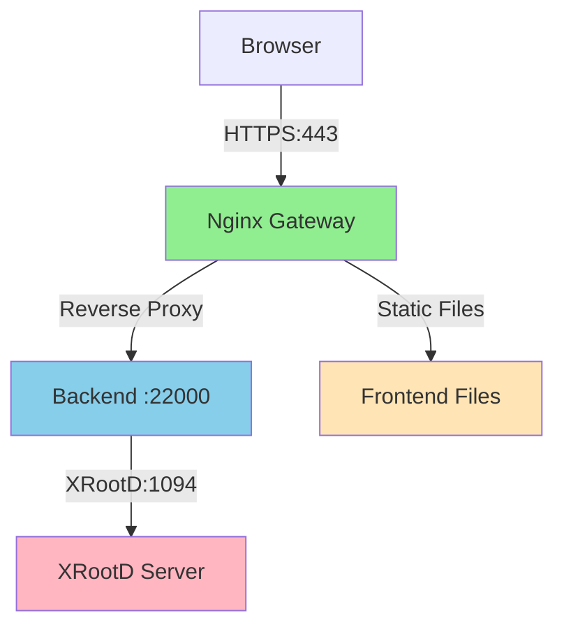
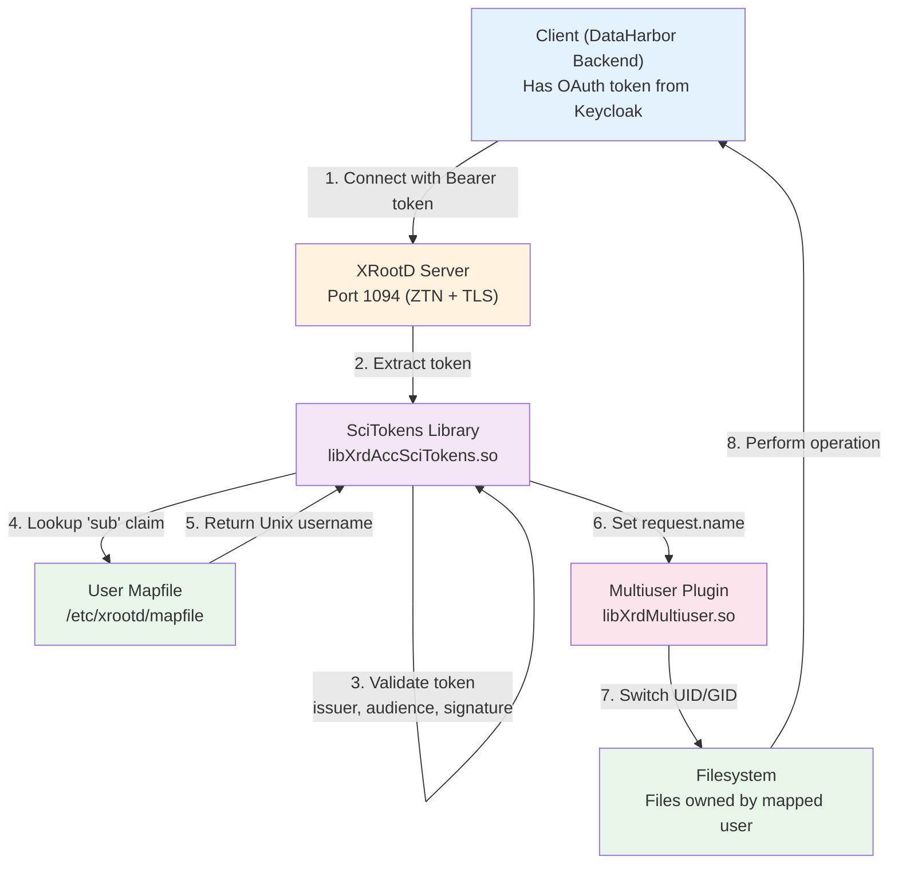

# DataHarbor Manual Deployment Guide for GSI Environment

[← Back to GSI Documentation](./README.md) | [Main Documentation](../README.md)

This guide provides step-by-step instructions for **manual deployment** of DataHarbor on GSI servers using RPM packages.

> **⚠️ Note**: For production deployments, we **strongly recommend using Docker Compose** instead of manual installation. See [Docker Deployment Guide](../../docker/README.md) for the recommended approach.

**This guide is for:**
- Legacy systems where Docker is not available
- Environments requiring traditional RPM package management
- Custom deployment scenarios with specific requirements

**Document Status**: Production-ready configuration for HTTPS deployment  
**Last Updated**: December 2025

---

## Table of Contents

1. [Prerequisites](#prerequisites)
2. [Deployment Overview](#deployment-overview)
3. [Initial Installation (One-Time Setup)](#initial-installation-one-time-setup)
4. [Version Updates](#version-updates-upgrading-dataharbor)
5. [Verification & Testing](#verification--testing)
6. [Troubleshooting](#troubleshooting)
7. [Quick Reference](#quick-reference)

---

## Prerequisites

### Required Access & Tools
- ✅ Root access to GSI server
- ✅ SSH access with public key authentication
- ✅ XRootD server (see [XRootD ZTN Setup](./XROOTD_ZTN_SETUP.md) for configuration)
- ✅ SSL certificates from GEANT CA or self-signed certificates
- ✅ OIDC provider configured at Keycloak (id.gsi.de)

### Pre-existing Infrastructure
- **XRootD Server**: Configured with ZTN protocol and SciTokens support
- **Keycloak OIDC**: https://id.gsi.de/realms/wl
- **Network**: Firewall configured for ports 443 (HTTPS), 22000 (Backend), 1094 (XRootD)

### System Requirements

**For RPM Installation:**
- **OS**: RHEL/CentOS 8+ or compatible
- **Nginx**: 1.20+ (reverse proxy)
- **XRootD**: 5.7+ with required plugins (scitokens, multiuser)

**Note**: Go and Node.js are NOT required for RPM installation - the packages contain pre-built binaries and static files.

---

## Deployment Overview

### Recommended: Docker Compose

Before proceeding with manual installation, consider using Docker Compose for a simpler deployment:

**See:** [Docker Deployment Guide](../../docker/README.md)

Docker Compose advantages:
- ✅ Pre-configured services (Backend, Frontend, XRootD, Nginx)
- ✅ Automatic TLS/SSL setup
- ✅ Easy version updates
- ✅ Consistent environments

### Manual Installation Architecture

This manual deployment guide will set up:



### Port Allocation

| Service             | Port  | Protocol | Purpose            | Notes            |
| ------------------- | ----- | -------- | ------------------ | ---------------- |
| XRootD Protocol     | 1094  | XRootD   | File system access | ZTN + TLS        |
| DataHarbor Backend  | 22000 | HTTPS    | API server         | SSL enabled      |
| DataHarbor Frontend | 443   | HTTPS    | Web UI             | Nginx proxy      |
| Keycloak OIDC       | 443   | HTTPS    | Authentication     | External service |

### File Locations (Standard)

| Item                     | Location                                             |
| ------------------------ | ---------------------------------------------------- |
| Backend binary           | `/usr/local/bin/dataharbor-backend`                  |
| Backend config (default) | `/etc/dataharbor/application.yaml`                   |
| Backend service          | `/usr/lib/systemd/system/dataharbor-backend.service` |
| Backend logs             | `/var/log/dataharbor/dataharbor-backend.log`         |
| Frontend files           | `/usr/share/dataharbor-frontend/`                    |
| Frontend config          | `/usr/share/dataharbor-frontend/config.json`         |
| Nginx config             | `/etc/nginx/conf.d/dataharbor.conf`                  |
| SSL certificates         | `/etc/ssl/certs/` and `/etc/ssl/private/`            |
| XRootD config            | `/etc/xrootd/xrootd.cfg`                             |
| XRootD SciTokens config  | `/etc/xrootd/scitokens.cfg`                          |
| XRootD user mapfile      | `/etc/xrootd/mapfile`                                |

---

---

## Initial Installation (One-Time Setup)

This section covers the complete initial setup. These steps are **only performed once** per server.

---

### Step 1: Prepare Configuration Directory

Create the configuration directory for your custom config (the RPM will create `/etc/dataharbor/` automatically):

```bash
# Create custom configuration directory (optional, if not using /etc/dataharbor/)
sudo mkdir -p /root/dataharbor/config
```

**Note**: 
- The backend RPM now creates `/var/log/dataharbor/` and `/etc/dataharbor/` automatically
- GSI servers use centralized SSL certificates from GEANT CA located at `/etc/ssl/certs/punch2.gsi.de.pem` and `/etc/ssl/private/punch2.gsi.de.key`
- Certificates are managed by GSI IT and are valid for one year

### Step 2: Create Backend Configuration File

Create the backend configuration file **before** installing the RPM.

> **Complete Reference**: See [Backend Configuration Guide](../BACKEND_CONFIGURATION.md) for all configuration options.

**Create minimal production config:**

```bash
sudo tee /root/dataharbor/config/backend-config.yaml << 'EOF'
env: production

server:
  address: ":22000"
  ssl:
    enabled: true
    cert_file: /etc/ssl/certs/your-server.pem
    key_file: /etc/ssl/private/your-server.key
  cors:
    allow_origins:
      - https://your-server.example.com

logging:
  level: info
  file:
    enabled: true
    filename: "/var/log/dataharbor/dataharbor-backend.log"

xrd:
  host: "localhost"
  port: 1094
  initial_dir: "/"
  enable_ztn: true

frontend:
  url: "https://your-server.example.com"

auth:
  enabled: true
  oidc:
    issuer: "https://id.gsi.de/realms/wl"
    client_id: "xrootd"
    client_secret: "your-client-secret-here"
    discovery_url: "https://id.gsi.de/realms/wl/.well-known/openid-configuration"
    allowed_roles:
      - "xrootd-user"
    session_secret: "GENERATE-RANDOM-SECRET"
EOF
```

**Required Changes:**
- Replace `your-server.example.com` with your actual hostname
- Replace `your-client-secret-here` with actual Keycloak client secret
- Generate random string for `session_secret`
- Update certificate paths if different

**Critical Settings:**
- **`frontend.url`**: MUST match the URL users access (affects OAuth redirects)
- **`enable_ztn`**: Required for XRootD token authentication
- **`initial_dir`**: Adjust based on XRootD export path (see `all.export` in XRootD config)

### Step 4: Create Frontend Configuration File

```bash
sudo tee /root/dataharbor/config/frontend-config-gsi-test-server.json << 'EOF'
{
  "apiBaseUrl": "/api",
  "features": {
    "enableDocumentation": true
  }
}
EOF
```

**Note**: The `apiBaseUrl: "/api"` uses a relative path because nginx will act as a reverse proxy.

### Step 5: Install RPM Packages

Now install both backend and frontend RPM packages:

```bash
# Install backend RPM
sudo rpm -ivh dataharbor-backend-*.rpm

# Install frontend RPM
sudo rpm -ivh dataharbor-frontend-*.rpm

# Verify installation
rpm -ql dataharbor-backend
rpm -ql dataharbor-frontend
```

**Installation Locations After RPM Install:**
- Backend binary: `/usr/local/bin/dataharbor-backend`
- **Backend systemd service**: `/usr/lib/systemd/system/dataharbor-backend.service` ✨ **New!**
- **Backend config directory**: `/etc/dataharbor/` ✨ **New!**
- **Backend log directory**: `/var/log/dataharbor/` ✨ **New!**
- Frontend files: `/usr/share/dataharbor-frontend/`
- **Frontend nginx templates**: `/etc/dataharbor-frontend/nginx/templates/` ✨ **New!**

### Step 6: Configure SystemD Service for Custom Config Path

**New:** The backend RPM now includes a systemd service file! However, since we're using a custom config path (`/root/dataharbor/config/`), we need to override the default.

**Option A: Use systemd drop-in file (recommended):**

```bash
# Create a drop-in override
sudo systemctl edit dataharbor-backend
```

Add the following, then save and exit:

```ini
[Service]
Environment="CONFIG_FILE=/root/dataharbor/config/backend-config-gsi-test-server.yaml"
```

**Option B: Copy and modify the service file:**

```bash
# Copy to /etc/systemd/system/ (takes precedence over /usr/lib/systemd/system/)
sudo cp /usr/lib/systemd/system/dataharbor-backend.service \
        /etc/systemd/system/dataharbor-backend.service

# Edit the copied file
sudo nano /etc/systemd/system/dataharbor-backend.service
```

Change the `ExecStart` line to:
```
ExecStart=/usr/local/bin/dataharbor-backend --config=/root/dataharbor/config/backend-config-gsi-test-server.yaml
```

**Note**: If you used the default location `/etc/dataharbor/application.yaml`, no override is needed!

### Step 7: Enable and Start Backend Service

```bash
# Reload systemd to recognize the new service
sudo systemctl daemon-reload

# Enable service to start on boot
sudo systemctl enable dataharbor-backend

# Start the service
sudo systemctl start dataharbor-backend

# Check status
sudo systemctl status dataharbor-backend
```

### Step 8: Verify Backend is Running

```bash
# Test health endpoint
curl -k https://localhost:22000/health

# Expected response:
# {"code":200,"data":"ok","message":"success"}

# Check systemd logs
sudo journalctl -u dataharbor-backend -n 50

# Check file logs (if enabled)
tail -f /var/log/dataharbor/dataharbor-backend.log
```

If health check fails, see [Troubleshooting](#troubleshooting) section.

### Step 9: Deploy Frontend Configuration

Copy the frontend config to the installation directory:

```bash
# Copy frontend config
sudo cp /root/dataharbor/config/frontend-config-gsi-test-server.json \
        /usr/share/dataharbor-frontend/config.json

# Verify the config
cat /usr/share/dataharbor-frontend/config.json
```

### Step 10: Configure Nginx (HTTPS on Port 443)

**New:** The frontend RPM now includes a GSI-specific nginx template!

**Option A: Use the included GSI template (recommended):**

```bash
# Copy the GSI-specific nginx template
sudo cp /etc/dataharbor-frontend/nginx/templates/nginx-gsi.conf \
        /etc/nginx/conf.d/dataharbor.conf

# Edit for your server
sudo nano /etc/nginx/conf.d/dataharbor.conf
```

Update the following in the config:
- Replace `punch2.gsi.de` with your actual server hostname
- Update SSL certificate paths if they differ from the defaults

**Option B: Create custom config (if needed):**

If you need to customize further, you can create your own config:

```bash
sudo tee /etc/nginx/conf.d/dataharbor.conf << 'EOF'
server {
    listen 443 ssl http2;
    server_name punch2.gsi.de;

    # SSL Configuration
    ssl_certificate /etc/ssl/certs/punch2.gsi.de.pem;
    ssl_certificate_key /etc/ssl/private/punch2.gsi.de.key;
    ssl_protocols TLSv1.2 TLSv1.3;
    ssl_ciphers HIGH:!aNULL:!MD5;

    # Frontend files
    root /usr/share/dataharbor-frontend;
    index index.html;

    # Serve frontend static files
    location / {
        try_files $uri $uri/ /index.html;
    }

    # Cache static assets
    location /assets/ {
        alias /usr/share/dataharbor-frontend/assets/;
        expires max;
        access_log off;
        add_header Cache-Control "public";
    }

    # Reverse proxy to backend API
    location /api/ {
        proxy_pass https://localhost:22000;
        proxy_ssl_verify off;
        proxy_set_header Host $host;
        proxy_set_header X-Real-IP $remote_addr;
        proxy_set_header X-Forwarded-For $proxy_add_x_forwarded_for;
        proxy_set_header X-Forwarded-Proto $scheme;
    }

    # Logging
    error_log /var/log/nginx/dataharbor-frontend-error.log;
    access_log /var/log/nginx/dataharbor-frontend-access.log;
}
EOF
```

**Important Notes**:
- **Replace `punch2.gsi.de`** with your actual server hostname (use full domain name)
- **Port 443 only**: No HTTP redirect on port 80 (XRootD uses port 80)
- SSL certificates are managed by GSI IT and located at `/etc/ssl/certs/` and `/etc/ssl/private/`
- Certificates are issued by GEANT CA and valid for one year

### Step 11: Comment Out Default Nginx Server Block

The default nginx server block may try to listen on port 80, conflicting with XRootD:

```bash
# Backup the default config
sudo cp /etc/nginx/nginx.conf /etc/nginx/nginx.conf.bak

# Edit nginx.conf and comment out the default server block
sudo sed -i '/^[[:space:]]*server[[:space:]]*{/,/^[[:space:]]*}/s/^/#/' /etc/nginx/nginx.conf
```

Or manually edit `/etc/nginx/nginx.conf` and comment out the `server { }` block inside the `http { }` section.

### Step 12: Test and Start Nginx

```bash
# Test nginx configuration syntax
sudo nginx -t

# If test passes, enable nginx
sudo systemctl enable nginx

# Start nginx
sudo systemctl start nginx

# Check status
sudo systemctl status nginx

# Verify nginx is listening on port 443 only
sudo ss -tlnp | grep nginx
# Should show: LISTEN on 0.0.0.0:443
```

### Step 13: Initial Testing

Test both frontend and backend locally:

```bash
# Test frontend HTML loads
curl -k https://localhost/

# Should return HTML content with <title>DataHarbor</title>

# Test API proxy to backend
curl -k https://localhost/api/health

# Should return: {"code":200,"data":"ok","message":"success"}
```

### Step 14: External Access Testing

From your local machine (outside the server), test external access:

```bash
# Test frontend access (replace punch2.gsi.de with your server)
curl -k https://punch2.gsi.de/

# Test API access
curl -k https://punch2.gsi.de/api/health
```

If external access fails, check:
- Firewall allows port 443 (usually open by default for HTTPS)
- SELinux is not blocking (set to Permissive if needed)
- DNS resolution for your hostname

### Step 15: Browser Testing

Open your browser and navigate to:

**URL**: `https://punch2.gsi.de/` (replace with your server hostname)

**Verify**:
- ✅ Frontend loads successfully
- ✅ No console errors in browser DevTools (F12)
- ✅ Can click "Login" button
- ✅ Redirects to Keycloak (id.gsi.de)
- ✅ After login, can browse XRootD directories
- ✅ Network tab shows successful API calls to `/api/*`

---

## XRootD Server Configuration

DataHarbor requires an XRootD server configured with:

- **ZTN Protocol**: Zero-Trust Networking for secure authentication
- **SciTokens**: OAuth token validation via GSI Keycloak
- **TLS/SSL**: Encrypted connections on port 1094
- **Multiuser Plugin**: Maps authenticated users to Unix UIDs

> **Reference**: This section provides manual configuration steps based on the production Docker Compose setup. For complete details, see:
> - [Docker XRootD Configuration](../../docker/xrootd/configs/xrootd-prod.cfg)
> - [SciTokens Configuration](../../docker/xrootd/configs/scitokens_prod.cfg)

### Architecture Overview

ZTN (Zero-Trust Networking) enables token-based authentication on the native XRootD protocol (port 1094) using OAuth tokens from GSI Keycloak.

**Authentication & Authorization Flow:**



**Key Components:**

1. **SciTokens Library** (`libXrdAccSciTokens.so`):
   - Validates OAuth tokens from Keycloak
   - Verifies issuer, audience, signature, expiration
   - Maps token `sub` claim to Unix username
   - Same library used for both HTTP and ZTN protocols

2. **Multiuser Plugin** (`libXrdMultiuser.so`):
   - Takes the mapped Unix username
   - Switches process UID/GID to the Unix user
   - Files are created/accessed as the actual user, not as 'xrootd'

3. **Token Mapping** (`/etc/xrootd/mapfile`):
   - JSON file: `{"sub": "keycloak.username", "result": "unix_user"}`
   - Maps JWT token subject to Unix system user
   - Shared between HTTP and ZTN protocols

**How ZTN Token Discovery Works:**

When a client connects to port 1094 with ZTN, XRootD looks for tokens in this order:

1. `BEARER_TOKEN` environment variable
2. `BEARER_TOKEN_FILE` environment variable → reads file contents
3. `$XDG_RUNTIME_DIR/bt_u{euid}` (if XDG_RUNTIME_DIR is set)
4. `/tmp/bt_u{euid}` (fallback)

### Prerequisites

Before configuring XRootD:

- ✅ XRootD packages installed (version 5.7+)
- ✅ SciTokens library installed (`xrootd-scitokens`)
- ✅ Multiuser plugin installed (`xrootd-multiuser`)
- ✅ TLS certificates available (GEANT CA or self-signed)
- ✅ User mapfile created (token-to-Unix-user mapping)

### Installation (RHEL/CentOS 8+)

```bash
# Install XRootD and required plugins
sudo dnf install -y epel-release
sudo dnf install -y osg-release  # For OSG packages

sudo dnf install -y \
    xrootd \
    xrootd-server \
    xrootd-scitokens \
    xrootd-multiuser \
    xrootd-selinux

# Verify installation
rpm -qa | grep xrootd
```

### Configuration Files

XRootD configuration consists of three main files:

1. **`/etc/xrootd/xrootd.cfg`** - Main server configuration
2. **`/etc/xrootd/scitokens.cfg`** - SciTokens validation settings
3. **`/etc/xrootd/mapfile`** - Token-to-Unix-user mapping (JSON)

### Step 1: Configure Main XRootD Server

Create `/etc/xrootd/xrootd.cfg` based on the Docker production configuration.

> **Complete Reference**: [docker/xrootd/configs/xrootd-prod.cfg](../../docker/xrootd/configs/xrootd-prod.cfg)

```bash
sudo tee /etc/xrootd/xrootd.cfg << 'EOF'
# SciTokens logging
scitokens.trace error

# Export and Path Mapping
all.export /
oss.localroot /data/xrootd

# Multi-User Filesystem Plugin (MUST come BEFORE ofs.authlib)
ofs.osslib ++ libXrdMultiuser.so default
multiuser.umask 0022

# ZTN Protocol for Native Port 1094
sec.protocol ztn -tokenlib libXrdAccSciTokens.so
sec.protbind * only ztn

# Authorization with SciTokens
ofs.authorize
ofs.authlib libXrdAccSciTokens.so config=/etc/xrootd/scitokens.cfg

# Trace/Debug Configuration
xrootd.trace auth
xrd.trace tls

# TLS Configuration
xrd.tls /etc/ssl/certs/your-server.pem /etc/ssl/private/your-server.key
xrd.tlsca certdir /etc/grid-security/certificates
# For self-signed certs: xrd.tlsca noverify
xrootd.tls all

# Security Library
xrootd.seclib /usr/lib64/libXrdSec-5.so
EOF
```

**Required Changes:**
- `oss.localroot /data/xrootd` - Change to your actual data directory
- `xrd.tls` - Update certificate paths
- `xrd.tlsca` - Use `noverify` for self-signed certs

**Key Configuration Notes:**
- `ofs.authorize` + `ofs.authlib` - SciTokens handles both authentication and authorization
- `sec.protocol` must come BEFORE `sec.protbind`
- `ofs.osslib` (multiuser) must come BEFORE `ofs.authlib` (scitokens)

### Step 2: Configure SciTokens

Create `/etc/xrootd/scitokens.cfg` for token validation.

> **Complete Reference**: [docker/xrootd/configs/scitokens_prod.cfg](../../docker/xrootd/configs/scitokens_prod.cfg)

```bash
sudo tee /etc/xrootd/scitokens.cfg << 'EOF'
[Global]
onmissing = deny
audience = https://id.gsi.de/realms/wl

[Issuer GSI]
issuer = https://id.gsi.de/realms/wl
base_path = /
map_subject = true
name_mapfile = /etc/xrootd/mapfile
default_user = ""
EOF
```

**Security Settings:**
- `onmissing = deny` - Reject requests without valid tokens
- `default_user = ""` - No fallback user (unmapped tokens denied)
- `map_subject = true` - Enable token-to-user mapping

### Step 3: Create User Mapfile

Create `/etc/xrootd/mapfile` for mapping JWT token subjects to Unix users:

```bash
sudo tee /etc/xrootd/mapfile << 'EOF'
[
  {"sub": "user.one", "result": "userone"},
  {"sub": "user.two", "result": "usertwo"},
  {"sub": "test.user", "result": "testuser"}
]
EOF
```

**Critical**: 

- The `sub` field must match the `sub` claim from Keycloak JWT tokens
- The `result` field must be an **existing Unix user** on your system
- The Unix user must have appropriate permissions on the data directory (`oss.localroot`)

**Example Keycloak token:**

```json
{
  "sub": "user.one",
  "preferred_username": "user.one",
  "name": "User One",
  ...
}
```

Maps to Unix user `userone` who must exist:

```bash
# Verify Unix user exists
id userone

# Create Unix user if needed
sudo useradd -m userone

# Set appropriate permissions on data directory
sudo chown -R userone:userone /data/xrootd/userone-files
```

### Step 4: Configure TLS Certificates

#### Option A: Using GEANT CA Certificates (Production)

```bash
# Verify certificates exist
ls -la /etc/ssl/certs/your-server.pem
ls -la /etc/ssl/private/your-server.key

# Set correct permissions
sudo chown xrootd:xrootd /etc/ssl/private/your-server.key
sudo chmod 600 /etc/ssl/private/your-server.key
sudo chmod 644 /etc/ssl/certs/your-server.pem

# Verify CA certificates
ls -la /etc/grid-security/certificates/
```

#### Option B: Using Self-Signed Certificates (Testing)

```bash
# Create self-signed certificate
sudo mkdir -p /etc/xrootd/certs

sudo openssl req -x509 -nodes -days 365 -newkey rsa:2048 \
  -keyout /etc/xrootd/certs/hostkey.pem \
  -out /etc/xrootd/certs/hostcert.pem \
  -subj "/C=DE/ST=Hesse/L=Darmstadt/O=GSI/CN=$(hostname -f)"

# Set permissions
sudo chown xrootd:xrootd /etc/xrootd/certs/hostkey.pem /etc/xrootd/certs/hostcert.pem
sudo chmod 600 /etc/xrootd/certs/hostkey.pem
sudo chmod 644 /etc/xrootd/certs/hostcert.pem

# Update xrootd.cfg to use these certificates
sudo sed -i 's|/etc/ssl/certs/your-server.pem|/etc/xrootd/certs/hostcert.pem|g' /etc/xrootd/xrootd.cfg
sudo sed -i 's|/etc/ssl/private/your-server.key|/etc/xrootd/certs/hostkey.pem|g' /etc/xrootd/xrootd.cfg

# Disable CA verification for self-signed certs
sudo sed -i 's|^xrd.tlsca certdir|# xrd.tlsca certdir|g' /etc/xrootd/xrootd.cfg
sudo sed -i 's|^# xrd.tlsca noverify|xrd.tlsca noverify|g' /etc/xrootd/xrootd.cfg
```

### Step 5: Configure SystemD Service

Create or edit `/etc/systemd/system/xrootd.service`:

```bash
sudo tee /etc/systemd/system/xrootd.service << 'EOF'
[Unit]
Description=XRootD Server
After=network.target

[Service]
Type=simple
User=root
Group=root
ExecStart=/usr/bin/xrootd -c /etc/xrootd/xrootd.cfg -n xrootd
Restart=on-failure
RestartSec=5
StandardOutput=journal
StandardError=journal

[Install]
WantedBy=multi-user.target
EOF
```

### Step 6: Start and Enable XRootD Service

```bash
# Reload systemd
sudo systemctl daemon-reload

# Enable service to start on boot
sudo systemctl enable xrootd

# Start XRootD
sudo systemctl start xrootd

# Check status
sudo systemctl status xrootd

# Verify port 1094 is listening
sudo ss -tlnp | grep 1094
```

### Step 7: Verify XRootD Configuration

Check the XRootD logs for any errors:

```bash
# View logs
sudo journalctl -u xrootd -n 50 -f

# Look for successful initialization messages:
# - "sec.protocol ztn" loaded
# - TLS certificate loaded
# - SciTokens library loaded
# - Multiuser plugin loaded
```

### Step 8: Test XRootD Connection (Without Token)

Test that XRootD rejects unauthenticated connections:

```bash
# This should fail without a token
xrdfs localhost:1094 ls /

# Expected error:
# [FATAL] Auth failed: No protocols left to try
```

This confirms ZTN authentication is enforced.

### Troubleshooting XRootD

#### Issue: "Unable to find /opt/xrd/etc/Authfile"

**Cause**: `ofs.authorize` without `ofs.authlib` loads the legacy authorization system.

**Solution**: Ensure your configuration has:

```properties
ofs.authorize
ofs.authlib libXrdAccSciTokens.so config=/etc/xrootd/scitokens.cfg
```

The `ofs.authlib` line replaces the default authorization with SciTokens.

#### Issue: "Anonymous client; no user set"

**Cause**: Token not provided or not mapped to a Unix user.

**Solutions**:

1. Verify token is being sent by the backend
2. Check `/etc/xrootd/mapfile` has correct mapping
3. Verify `map_subject = true` in `scitokens.cfg`
4. Check XRootD logs for token validation errors

#### Issue: TLS Handshake Failures

**Cause**: Certificate issues or CA verification problems.

**Solutions**:

1. For self-signed certs: Use `xrd.tlsca noverify` in `xrootd.cfg`
2. Verify certificate permissions (key should be 600, owned by xrootd)
3. Check certificate expiration: `openssl x509 -in /path/to/cert.pem -noout -dates`

---

## Version Updates (Upgrading DataHarbor)

This section covers upgrading to a new version of DataHarbor. These steps are performed **every time you update** to a new version.

---

### Update Checklist

**What needs to be updated:**
- ✅ Backend RPM package
- ✅ Frontend RPM package
- ✅ Frontend config.json (copy to installation directory)

**What does NOT need to be changed:**
- ❌ Backend config YAML (unless new features require it)
- ❌ SystemD service file override (if you created one, it persists)
- ❌ Nginx configuration (already created during initial setup)
- ❌ SSL certificates (unless renewing/replacing)
- ❌ Log and config directories (already exist)

**Note:** The backend systemd service file is now managed by RPM, but your custom override (if any) takes precedence.

### Update Procedure

#### Step 1: Stop Running Services

```bash
# Stop backend service
sudo systemctl stop dataharbor-backend

# Stop nginx (optional, can update without stopping)
# sudo systemctl stop nginx
```

#### Step 2: Backup Current Configuration

Always backup before updating:

```bash
# Create backup directory with timestamp
BACKUP_DIR=~/dataharbor-backups/backup-$(date +%Y%m%d-%H%M%S)
mkdir -p $BACKUP_DIR

# Backup configuration files
sudo cp -r /root/dataharbor/config/ $BACKUP_DIR/
sudo cp /etc/systemd/system/dataharbor-backend.service $BACKUP_DIR/
sudo cp /etc/nginx/conf.d/dataharbor.conf $BACKUP_DIR/
sudo cp /usr/share/dataharbor-frontend/config.json $BACKUP_DIR/

# List backup
ls -la $BACKUP_DIR/

echo "Backup saved to: $BACKUP_DIR"
```

#### Step 3: Update Backend RPM

```bash
# Update (or reinstall) backend RPM
sudo rpm -Uvh dataharbor-backend-*.rpm

# Verify new version installed
rpm -qi dataharbor-backend | grep Version
```

**Note**: The binary location remains the same: `/usr/local/bin/dataharbor-backend`

#### Step 4: Update Frontend RPM

```bash
# Update (or reinstall) frontend RPM
sudo rpm -Uvh dataharbor-frontend-*.rpm

# Verify new version installed
rpm -qi dataharbor-frontend | grep Version
```

**Note**: Frontend files are updated in: `/usr/share/dataharbor-frontend/`

#### Step 5: Update Frontend Configuration

The RPM installation may overwrite `config.json`, so re-copy your configuration:

```bash
# Copy your frontend config back
sudo cp /root/dataharbor/config/frontend-config-gsi-test-server.json \
        /usr/share/dataharbor-frontend/config.json

# Verify the config
cat /usr/share/dataharbor-frontend/config.json
```

#### Step 6: Review Backend Configuration (If Needed)

Check release notes for any new configuration options:

```bash
# Edit backend config if needed
sudo nano /root/dataharbor/config/backend-config-gsi-test-server.yaml
```

**Common reasons to update backend config:**
- New authentication options
- New XRootD features
- Performance tuning options
- CORS origins changes

#### Step 7: Restart Services

```bash
# Reload systemd (in case service file changed)
sudo systemctl daemon-reload

# Restart backend
sudo systemctl restart dataharbor-backend

# Check backend status
sudo systemctl status dataharbor-backend

# Reload nginx (reload is enough, no restart needed)
sudo systemctl reload nginx

# Check nginx status
sudo systemctl status nginx
```

#### Step 8: Verify Update

```bash
# Test backend health
curl -k https://localhost:22000/health

# Expected: {"code":200,"data":"ok","message":"success"}

# Test frontend
curl -k https://localhost/

# Should return updated HTML

# Test API proxy
curl -k https://localhost/api/health

# Check backend logs for errors
sudo journalctl -u dataharbor-backend -n 50
```

#### Step 9: Browser Testing After Update

Open browser to `https://your-server/` and verify:

- ✅ Frontend loads with new version
- ✅ Clear browser cache (Ctrl+Shift+R or Cmd+Shift+R)
- ✅ No console errors
- ✅ Login still works
- ✅ XRootD browsing works
- ✅ All features functional

#### Step 10: Monitor Logs

After update, monitor logs for any issues:

```bash
# Watch backend logs in real-time
sudo journalctl -u dataharbor-backend -f

# Watch nginx error logs
sudo tail -f /var/log/nginx/dataharbor-frontend-error.log
```

Press `Ctrl+C` to stop watching.

---

## Verification & Testing

### Quick Health Check

Run these commands to verify everything is working:

```bash
# 1. Check backend service
sudo systemctl status dataharbor-backend

# 2. Check nginx service
sudo systemctl status nginx

# 3. Check listening ports
sudo ss -tlnp | grep -E ':(22000|443)'

# 4. Test backend health
curl -k https://localhost:22000/health

# 5. Test frontend through nginx
curl -k https://localhost/

# 6. Test API proxy
curl -k https://localhost/api/health
```

All should return success/running status.

### External Access Test

From a different machine on the network:

```bash
# Replace punch2.gsi.de with your server hostname
curl -k https://punch2.gsi.de/

curl -k https://punch2.gsi.de/api/health
```

### Browser End-to-End Test

1. Open browser: `https://your-server/`
2. Accept self-signed certificate warning (if applicable)
3. Click "Login" button
4. Redirected to Keycloak → Enter credentials
5. Redirected back to DataHarbor → Logged in
6. Browse XRootD directories
7. Open browser DevTools (F12):
   - **Console tab**: No errors
   - **Network tab**: API calls to `/api/*` return 200 OK

---

## Troubleshooting

> **Complete Troubleshooting Guide**: See [DataHarbor Troubleshooting Guide](../TROUBLESHOOTING.md) for comprehensive issue resolution.

This section covers GSI-specific deployment issues. For general DataHarbor troubleshooting, authentication problems, and XRootD integration issues, refer to the main troubleshooting guide.

### Backend Service Issues

**Service won't start:**

```bash
# Check logs
sudo journalctl -u dataharbor-backend -n 50

# Common causes:
# - Config file syntax errors
# - Missing/invalid SSL certificates
# - Port 22000 already in use
# - Permission issues with log directory
```

**SSL Certificate Issues:**

```bash
# Verify certificates exist and have correct permissions
ls -la /etc/ssl/certs/your-server.pem  # Should be 644
ls -la /etc/ssl/private/your-server.key  # Should be 600

# Check certificate validity
openssl x509 -in /etc/ssl/certs/your-server.pem -noout -dates
```

### Nginx Issues

**Port conflicts with XRootD:**

```bash
# Verify XRootD is on port 80, nginx on 443
sudo ss -tlnp | grep -E ':(80|443|22000|1094)'

# Nginx should only listen on 443, not 80
grep -n \"listen\" /etc/nginx/conf.d/dataharbor.conf
```

**Proxy not reaching backend:**

```bash
# Test backend directly
curl -k https://localhost:22000/health

# Check nginx config
sudo nginx -t
```

### Authentication Issues

> **See**: [Authentication System Guide](../AUTHENTICATION.md) for OIDC configuration details.

**Common OAuth redirect issues:**

1. **`frontend.url` mismatch**: Backend config must match actual URL users access
2. **Keycloak redirect URIs**: Must include `https://your-server/*`
3. **After config changes**: Users must log out and log back in

```bash
# Check current frontend URL setting
grep -A 2 \"frontend:\" /root/dataharbor/config/backend-config.yaml

# Should show: url: \"https://your-actual-server.com\"
# NOT: url: \"https://localhost:5173\"
```

### XRootD Integration Issues

> **See**: [XRootD Integration Guide](../xrootd.md) for client configuration.

**Connection failures:**

```bash
# Verify XRootD is running
sudo systemctl status xrootd
sudo ss -tlnp | grep 1094

# Test ZTN authentication is enforced (should fail without token)
xrdfs localhost:1094 ls /
# Expected: [FATAL] Auth failed
```

**User mapping issues:**

```bash
# Check token mapping
cat /etc/xrootd/mapfile | jq '.[0:3]'

# Verify Unix user exists
id username

# Check XRootD logs for SciTokens errors
sudo journalctl -u xrootd | grep -i scitoken
```

---

## Quick Reference

### Service Management Commands

```bash
# Backend Service
sudo systemctl status dataharbor-backend     # Check status
sudo systemctl start dataharbor-backend      # Start
sudo systemctl stop dataharbor-backend       # Stop
sudo systemctl restart dataharbor-backend    # Restart
sudo systemctl enable dataharbor-backend     # Enable on boot

# Nginx Service
sudo systemctl status nginx                   # Check status
sudo systemctl start nginx                    # Start
sudo systemctl stop nginx                     # Stop
sudo systemctl restart nginx                  # Restart
sudo systemctl reload nginx                   # Reload config (no downtime)
sudo systemctl enable nginx                   # Enable on boot
```

### Health Check Commands

```bash
# Backend Health (Direct)
curl -k https://localhost:22000/health

# Backend Health (Through Nginx Proxy)
curl -k https://localhost/api/health

# Frontend HTML
curl -k https://localhost/

# All should return successful responses
```

### Log Viewing Commands

```bash
# Backend Logs (SystemD)
sudo journalctl -u dataharbor-backend -f          # Follow real-time
sudo journalctl -u dataharbor-backend -n 100      # Last 100 lines
sudo journalctl -u dataharbor-backend --since "1 hour ago"

# Backend Logs (File, if enabled)
tail -f /var/log/dataharbor/dataharbor-backend.log

# Nginx Error Logs
tail -f /var/log/nginx/dataharbor-frontend-error.log

# Nginx Access Logs
tail -f /var/log/nginx/dataharbor-frontend-access.log
```

### Configuration File Locations

```bash
# Backend Configuration
/root/dataharbor/config/backend-config-gsi-test-server.yaml

# Frontend Configuration
/usr/share/dataharbor-frontend/config.json

# Backend SystemD Service
/etc/systemd/system/dataharbor-backend.service

# Nginx Configuration
/etc/nginx/conf.d/dataharbor.conf

# SSL Certificates (managed by GSI IT)
/etc/ssl/certs/punch2.gsi.de.pem
/etc/ssl/private/punch2.gsi.de.key
```

### Port and Service Overview

| Service             | Port  | Protocol | URL                       | Notes                           |
| ------------------- | ----- | -------- | ------------------------- | ------------------------------- |
| XRootD Protocol     | 1094  | XRootD   | `root://localhost:1094`   | Pre-existing                    |
| XRootD HTTP         | 80    | HTTP     | `http://localhost/`       | Pre-existing, **Do not modify** |
| DataHarbor Backend  | 22000 | HTTPS    | `https://localhost:22000` | SSL enabled                     |
| DataHarbor Frontend | 443   | HTTPS    | `https://your-server/`    | SSL enabled, reverse proxy      |
| Keycloak OIDC       | 443   | HTTPS    | `https://id.gsi.de`       | External authentication         |

### Quick Diagnostic Commands

```bash
# Check all services
sudo systemctl status dataharbor-backend nginx

# Check listening ports
sudo ss -tlnp | grep -E ':(22000|443)'

# Test complete stack
curl -k https://localhost:22000/health && \
curl -k https://localhost/ && \
curl -k https://localhost/api/health && \
echo "All tests passed!"

# Check recent errors
sudo journalctl -u dataharbor-backend -p err --since "1 hour ago"
sudo tail -50 /var/log/nginx/dataharbor-frontend-error.log
```

### Common Maintenance Tasks

#### Update frontend config only

```bash
# Edit config
sudo nano /usr/share/dataharbor-frontend/config.json

# No restart needed - browser will fetch on next reload
```

#### Update backend config

```bash
# Edit config
sudo nano /root/dataharbor/config/backend-config-gsi-test-server.yaml

# Restart backend
sudo systemctl restart dataharbor-backend
```

#### Update nginx config

```bash
# Edit config
sudo nano /etc/nginx/conf.d/dataharbor.conf

# Test syntax
sudo nginx -t

# Reload (no downtime)
sudo systemctl reload nginx
```

#### Rotate logs manually

```bash
# Trigger logrotate for DataHarbor
sudo logrotate -f /etc/logrotate.d/dataharbor
```

#### Clear browser cache issues

```bash
# If frontend shows old version after update:
# 1. Hard refresh: Ctrl+Shift+R (Windows/Linux) or Cmd+Shift+R (Mac)
# 2. Clear browser cache
# 3. Open incognito/private window
# 4. Check browser console for cache errors
```

---

## Backup and Recovery

### Create Complete Backup

```bash
# Create timestamped backup
BACKUP_DIR=~/dataharbor-backups/backup-$(date +%Y%m%d-%H%M%S)
mkdir -p $BACKUP_DIR

# Backup all critical files
sudo cp -r /root/dataharbor/config/ $BACKUP_DIR/
sudo cp /etc/systemd/system/dataharbor-backend.service $BACKUP_DIR/
sudo cp /etc/nginx/conf.d/dataharbor.conf $BACKUP_DIR/
sudo cp /usr/share/dataharbor-frontend/config.json $BACKUP_DIR/

# Create archive
tar -czf ~/dataharbor-backups/dataharbor-backup-$(date +%Y%m%d-%H%M%S).tar.gz \
  -C $BACKUP_DIR .

# List backups
ls -lh ~/dataharbor-backups/

echo "Backup completed: $BACKUP_DIR"
```

### Restore from Backup

```bash
# List available backups
ls -lh ~/dataharbor-backups/

# Extract backup (replace TIMESTAMP with your backup timestamp)
BACKUP_FILE=~/dataharbor-backups/dataharbor-backup-TIMESTAMP.tar.gz
mkdir -p ~/restore-temp
tar -xzf $BACKUP_FILE -C ~/restore-temp/

# Review files before restoring
ls -la ~/restore-temp/

# Restore configuration files
sudo cp ~/restore-temp/backend-config-gsi-test-server.yaml /root/dataharbor/config/
sudo cp ~/restore-temp/dataharbor-backend.service /etc/systemd/system/
sudo cp ~/restore-temp/dataharbor.conf /etc/nginx/conf.d/
sudo cp ~/restore-temp/config.json /usr/share/dataharbor-frontend/

# Reload and restart services
sudo systemctl daemon-reload
sudo systemctl restart dataharbor-backend
sudo systemctl reload nginx

# Verify
sudo systemctl status dataharbor-backend nginx
curl -k https://localhost/api/health
```

---

## Security Best Practices

### SSL Certificate Management

GSI servers use SSL certificates issued by GEANT CA. These certificates are managed centrally by GSI IT.

```bash
# Check certificate expiration
openssl x509 -in /etc/ssl/certs/punch2.gsi.de.pem -noout -dates

# Verify certificate is not expired
openssl x509 -in /etc/ssl/certs/punch2.gsi.de.pem -noout -checkend 0

# Verify certificate and key match
openssl x509 -noout -modulus -in /etc/ssl/certs/punch2.gsi.de.pem | openssl md5
openssl rsa -noout -modulus -in /etc/ssl/private/punch2.gsi.de.key | openssl md5
# Both should output the same hash

# Check certificate details
openssl x509 -in /etc/ssl/certs/punch2.gsi.de.pem -noout -text
```

**Certificate Renewal**: Contact GSI IT when certificates are approaching expiration (typically valid for 1 year). GSI IT manages certificate renewal with GEANT CA.

### Secure Configuration Files

```bash
# Restrict access to sensitive configs
sudo chmod 600 /root/dataharbor/config/backend-config-gsi-test-server.yaml

# Verify no secrets in world-readable files
sudo find /root/dataharbor -type f -perm /o=r -ls
```

### Update OIDC Secrets

```bash
# Edit backend config
sudo nano /root/dataharbor/config/backend-config-gsi-test-server.yaml

# Update:
# - auth.oidc.client_secret
# - auth.oidc.session_secret (should be random string)

# Restart backend
sudo systemctl restart dataharbor-backend
```

---

## Monitoring and Alerting

### Set Up Log Monitoring

```bash
# Watch for errors in real-time
sudo journalctl -u dataharbor-backend -f | grep -i error

# Count errors in last hour
sudo journalctl -u dataharbor-backend --since "1 hour ago" | grep -c ERROR

# Email on service failure (optional)
# Add to /etc/systemd/system/dataharbor-backend.service:
# [Unit]
# OnFailure=status-email@%n.service
```

### Performance Monitoring

```bash
# Monitor backend process
top -p $(pgrep dataharbor-backend)

# Check memory usage
ps aux | grep dataharbor-backend

# Monitor network connections
sudo ss -tnp | grep dataharbor-backend

# Check disk space for logs
df -h /var/log
du -sh /var/log/dataharbor/
```

---

## Support and Additional Resources

### Getting Help

**For GSI-specific issues:**

- XRootD connectivity issues → Contact GSI storage team
- Keycloak/OIDC configuration → Contact GSI identity management team  
- Network/firewall issues → Contact GSI network operations team

**For DataHarbor issues:**

- See main **[DEPLOYMENT.md](../DEPLOYMENT.md)** - General deployment guide
- See **[TROUBLESHOOTING.md](../TROUBLESHOOTING.md)** - Detailed troubleshooting
- See **[BACKEND_CONFIGURATION.md](../BACKEND_CONFIGURATION.md)** - Backend config reference
- See **[FRONTEND_CONFIGURATION.md](../FRONTEND_CONFIGURATION.md)** - Frontend config reference
- GitHub Issues: [https://github.com/AnarManafov/dataharbor/issues](https://github.com/AnarManafov/dataharbor/issues)

---

[← Back to GSI Documentation](./README.md) | [Main Documentation](../README.md) | [↑ Top](#dataharbor-manual-deployment-guide-for-gsi-environment)
