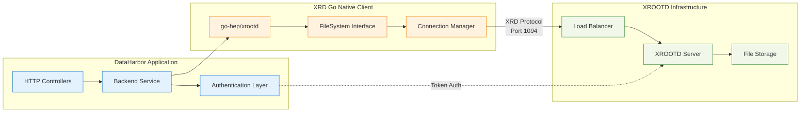
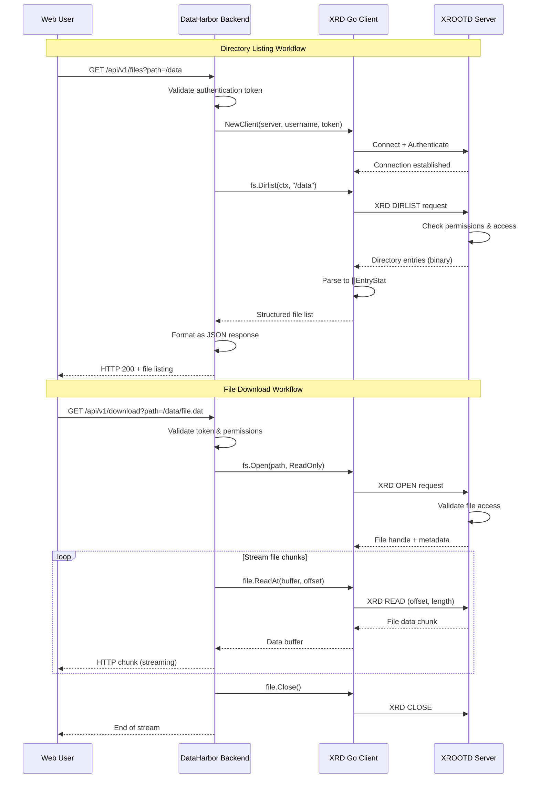
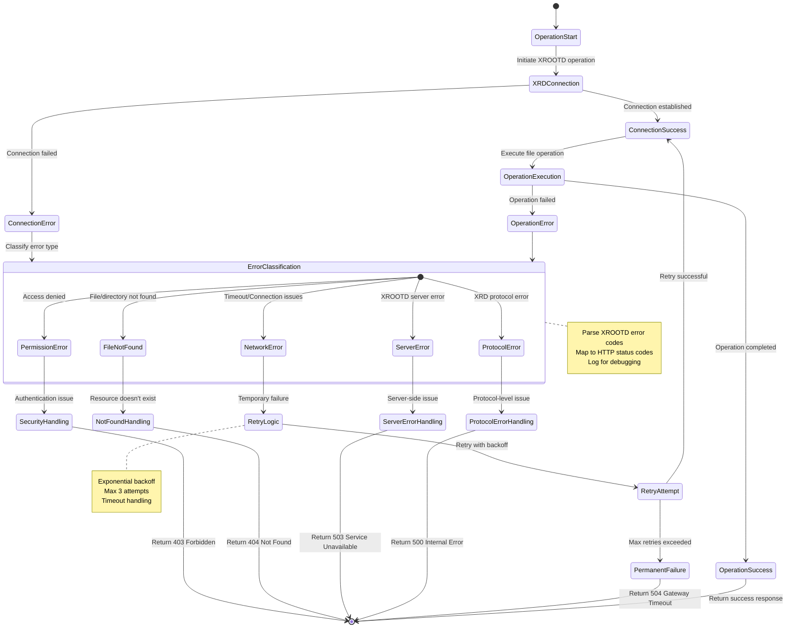

# XROOTD Integration

[← Back to Documentation](./README.md)

This document describes how DataHarbor integrates with XROOTD for file system operations, focusing on XROOTD concepts, the XRD Go native client, and protocol interactions.

## XROOTD Integration Architecture

DataHarbor integrates with XROOTD through the go-hep/xrootd Go native client, providing direct protocol communication without external dependencies.

### Integration Pattern

- **XROOTD Server**: The main data server that hosts files and manages access
- **XRD Go Native Client**: Pure Go implementation from go-hep/xrootd package for direct protocol communication
- **DataHarbor Backend**: Orchestrates file operations through the Go native client



### XROOTD Operation Sequences



### XROOTD Error Handling & Recovery



## XRD Go Native Client

DataHarbor uses the **go-hep/xrootd** package, which provides a pure Go implementation of the XROOTD protocol. This eliminates dependencies on external XROOTD client tools and enables direct protocol communication.

### Key Features

- **Pure Go Implementation**: No external dependencies on XROOTD client tools
- **Direct Protocol Support**: Native XROOTD protocol communication
- **Type Safety**: Go struct-based API with compile-time safety
- **Context Support**: Full Go context integration for timeouts and cancellation
- **Connection Management**: Built-in connection pooling and management
- **Error Handling**: Structured error responses with XROOTD error codes

### Core Operations

**Directory Listing**:
- Uses `xrdfs.FileSystem.Dirlist()` method
- Returns structured `EntryStat` objects with file metadata
- Supports recursive directory traversal

**File Reading**:
- Implements `io.ReaderAt` interface for random access
- Supports streaming reads with configurable buffer sizes
- Handles large files efficiently with chunked reading

**Authentication**:
- Supports various XROOTD authentication mechanisms
- Token-based authentication for secure access
- User credential management

## Configuration

### Backend Configuration

```yaml
xrd:
  server: "root://xrootd.example.com:1094"
  timeout: 60  # seconds
  initial_dir: "/store/data"
```

### Go Client Configuration

The go-hep/xrootd client is configured programmatically:

- **Server Address**: XROOTD server URL with protocol and port
- **Authentication**: Username and authentication tokens
- **Timeouts**: Operation-specific timeout settings
- **Connection Options**: SSL/TLS settings, retry policies

## XROOTD Client Installation

### macOS Installation

```bash
# Using Homebrew
brew install xrootd
```

### Linux Installation

#### Ubuntu/Debian
```bash
sudo apt update
sudo apt install xrootd-client
```

#### CentOS/RHEL/Fedora
```bash
# Using dnf (Fedora)
sudo dnf install xrootd-client

# Using yum (CentOS/RHEL)
sudo yum install xrootd-client
```

### Windows Installation

For Windows development, consider using:
- WSL (Windows Subsystem for Linux) with Linux installation
- Cross-compilation from Linux systems

### Verification

Verify installation:
```bash
xrdfs --help
xrdcp --help
which xrdfs
```

## XROOTD Command Reference

### Common XROOTD Client Commands

**Directory Operations**:

```bash
# List directory contents
xrdfs root://server.example.com:1094 ls /path/to/directory

# List with detailed information
xrdfs root://server.example.com:1094 ls -l /path/to/directory

# List recursively
xrdfs root://server.example.com:1094 ls -R /path/to/directory
```

**File Operations**:

```bash
# Copy file from XROOTD to local
xrdcp root://server.example.com:1094//path/to/file.txt /local/path/file.txt

# Copy file from local to XROOTD
xrdcp /local/path/file.txt root://server.example.com:1094//path/to/file.txt

# Get file information
xrdfs root://server.example.com:1094 stat /path/to/file.txt

# Stream file content (used for direct downloads)
xrdfs root://server.example.com:1094 cat /path/to/file.txt
```

**Server Information**:

```bash
# Query server configuration
xrdfs root://server.example.com:1094 query config version

# Check server status
xrdfs root://server.example.com:1094 query stats info

# Get server hostname
xrdfs root://server.example.com:1094 query config hostname
```

### XROOTD URL Format

XROOTD URLs follow this format:

```
root://hostname:port//absolute/path/to/file
```

Examples:

```
root://xrootd.example.com:1094//store/data/file.txt
root://192.168.1.100:1094//tmp/test.dat
```

## File Streaming

DataHarbor implements efficient file streaming through the XRD Go native client, providing several key advantages:

### Performance Benefits

- **Zero Intermediate Storage**: Files stream directly from XROOTD to the client
- **Memory Efficient**: Uses chunked transfer with configurable buffer sizes
- **Binary Safe**: Handles any file type without corruption risk
- **Scalable**: No disk space consumption on the backend server

### Security Benefits

- **No Temporary Files**: Eliminates security risks from temporary files
- **Direct Authentication**: Each download request is authenticated individually
- **No Public Exposure**: Files are never exposed in public directories
- **Audit Trail**: Every download attempt is logged with user context

### Why Go Native Client is Optimal

- **True Streaming**: Data flows directly through Go channels
- **Binary Preservation**: No encoding or transformation applied to file contents
- **Efficient Protocol**: Uses XROOTD's native read operations with optimal chunk sizes
- **Error Propagation**: Cleanly handles network issues and file access errors
- **Resource Light**: Minimal memory footprint on both client and server

### Need Help?

For troubleshooting XROOTD connection and operation issues, see the **[Troubleshooting Guide](./TROUBLESHOOTING.md)**.

## References

- [XROOTD Official Documentation](https://xrootd.slac.stanford.edu)
- [XROOTD Client API](https://xrootd.slac.stanford.edu/doc/doxygen/current/html/classXrdCl_1_1FileSystem.html)
- [XROOTD Configuration Guide](https://xrootd.slac.stanford.edu/doc/prod/cms_config.htm)

---

## Related Documentation

- **[Backend Development](./BACKEND.md)** - XROOTD integration in backend
- **[API Reference](./API.md)** - File operation endpoints
- **[Architecture](./ARCHITECTURE.md)** - System overview
- **[Troubleshooting](./TROUBLESHOOTING.md)** - XROOTD connection issues

---

[← Back to Documentation](./README.md) | [↑ Top](#xrootd-integration)
